# MPC VST Instruments

**40 plugins for Akai MPC OS standalone devices**: 24 synths, 2 drum machines, 11 MIDI sequencers and generators, and 3 audio effects. They run inside MPC's own plugin host like Akai's instruments do (pads, keys, clips, Q-Links, automation, saved with the project), and every one has its own native touchscreen page, designed in Google Stitch (or, for the Stevequencers, a browser prototype and a generator) and converted into MPC's skin format; the two made for MPC by other authors keep their own.

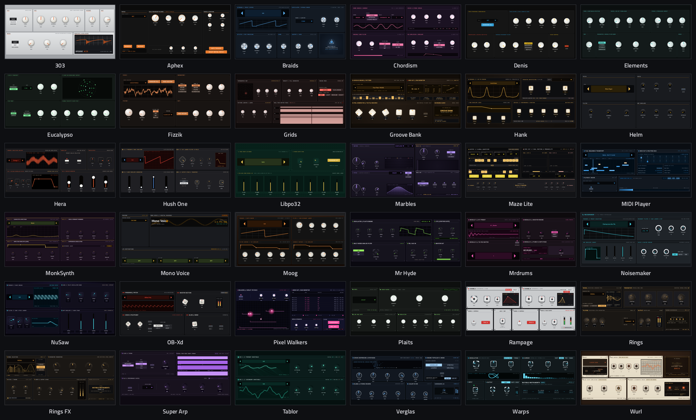

## Thank you, sd88me

None of this would exist without **[sd88me](https://github.com/sd88me)** and his **[mpc-vst-plugins](https://github.com/sd88me/mpc-vst-plugins)**. He worked out that MPC OS's built-in plugin host loads Linux VST2 plugins, and built everything these ports stand on: the hand-written VST2 wrapper, the adapter that runs Ableton Move's Schwung modules unchanged, the generator that turns a layout into MPC's native touchscreen pages, Skin Studio and the offline test. These ports started as experiments on top of his framework, and he'll probably bring them into his own repo. Thank you!

Thanks also to NoQuestion and dustyslices, who first described the route on MPC-Forums ("Proof of Concept: Custom Standalone Plugins", September 2026); to Charles Vestal and everyone writing Schwung modules for Ableton Move; to Emilie Gillet for open-sourcing the Mutable Instruments modules; to Befaco and the VCV Rack community; and to every author in [CREDITS.md](CREDITS.md), whose engines these are.

## The plugins

Click a picture for the plugin's page: what it is, every screen, how to play it, where it comes from.

Design QA: ☐ not checked on the MPC yet, ✅ every page checked on the device (names, values, touch controls,
Q-Links, switches, pop-ups and displays, nothing clipped). Edit this file and swap the box to tick one.

### Synths (24)

| | Plugin | What it is | Design QA |
|---|---|---|:---:|
| <a href="schwung/instruments/303/">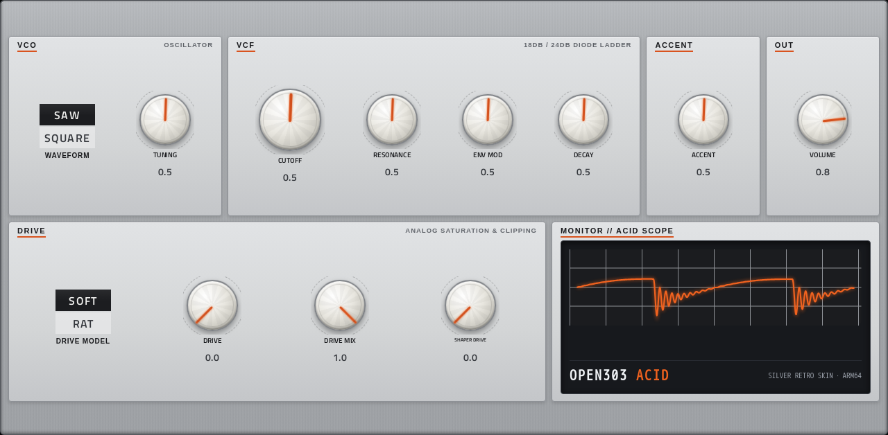</a> | **[303](schwung/instruments/303/)**<br><sub>Synth · Robin Schmidt · GPL-3.0</sub> | TB-303 bass line: Open303 with the Devilfish mods, a drive stage and 13 presets. | ✅ |
| <a href="schwung/instruments/aphex/">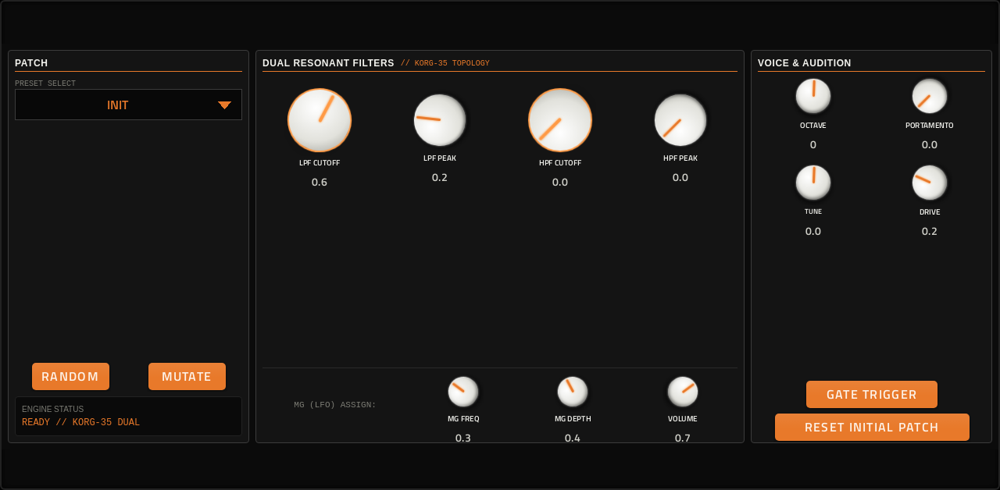</a> | **[Aphex](schwung/instruments/aphex/)**<br><sub>Synth · Filliformes · MIT</sub> | Korg MS-10/MS-20 style mono synth with a patch bay, an ESP section and both MS filters. | ✅ |
| <a href="schwung/instruments/braids/">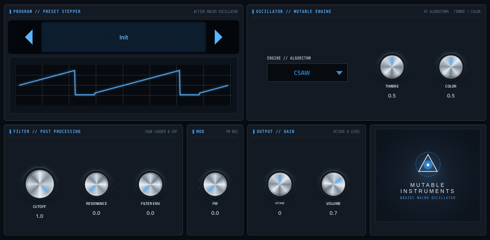</a> | **[Braids](schwung/instruments/braids/)**<br><sub>Synth · Mutable Instruments · MIT</sub> | Mutable Instruments Braids: a macro oscillator with 47 synthesis models. | ✅ |
| <a href="schwung/instruments/chordism/">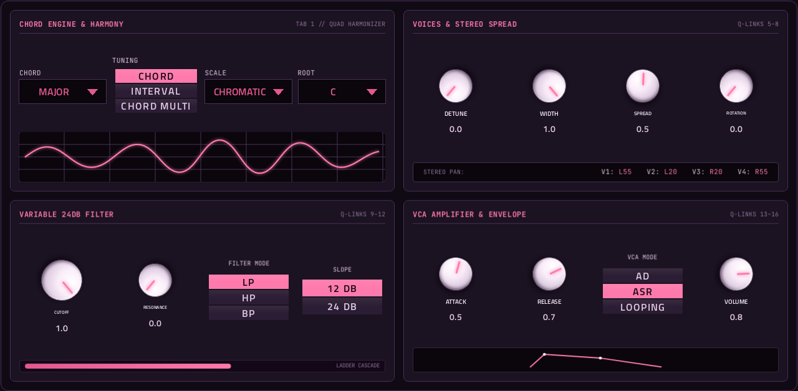</a> | **[Chordism](schwung/instruments/chordism/)**<br><sub>Synth · Charles Vestal · MIT</sub> | One key in, a four-voice chord out: morphing oscillators, FM, filter, lo-fi, delay, reverb and an arpeggiator. | ✅ |
| <a href="schwung/instruments/denis/">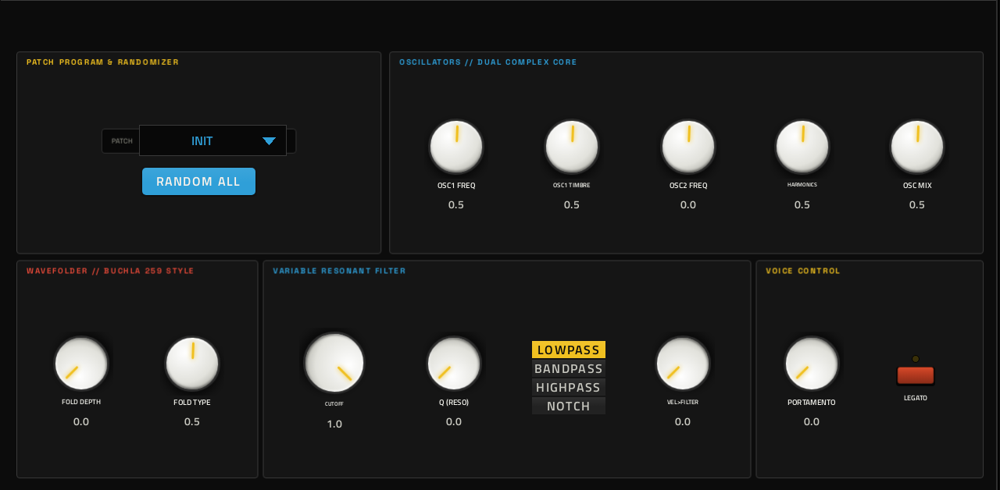</a> | **[Denis](schwung/instruments/denis/)**<br><sub>Synth · Filliformes · MIT</sub> | West Coast / Serge-inspired mono synth: complex oscillators, a wavefolder and a modulation matrix. | ✅ |
| <a href="mutable-instruments/elements/">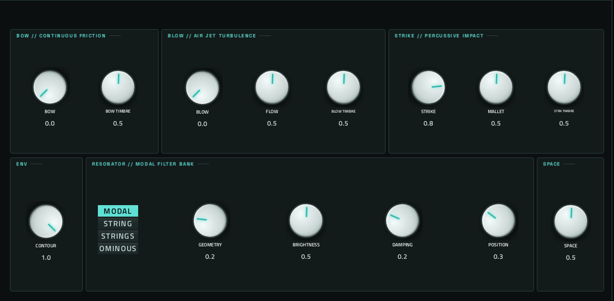</a> | **[Elements](mutable-instruments/elements/)**<br><sub>Synth · Mutable Instruments · MIT</sub> | Mutable Instruments Elements: a modal synthesis voice you bow, blow and strike, with 12 presets. | ✅ |
| <a href="schwung/instruments/fizzik/">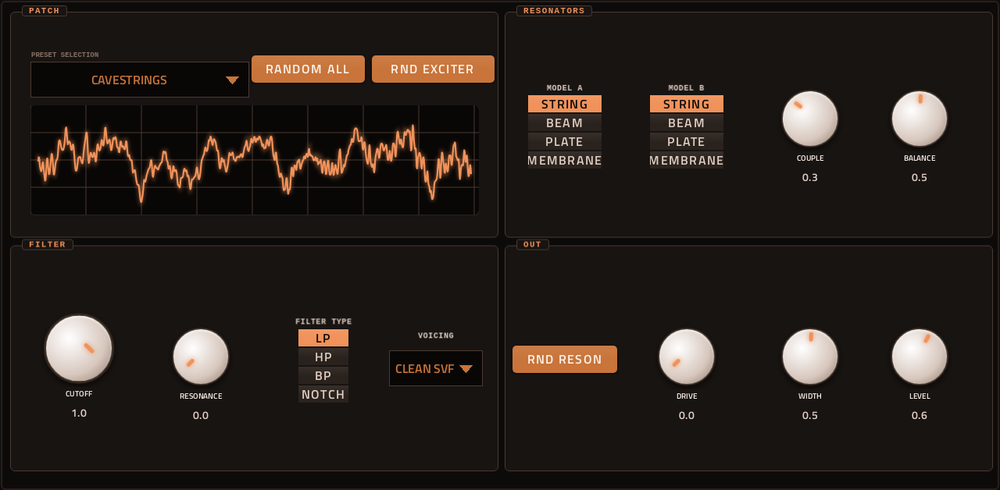</a> | **[Fizzik](schwung/instruments/fizzik/)**<br><sub>Synth · Filliformes · MIT</sub> | Physical modelling: an exciter and two coupled resonators (string, beam, plate, membrane). | ✅ |
| <a href="schwung/instruments/hank/">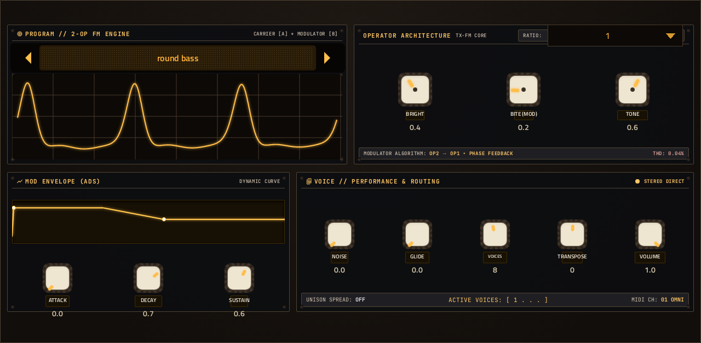</a> | **[Hank](schwung/instruments/hank/)**<br><sub>Synth · Charles Vestal · MIT</sub> | Two-operator FM on one page: ratio, brightness, bite, an envelope pair, noise and a tone sweep. | ✅ |
| <a href="schwung/instruments/helm/">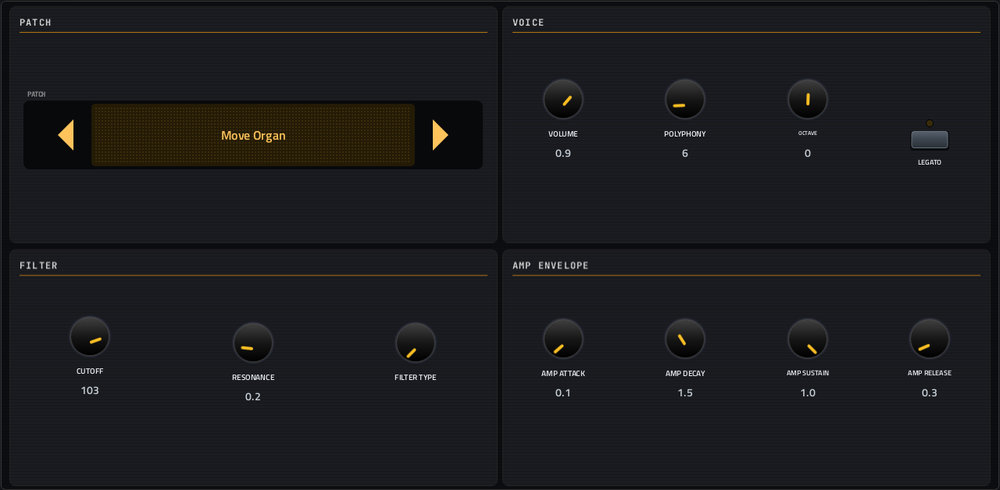</a> | **[Helm](schwung/instruments/helm/)**<br><sub>Synth · Matt Tytel · GPL-3.0</sub> | Matt Tytel's Helm polysynth with its factory patches (275 with Move Organ). | ✅ |
| <a href="schwung/instruments/hera/">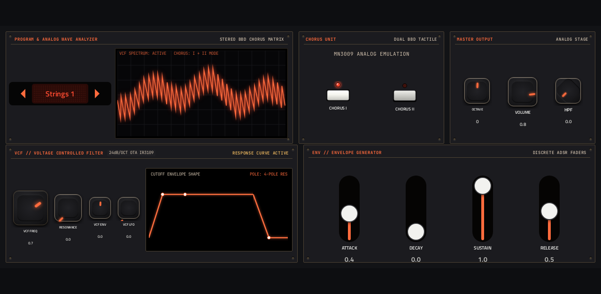</a> | **[Hera](schwung/instruments/hera/)**<br><sub>Synth · jpcima · GPL-3.0</sub> | Roland Juno-60: jpcima's Hera engine, with its 56 presets. | ✅ |
| <a href="schwung/instruments/hush1/">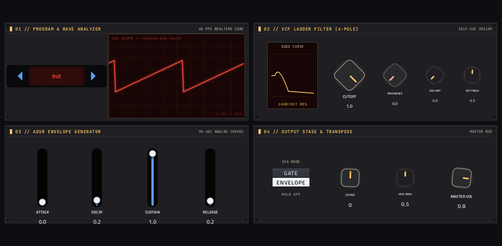</a> | **[Hush One](schwung/instruments/hush1/)**<br><sub>Synth · Move Everything · not stated upstream</sub> | Roland SH-101: a monophonic bass and lead synth with 11 presets, plus TAL-BassLine-101 presets you add. | ✅ |
| <a href="schwung/instruments/monksynth/">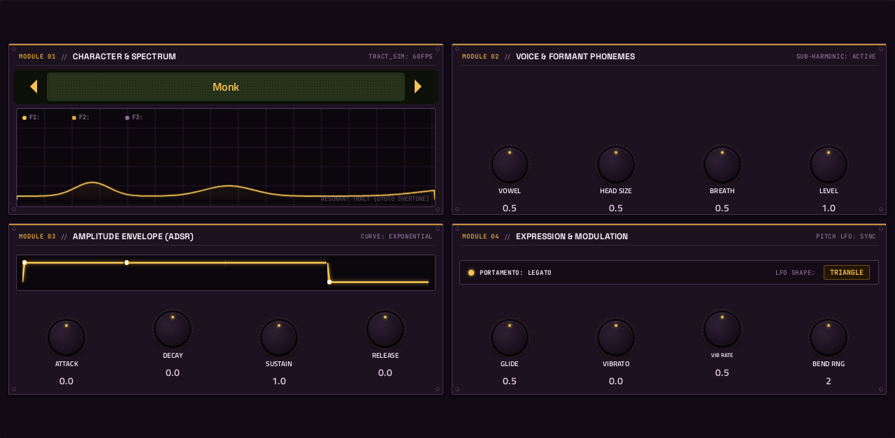</a> | **[MonkSynth](schwung/instruments/monksynth/)**<br><sub>Synth · Jonathan Taylor · MIT</sub> | A formant (FOF) singing voice with 12 characters and a choir. | ✅ |
| <a href="schwung/instruments/monovoice/">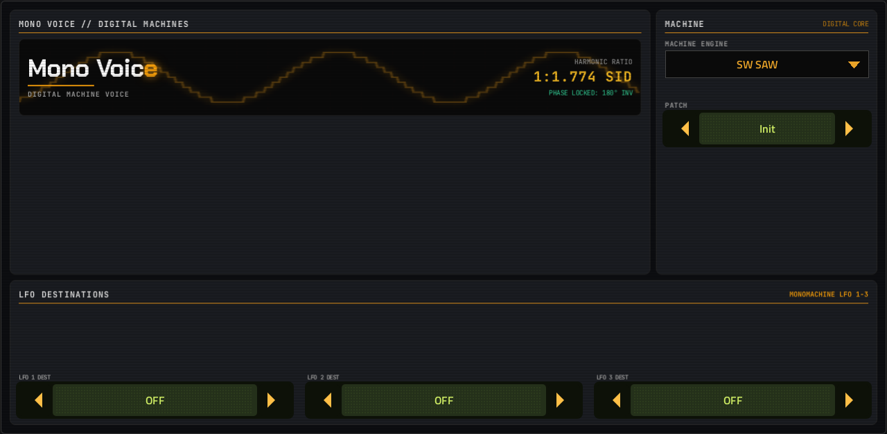</a> | **[Mono Voice](schwung/instruments/monovoice/)**<br><sub>Synth · timncox · MIT</sub> | Elektron Monomachine-style digital voice: SuperWave, SID, DigiPRO, FM and more machines; 12 factory patches. | ✅ |
| <a href="schwung/instruments/moog/">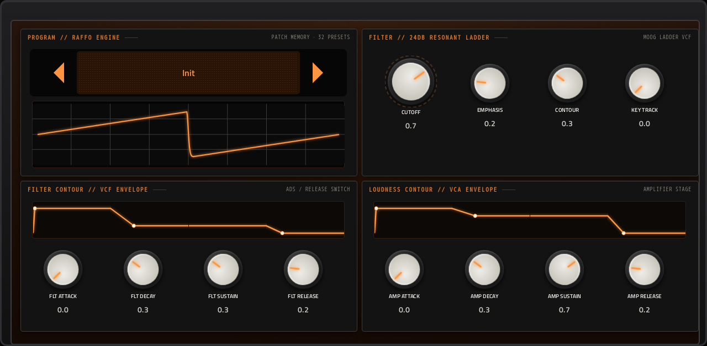</a> | **[Moog](schwung/instruments/moog/)**<br><sub>Synth · Raffo · MIT</sub> | RaffoSynth: a Minimoog-style mono synth with four oscillators and a ladder filter. | ✅ |
| <a href="mpc-ports/mpcplaits/">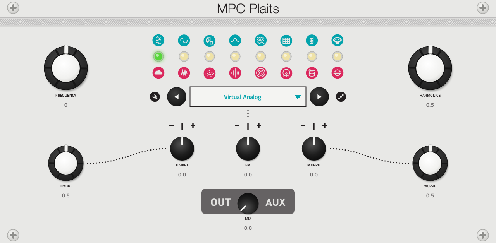</a> | **[MPC Plaits](mpc-ports/mpcplaits/)**<br><sub>Synth · poloq · MIT</sub> | poloq's polyphonic Plaits for MPC: all 24 models, up to 8 voices, four low-pass gate modes, LFOs, envelopes and two mod matrices, on the module's own panel art; 31 presets. | ☐ |
| <a href="schwung/instruments/mrhyde/">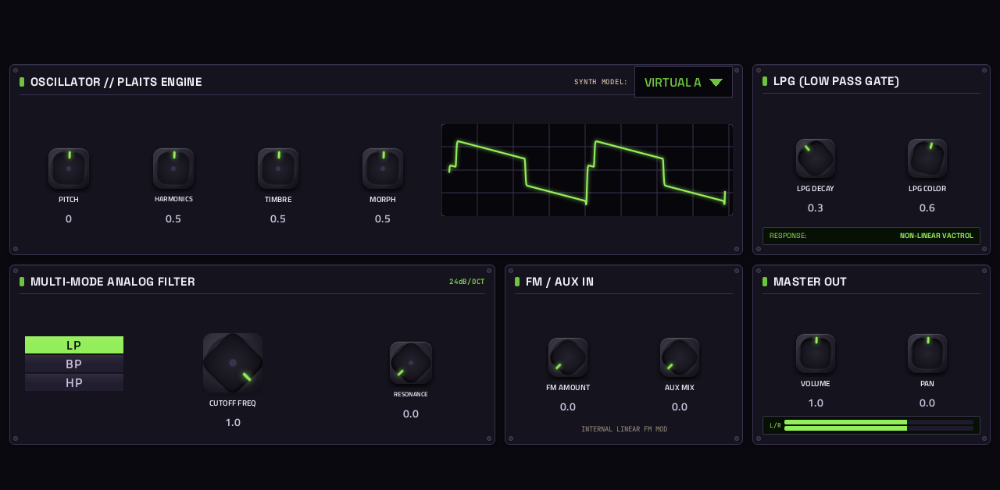</a> | **[Mr Hyde](schwung/instruments/mrhyde/)**<br><sub>Synth · Move Everything · MIT</sub> | A MicroFreak-inspired voice: Plaits models with a low-pass gate, filter and a 6x6 mod matrix; 19 presets. | ✅ |
| <a href="mpc-ports/mutablevibe/">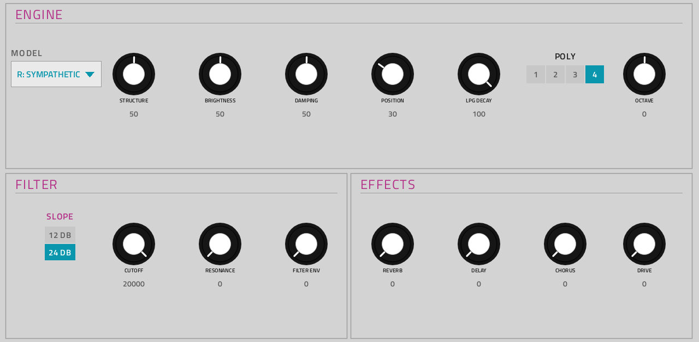</a> | **[Mutable Vibe](mpc-ports/mutablevibe/)**<br><sub>Synth · nachtaktiv303 · MIT</sub> | nachtaktiv303's Rings + Plaits instrument for MPC: 20 resonator and macro-oscillator engines with a filter, four LFOs, four envelopes, reverb, delay, chorus and drive; 24 presets. | ☐ |
| <a href="schwung/instruments/noisemaker/"></a> | **[Noisemaker](schwung/instruments/noisemaker/)**<br><sub>Synth · TAL · GPL-2.0</sub> | TAL-NoiseMaker: a classic virtual-analog polysynth with 256 factory presets, plus preset banks you add. | ✅ |
| <a href="schwung/instruments/nusaw/">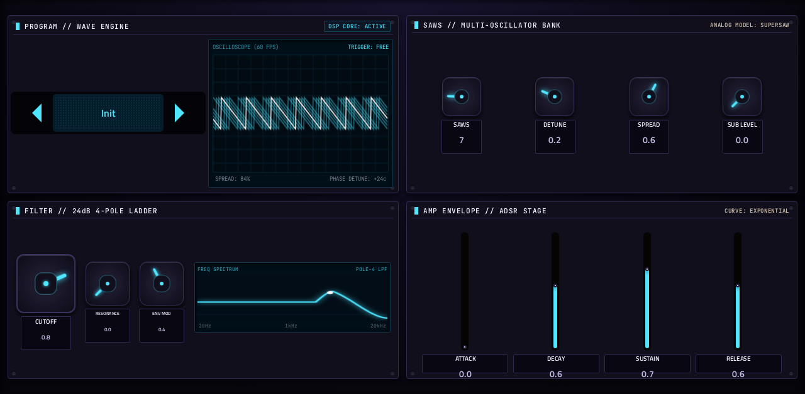</a> | **[NuSaw](schwung/instruments/nusaw/)**<br><sub>Synth · Charles Vestal · MIT</sub> | A detuned multi-saw (supersaw) polysynth with 27 presets. | ✅ |
| <a href="schwung/instruments/obxd/">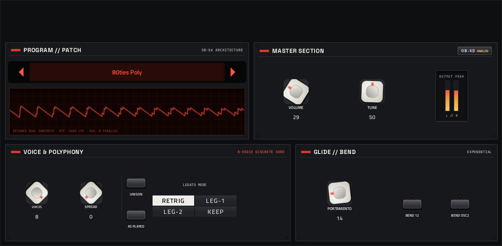</a> | **[OB-Xd](schwung/instruments/obxd/)**<br><sub>Synth · reales · GPL-3.0</sub> | Oberheim OB-X: reales' OB-Xd with its 128 factory presets, plus `.fxb` banks you add. | ✅ |
| <a href="schwung/instruments/plaits/">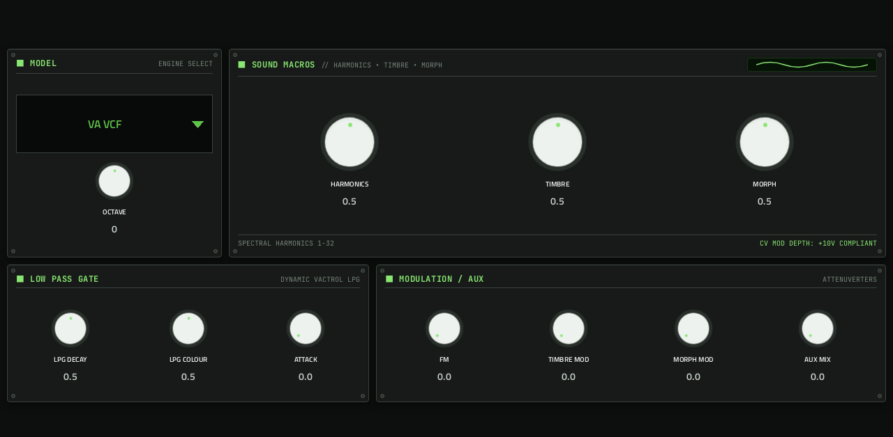</a> | **[Plaits](schwung/instruments/plaits/)**<br><sub>Synth · Mutable Instruments · MIT</sub> | Mutable Instruments Plaits: a macro oscillator with 24 models, played like a synth; 24 presets. | ✅ |
| <a href="mutable-instruments/rings/">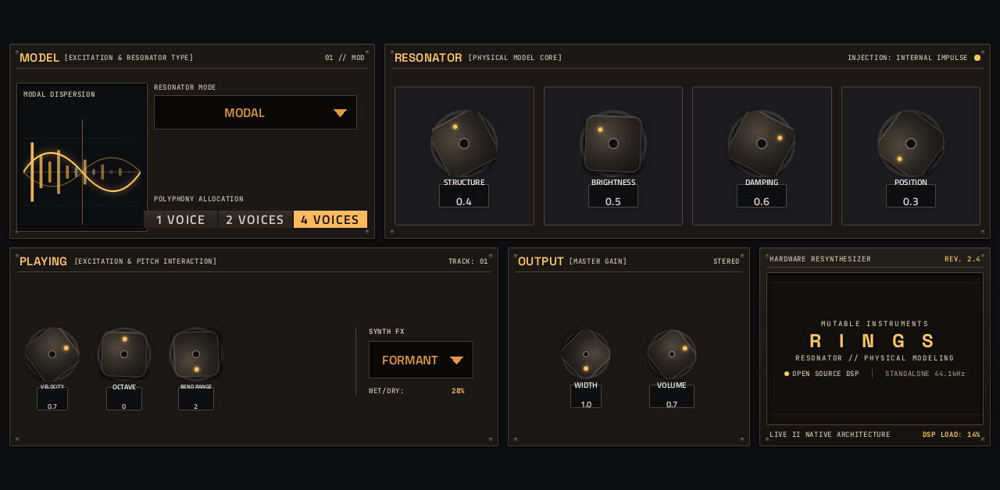</a> | **[Rings](mutable-instruments/rings/)**<br><sub>Synth · Mutable Instruments · MIT</sub> | Mutable Instruments Rings: a resonator, strummed by the notes you play; 14 presets. | ✅ |
| <a href="schwung/instruments/tablor/">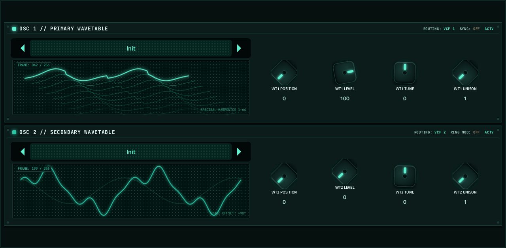</a> | **[Tablor](schwung/instruments/tablor/)**<br><sub>Synth · athousanddetails · BSD-3-Clause</sub> | A two-oscillator wavetable synth that ships with its wavetables; 9 factory presets. | ✅ |
| <a href="schwung/instruments/wurl/">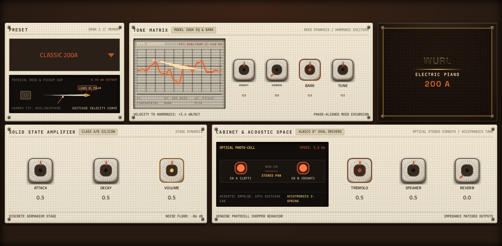</a> | **[Wurl](schwung/instruments/wurl/)**<br><sub>Synth · Filliformes · GPL-3.0</sub> | A physically modelled Wurlitzer 200A electric piano. | ✅ |

### Drum machines (2)

| | Plugin | What it is | Design QA |
|---|---|---|:---:|
| <a href="schwung/instruments/libpo32/">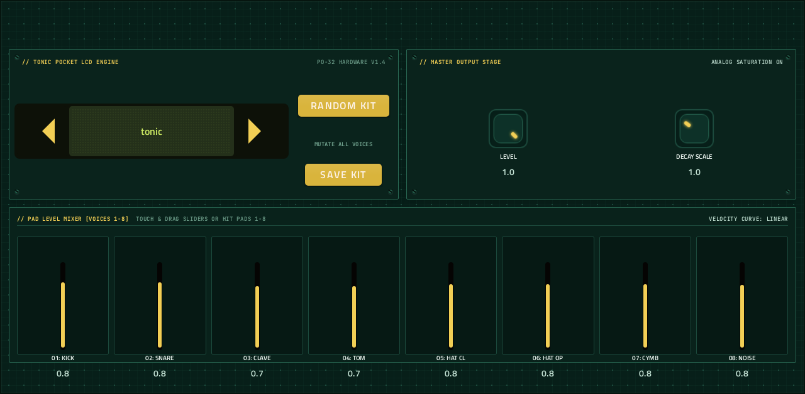</a> | **[Libpo32](schwung/instruments/libpo32/)**<br><sub>Drum synth · mestela · not stated upstream</sub> | PO-32-style drum synth: 16 synthesised drum sounds on pads 36-51. | ✅ |
| <a href="schwung/instruments/mrdrums/">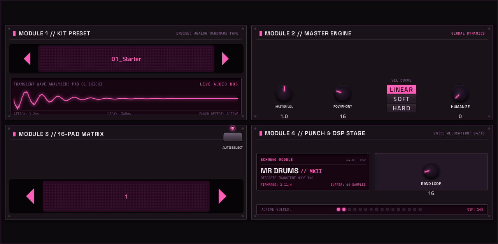</a> | **[Mr Drums](schwung/instruments/mrdrums/)**<br><sub>Drum sampler · Move Everything · MIT</sub> | A 16-pad drum sampler: kits of samples on pads 36-51. | ✅ |

### MIDI sequencers and generators (11)

| | Plugin | What it is | Design QA |
|---|---|---|:---:|
| <a href="schwung/sequencers/eucalypso/">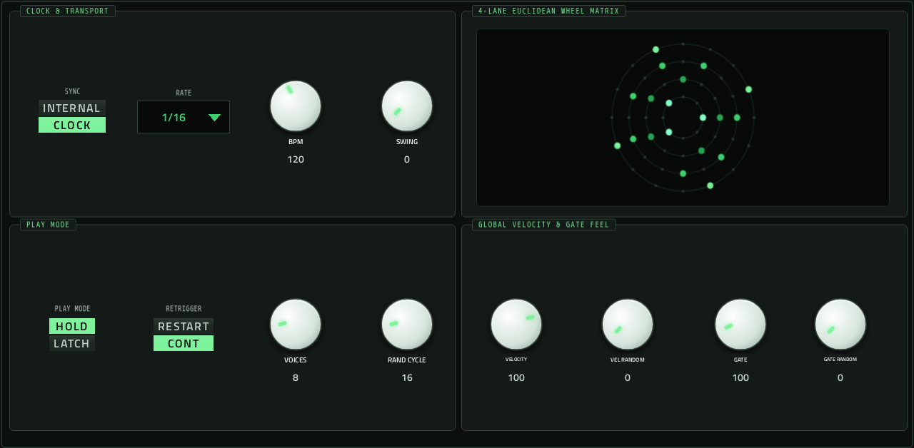</a> | **[Eucalypso](schwung/sequencers/eucalypso/)**<br><sub>MIDI sequencer · handcraftedcc · MIT</sub> | Four-lane Euclidean sequencer: turns held notes into interlocking rhythms for other tracks. | ☐ |
| <a href="mutable-instruments/grids/">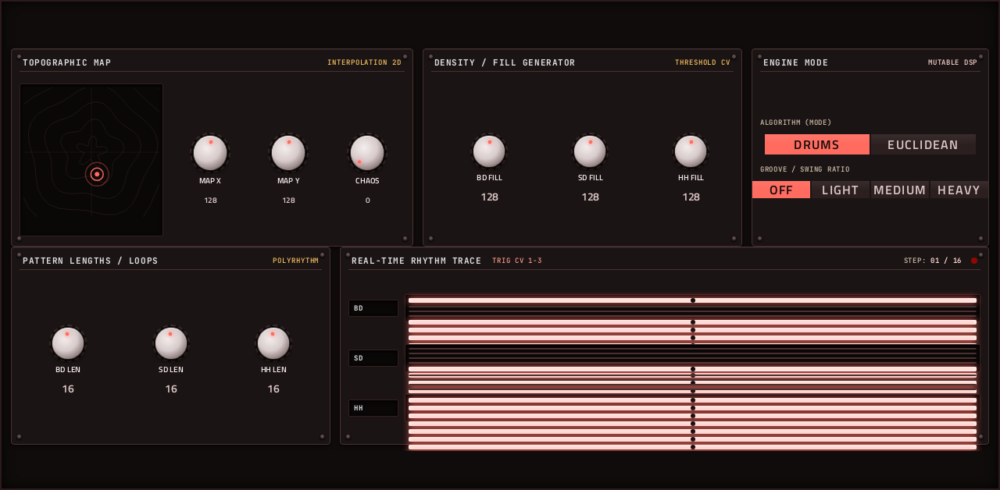</a> | **[Grids](mutable-instruments/grids/)**<br><sub>MIDI sequencer · Mutable Instruments · GPL-3.0</sub> | Mutable Instruments Grids: a topographic drum sequencer that plays a drum track from MPC's clock. | ☐ |
| <a href="schwung/sequencers/groovebank/">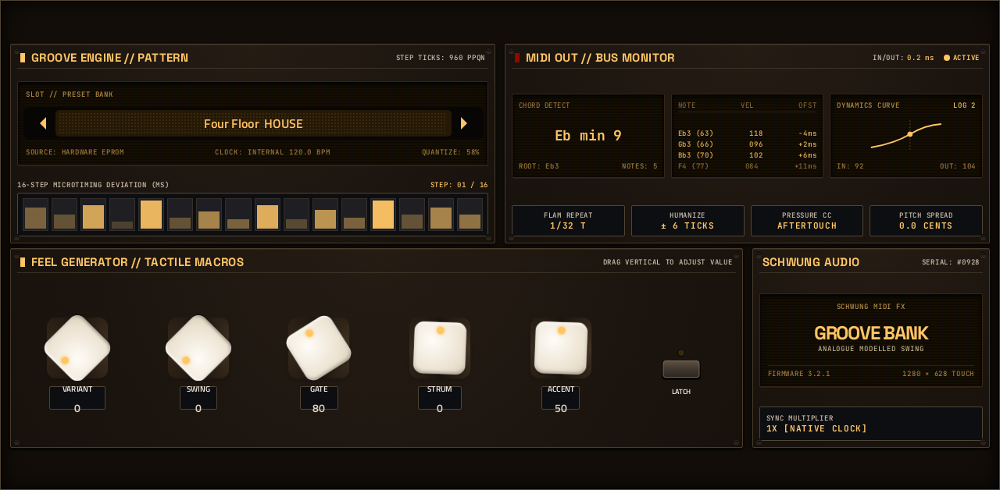</a> | **[Groove Bank](schwung/sequencers/groovebank/)**<br><sub>MIDI sequencer · Mission Minnow · MIT</sub> | Retriggers the chord you hold in a rhythm from a library of genre grooves. | ☐ |
| <a href="mutable-instruments/marbles/">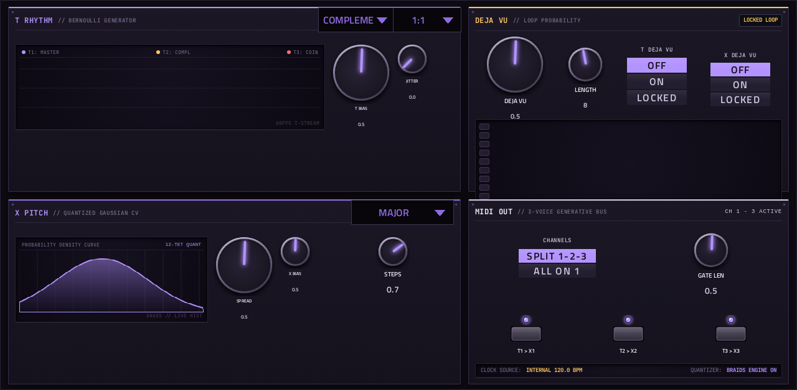</a> | **[Marbles](mutable-instruments/marbles/)**<br><sub>MIDI sequencer · Mutable Instruments · MIT</sub> | Mutable Instruments Marbles: a random sampler that plays up to three tracks. | ☐ |
| <a href="schwung/sequencers/mazelite/">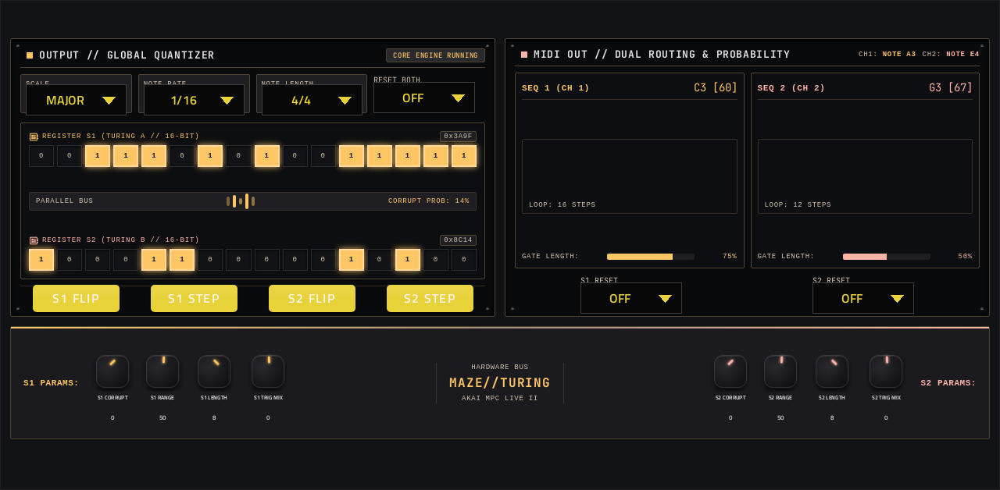</a> | **[Maze Lite](schwung/sequencers/mazelite/)**<br><sub>MIDI sequencer · sd88me · MIT</sub> | A dual generative sequencer in the style of the Moog Labyrinth. | ☐ |
| <a href="schwung/sequencers/midiplayer/">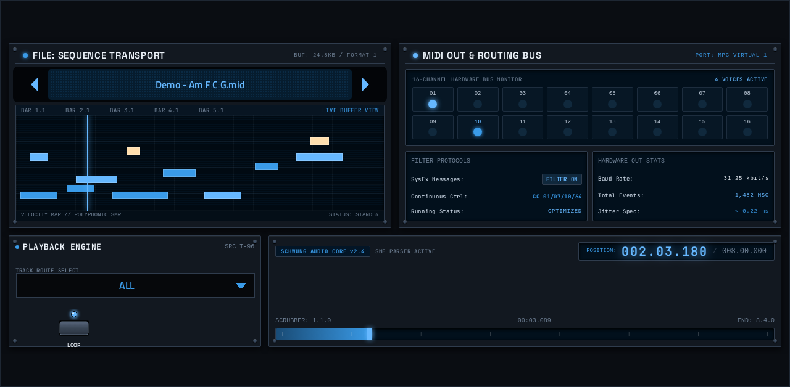</a> | **[MIDI Player](schwung/sequencers/midiplayer/)**<br><sub>MIDI sequencer · Charles Vestal · MIT</sub> | Plays Standard MIDI Files in time with MPC's transport. | ☐ |
| <a href="schwung/sequencers/pixelwalkers/">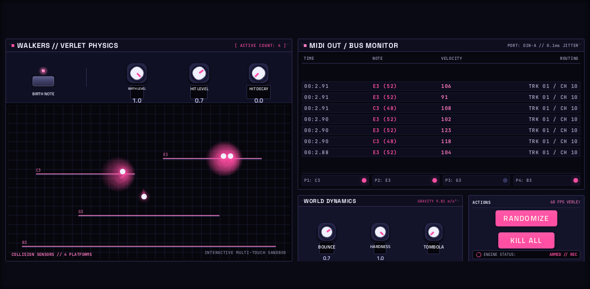</a> | **[Pixel Walkers](schwung/sequencers/pixelwalkers/)**<br><sub>MIDI sequencer · mestela · MIT</sub> | Generative: the notes you play become walkers that bounce and retrigger when they land. | ☐ |
| <a href="vcv-rack/rampage/">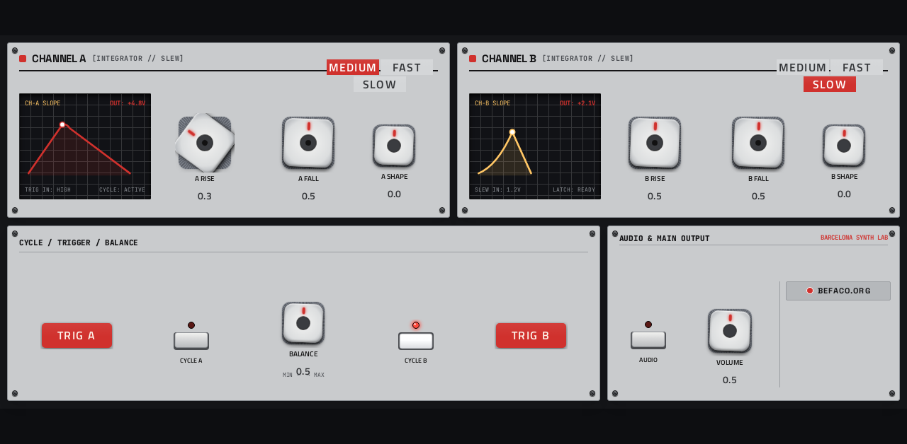</a> | **[Rampage](vcv-rack/rampage/)**<br><sub>Modulator · Befaco · GPL-3.0</sub> | Befaco Rampage: a dual slope generator (envelopes, LFOs, slew) that modulates other tracks. | ☐ |
| <a href="originals/stevequencer/">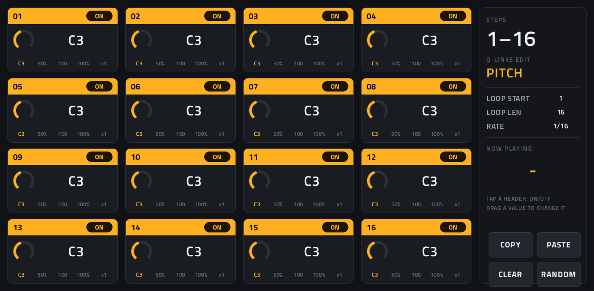</a> | **[Stevequencer](originals/stevequencer/)**<br><sub>MIDI sequencer · Steve A · written for this repo</sub> | A 64-step melodic step sequencer on a 4x4 grid, edited from the Q-Links: pitch, length, on/off, velocity, chance and ratchets per step. | ☐ |
| <a href="originals/stevequencer16/">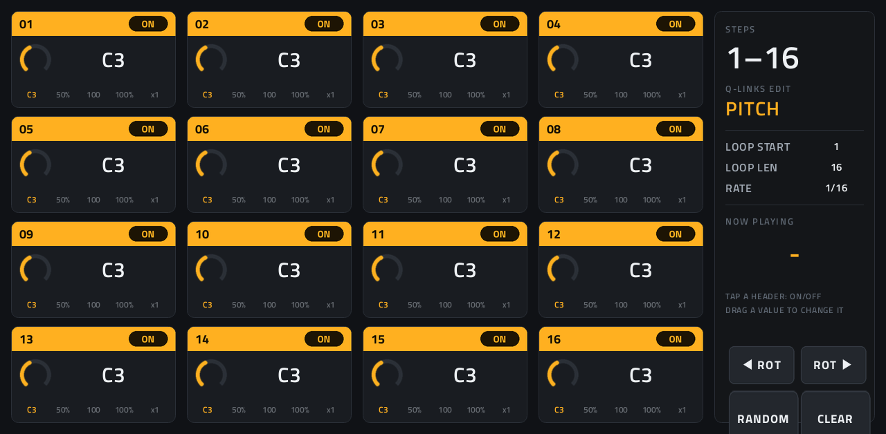</a> | **[Stevequencer 16](originals/stevequencer16/)**<br><sub>MIDI sequencer · Steve A · written for this repo</sub> | 16 steps and eight modulation lanes to any parameter of the instrument, Elektron-style: hold, return, slide across steps, LFO, follow another lane; per-lane rate and length. | ☐ |
| <a href="schwung/sequencers/superarp/">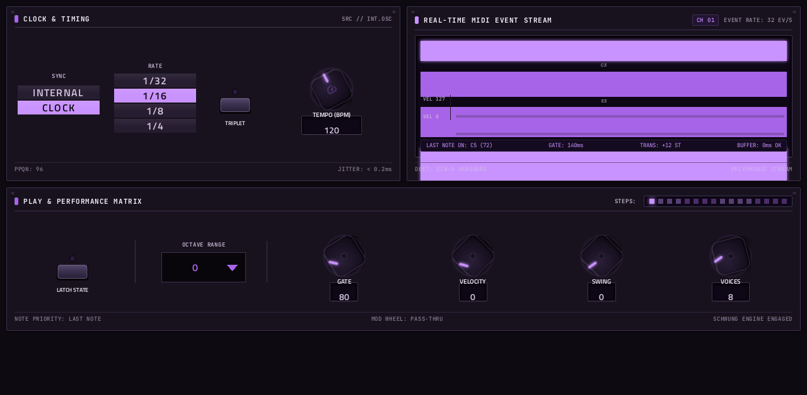</a> | **[Super Arp](schwung/sequencers/superarp/)**<br><sub>Arpeggiator · handcraftedcc · MIT</sub> | A pattern and rhythm arpeggiator with 40 patterns, 40 rhythms and random modifiers. | ☐ |

### Audio effects (3)

| | Plugin | What it is | Design QA |
|---|---|---|:---:|
| <a href="mutable-instruments/ringsfx/">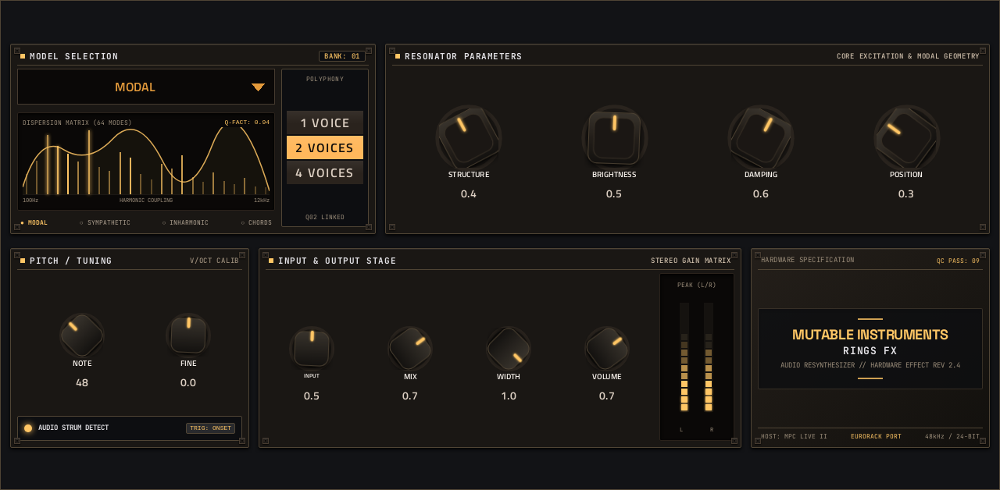</a> | **[Rings FX](mutable-instruments/ringsfx/)**<br><sub>Audio effect · Mutable Instruments · MIT</sub> | Rings as an audio effect: the track's sound excites the resonator; 12 presets. | ✅ |
| <a href="schwung/effects/verglas/">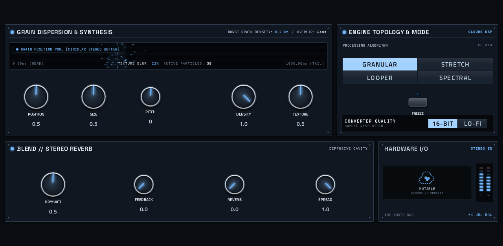</a> | **[Verglas](schwung/effects/verglas/)**<br><sub>Audio effect · Mutable Instruments · MIT</sub> | Mutable Instruments Clouds: a granular texture processor as an audio effect; 12 presets. | ✅ |
| <a href="mutable-instruments/warps/">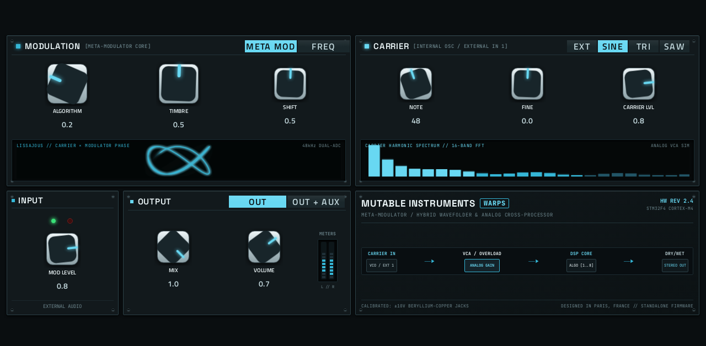</a> | **[Warps](mutable-instruments/warps/)**<br><sub>Audio effect · Mutable Instruments · MIT</sub> | Mutable Instruments Warps: a meta-modulator (ring mod, fold, vocoder...) as an audio effect; 12 presets. | ✅ |

## Installing

You need a **Gen1 MPC OS device** (32-bit ARM: e.g. MPC Live, Live II, One, X, Force) with **root SSH access**, and a Mac or Linux computer (Windows: WSL) on the same network. Then:

```
git clone https://github.com/saustin2010/vst_instruments.git
cd vst_instruments
./install.sh <mpc-address> --dry-run all      # check first: changes nothing
./install.sh <mpc-address> hera grids verglas  # or a group: instruments, sequencers, effects, all
```

The first install of a plugin restarts MPC once (it asks first; `MPC.settings` is backed up). **[INSTALL.md](INSTALL.md)** walks through every step: getting SSH access, what the installer changes, adding a plugin to a track, routing the sequencers, updating, uninstalling, installing by hand and troubleshooting. Presets, kits and wavetables are fetched from their original projects into `presets/` and installed with each plugin; [docs/presets-and-libraries.md](docs/presets-and-libraries.md) lists them, where they come from and how to add your own.

**One plugin at a time, as a release zip:** 21 of the plugins are in
[sd88me's plugin catalogue](https://sd88me.github.io/mpc-vst-plugins/) and 9 more are proposed, each from its own repo with its own releases
(`saustin2010/mpc-vst-<plugin>`, for example [mpc-vst-303](https://github.com/saustin2010/mpc-vst-303)); more follow.
This repo stays where they're developed; the plan and where each plugin stands: [docs/catalogue-migration.md](docs/catalogue-migration.md).

## Status (2026-10-05)

- All 40 build and pass the offline test (all rebuilt 2026-10-05): an x86 build under AddressSanitizer/UBSan that checks every parameter, presets, saving and restoring, Q-Link behaviour, notes to audio, and a stress test that hammers the plugin from two threads as MPC does.
- All 40 are installed on an MPC Live II (MPC OS 3.9.1); these builds since 2026-10-05 (the first set 2026-10-03).
- Design QA on the device: **27 of 40 passed** (2026-10-04): the first 22 synths, both drum machines and the three audio effects, every page checked on the Live II (names, values, touch controls, Q-Links, pop-ups, displays). Every screen has one Q-Link column per panel, with Moog as the model, and each plugin's `DESIGN-QA.md` says what changed. Still to do: the 11 sequencers and generators and the two newest synths (Mutable Vibe, MPC Plaits); their screens have had the same pass offline.
- Presets: every instrument and audio effect now has presets in MPC's own **PRESET menu** in the plugin header (also on the arrangement screen); checked on the Live II. Where upstream had none, the port brings its own, levels evened out (303, Elements, Rings, Plaits, Mr Hyde, Rings FX, Verglas, Warps; 2026-10-03/04); Tablor's and Mono Voice's factory sets are reachable now too. OB-Xd and Noisemaker get a BANK selector for banks you add, Hush One reads TAL-BassLine-101 presets you add, and the menu follows what's loaded ([docs/presets-and-libraries.md](docs/presets-and-libraries.md)).
- Every screen is checked offline before it ships: each control's binding, the Q-Link layout, the touch areas (`dev-tools/stitch/check_skin.py`) and the Q-Link column outlines MPC highlights (`dev-tools/stitch/qlink_overlay.py`).
- Sequencers on a stock MPC: on the Live II, MPC finds a sequencer's own MIDI port and connects to it by itself, no restart (2026-10-04); a second track plays from it (Monitor In on that track, Remote off for the port; confirmed 2026-10-04, as on a Force). [docs/sequencers.md](docs/sequencers.md) walks through the routing.
- Plugin browser: every name starts with its kind, **[SYN]**, **[DRUM]**, **[SEQ]** or **[FX]** (2026-10-04). MPC's plugin menu sorted by type puts every VST in one VST folder (it ignores the category a plugin reports, Akai's own folder names included: tested on the Live II), so the tags group them there; sorted by manufacturer it makes a folder per maker. All plugins keep their real makers.
- Audio effects: Verglas, Warps and Rings FX are in a track's insert effect slots, under VST, and work there (Live II, 2026-10-04; their screens passed the design QA in the slot).
- New: **[Stevequencer](originals/stevequencer/)**, a 64-step sequencer edited from the Q-Links, written for this repo (2026-10-04): built, offline test passed, installed and working on the Live II. Its browser prototype (`design/prototype.html`) plays in Chrome. Its two MOD lanes (a CC value per step that moves the instrument's controls) work on the Live II (2026-10-05).
- MIDI CC 20-35 move every plugin's first-page Q-Links (column 1 = CC 20-23, top to bottom, and so on), with no MIDI learn: a sequencer's per-step CCs or a controller drive the instrument through the track's MIDI input (2026-10-04; working on the Live II 2026-10-05). For any parameter on any page, NRPN: see Stevequencer 16 below.
- New: **[Mutable Vibe](mpc-ports/mutablevibe/)** (nachtaktiv303) and **[MPC Plaits](mpc-ports/mpcplaits/)** (poloq), two instruments their authors wrote for MPC OS on sd88me's framework, built here from their source with this repo's copy of it (2026-10-05): offline test passed, Q-Links one column per panel on every page (their screens are otherwise the authors'). Installed and working on the Live II (2026-10-05). Presets made for both, levels evened out offline (24 and 31; Mutable Vibe gained a VOLUME control for it).
- New: **[Stevequencer 16](originals/stevequencer16/)** (2026-10-05; offline tests passed, installed on the Live II, first device test next): 16 steps and eight modulation lanes that can move any parameter of the instrument, on any page (NRPN, which every plugin here now takes as its parameter number: [docs/parameter-numbers.md](docs/parameter-numbers.md)), with slides across steps, LFOs, per-lane rate and length, and lanes that follow each other (modulation groups). Stevequencer's MOD lanes are confirmed working on the Live II (2026-10-05): MPC passes a track's MIDI CCs through to the instrument.
- Developed on a Live II. Other Gen1 devices run the same MPC software and should behave the same; Gen2 devices (e.g. Live III) are reported to be more locked down. Reports welcome.

What's next is in [ROADMAP.md](ROADMAP.md). Found a problem? Open an issue with the plugin, your MPC model and firmware, and what you did.

## What's in this repo

```
schwung/instruments/   22 instruments ported from Ableton Move "Schwung" modules
schwung/sequencers/     6 MIDI sequencers from Schwung MIDI FX modules
schwung/effects/        1 audio effect from a Schwung audio FX module
mutable-instruments/    6 ported from Mutable Instruments' own firmware source
vcv-rack/               1 ported from a VCV Rack module
originals/              2 written for this repo (Stevequencer, Stevequencer 16)
mpc-ports/              2 written for MPC by other authors (Mutable Vibe, MPC Plaits), built here
  <plugin>/            README.md, screenshots/, deploy/ (ready to install), source, screen design
presets/               the plugins' presets, kits, wavetables (not in git: tools/fetch-presets.py)
install.sh, uninstall.sh, tools/   the installer (and tools/build.sh to build from source, tools/publish.sh to publish a plugin to its own repo)
framework/             our changes to sd88me's mpc-vst-plugins, as a patch, and setup.sh (setup-release.sh: the tools the plugins' own repos release with)
dev-tools/             the tools the ports and screens were made with
docs/                  extra guides (presets and libraries, parameter numbers, root SSH on a stock MPC, the catalogue migration plan) and images
licenses/              licence texts the plugins refer to
```

Each plugin's `deploy/` folder is the finished build, so installing needs only this repo; the presets come from their original projects (the installer fetches them). To build from source see [BUILDING.md](BUILDING.md); to change a screen, [RESKINNING.md](RESKINNING.md).

## Licences

Each plugin keeps its upstream licence (GPL-2.0, GPL-3.0, MIT or BSD-3-Clause; two state none; MPC Plaits' panel artwork is CC-BY-SA 3.0): see the plugin's README and [CREDITS.md](CREDITS.md). The GPL plugins' complete source is in their folders. The scripts and documents written for this repo don't have a licence of their own yet.

## Disclaimer

Not affiliated with or endorsed by Akai Professional / inMusic, or by the makers of the instruments these plugins emulate or are named after (Roland, Korg, Oberheim, Moog, Elektron, Wurlitzer, Teenage Engineering, Mutable Instruments, Befaco and others); their names are used only to say what a plugin is modelled on. VST is a trademark of Steinberg; these plugins use a hand-written VST2 interface, not Steinberg's SDK. No Akai content is included. Installing edits MPC's settings file: the installer backs it up first, and you use all of this at your own risk, on hardware you own.
