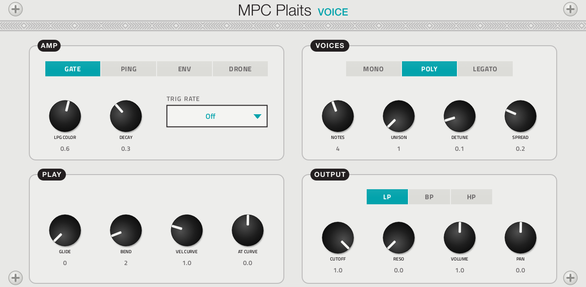
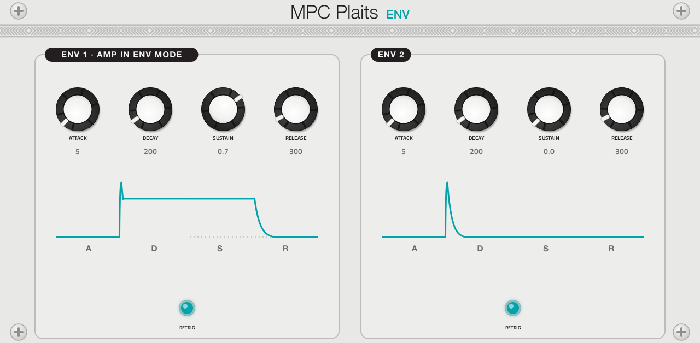
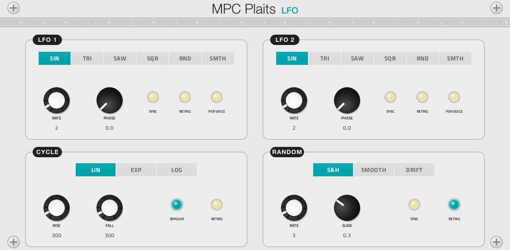
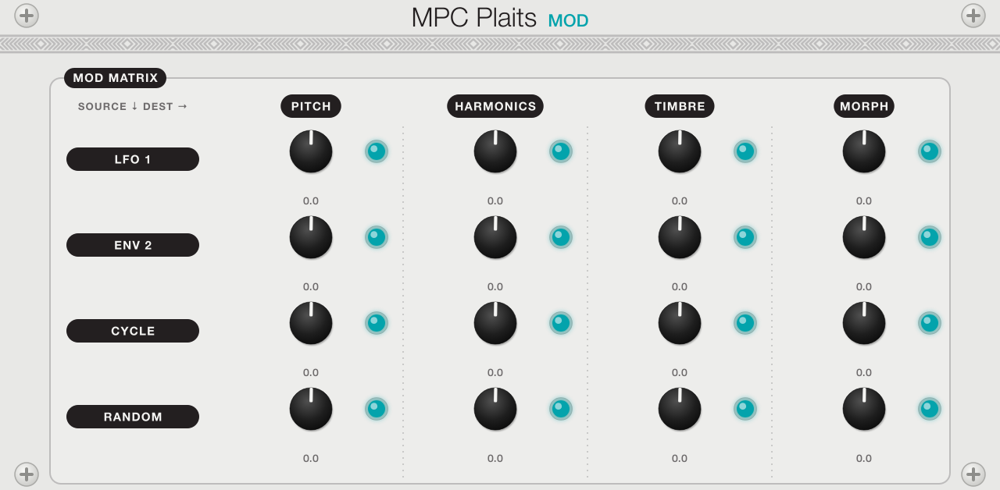
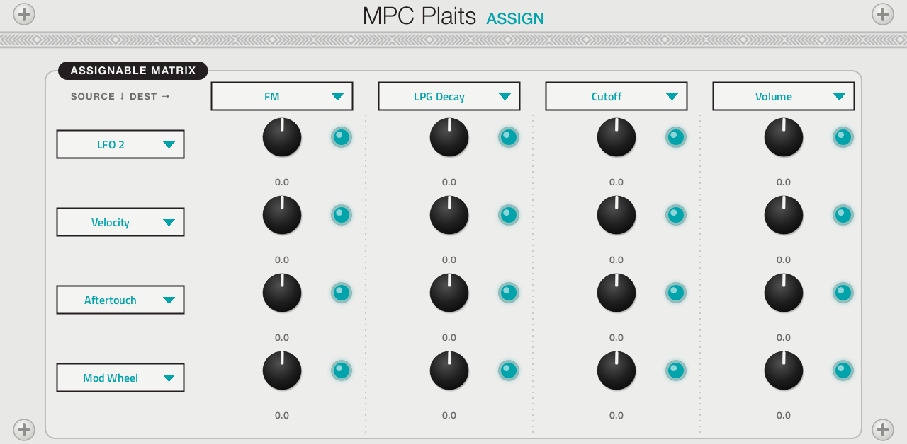

# MPC Plaits

**Synth** · Mutable Instruments Plaits as a polyphonic instrument: all 24 models, LFOs, envelopes and two modulation matrices; 31 presets. · maker in MPC: poloq · licence: MIT (panel artwork CC-BY-SA 3.0)


poloq's MPC instrument around Plaits (firmware 1.2's 24 models, in the module's order): up to 8 voices (mono, poly or
legato, with unison, detune and spread), four ways to play the low-pass gate (GATE, PING, ENV, DRONE), a filter, two
ADSRs drawn live as you turn them, two LFOs, a cycling envelope and a random source, a ready-made 4 x 4 modulation
matrix and an assignable one (velocity, aftertouch and mod wheel among the sources). LFOs, random and retriggers
follow MPC's tempo and restart when it starts playing. The PLAITS page is laid out like the module, with Mutable
Instruments' own panel artwork.

It was written for MPC OS by poloq, starting from the Mr Hyde Schwung module (also in this repo, as **Mr Hyde**); this
repo builds it from poloq's source with its own copy of the framework, keeps poloq's screen, and changes what some
Q-Links do (one column per panel, see below and `DESIGN-QA.md`). It sits next to this repo's own **[Plaits](../../schwung/instruments/plaits/)**
port, which is a simpler, monophonic take with 24 presets.

Upstream has no presets, so the port brings 31, one or more for every model (Init, Analog Bass, Acid Line, Poly Brass,
Super Saw Pad, Phase Keys; seven 6-op FM patches from the module's banks: E.Piano, Marimba, Tubular Bells, Hammond, Full
Strings, FM Brass, Solid Bass; Terrain Pad, String Machine, Chip Arp, Fold Bass, FM Bell, Formant Choir, Additive Organ,
Wavetable Sweep, Chord Stab, Talking Synth, Swarm Pad, Particle Rain, Noise Sweep, Plucked String, Modal Bell, Kick,
Snare, Hi-Hat), in MPC's PRESET menu. Each sets every control; VOLUME evens out their levels as far as its +6 dB
allows (measured offline with `dev-tools/presets/levels.sh`): most sit within a dB of each other, the drums and the
quietest models (Plucked String, Solid Bass, Additive Organ) a little under.

## On the MPC

- In the plugin browser: **[SYN] MPC Plaits** by **poloq** (Synth)
- Files: `/sdcard/vst/mpcplaits.so`, screen in `/sdcard/Synths/poloq - VST - [SYN] MPC Plaits/`
- 136 parameters (all automatable) on 6 pages

## Playing it

Add it to a **plugin track** and play it from the pads, a keyboard or a MIDI clip; it answers velocity, the sustain
pedal, pitch bend, the mod wheel and poly and channel aftertouch. The two round buttons beside the model name step
through the models; tap the name for the full list. Every control can be turned with the Q-Links and automated, and
the settings are saved with your project. MIDI CC 20-35 move the PLAITS page's Q-Links (CC 20 = FREQUENCY, CC 21 =
TIMBRE), as on every plugin here.

## Pages

Screenshots are rendered from the built skin with the engine's real values right after it's inserted. On the MPC each page is a tab under the plugin header. The Q-Links follow the page column by column: on a 4-knob MPC the Q-Link button steps through the columns, and MPC outlines the active one.

### 1. PLAITS


Q-Link columns: **1** FREQUENCY, TIMBRE  ·  **2** MODEL, TIMBRE ATT, FM ATT, MORPH ATT  ·  **3** HARMONICS, MORPH  ·  **4** OUT / AUX

### 2. VOICE



Q-Link columns: **1** AMP, LPG COLOR, DECAY, TRIG RATE  ·  **2** NOTES, UNISON, DETUNE, SPREAD  ·  **3** GLIDE, BEND, VEL CURVE, AT CURVE  ·  **4** CUTOFF, RESO, VOLUME, PAN

### 3. ENV



Q-Link columns: **1** ATTACK 1, DECAY 1, SUSTAIN 1, RELEASE 1  ·  **2** ATTACK 2, DECAY 2, SUSTAIN 2, RELEASE 2

### 4. LFO



Q-Link columns: **1** LFO1 SHAPE, LFO1 RATE, LFO1 DIV, LFO1 PHASE  ·  **2** LFO2 SHAPE, LFO2 RATE, LFO2 DIV, LFO2 PHASE  ·  **3** CYC SHAPE, RISE, FALL  ·  **4** RND MODE, RND RATE, RND DIV, SLEW

### 5. MOD



Q-Link columns: **1** LFO1 PITCH, ENV2 PITCH, CYCLE PITCH, RND PITCH  ·  **2** LFO1 HARM, ENV2 HARM, CYCLE HARM, RND HARM  ·  **3** LFO1 TIMBRE, ENV2 TIMBRE, CYCLE TIMBRE, RND TIMBRE  ·  **4** LFO1 MORPH, ENV2 MORPH, CYCLE MORPH, RND MORPH

### 6. ASSIGN



Q-Link columns: **1** S1 > D1, S2 > D1, S3 > D1, S4 > D1  ·  **2** S1 > D2, S2 > D2, S3 > D2, S4 > D2  ·  **3** S1 > D3, S2 > D3, S3 > D3, S4 > D3  ·  **4** S1 > D4, S2 > D4, S3 > D4, S4 > D4

## Install

From the top of this repo (see [INSTALL.md](../../INSTALL.md)):

```
./install.sh <mpc-address> mpcplaits
```

## Where it comes from

- [poloq-instruments/mpc-vst-plaits](https://github.com/poloq-instruments/mpc-vst-plaits) 1.0.0 (commit in
  `UPSTREAM`): the engine bridge, the parameter set, the screen and its artwork, by poloq; tested by its author on an
  MPC One (MPC OS 3.9.1).
- The bridge started as [schwung-mrhyde](https://github.com/handcraftedcc/schwung-mrhyde) (move-anything contributors,
  MIT); the DSP is Mutable Instruments Plaits by Emilie Gillet (MIT), vendored in `src/dsp/third_party/eurorack/` with
  poloq's crash fixes (`src/VENDORED.md`).
- Licence: MIT ([LICENSE](LICENSE), which lists the third-party parts). The panel artwork in `images/` and
  `design/art/` is derived from Mutable Instruments' Plaits panel (© Emilie Gillet, CC-BY-SA 3.0).

## Changes for the MPC

What this repo changed from upstream (the diff is in `upstream-changes.diff`):

- Name and files: **[SYN] MPC Plaits**, `mpcplaits.so` (upstream: "MPC Plaits", `plaits.so`, the same file name as this
  repo's Plaits); the same plugin ID (`MiPl`) and maker.
- Q-Links on the PLAITS page: one column per part of the panel. Upstream's first column was FREQUENCY, HARMONICS,
  TIMBRE and MORPH, whose outline took in the whole page; now the left pair, the centre (MODEL and the three
  attenuverters), the right pair and OUT/AUX are a column each. The empty slots on VOICE and LFO took the AMP, shape and
  random-mode switches.
- 31 presets (`presets.json`, written by `mpc/make_presets.py`, which keeps each preset's VOLUME).
- Touch boxes narrowed where neighbours' overlapped (matrix knobs and their LEDs, the LFO page's LEDs, PHASE, SLEW,
  DIV); nothing moved.
- Built with this repo's framework instead of poloq's fork of it; the fork's transport messages (`HAS_TRANSPORT`, so
  synced LFOs restart with MPC's transport) were added to it. Not taken: the fork's pop-up `wheel=1` (experimental
  there; the pop-ups still open on a tap and turn with their Q-Link) and its model buttons wrapping round (here they
  stop at the first and last model).

## Files

| Path | What |
|---|---|
| `screenshots/` | the pages as MPC draws them |
| `deploy/` | ready to install: `vst/` → `/sdcard/vst/`, `Synths/` → `/sdcard/Synths/`, plus the plugin-list entry |
| `vst.json` | build settings: name, maker, sources, compiler flags |
| `src/module.json` | the plugin's parameters as MPC sees them (VST index = order) |
| `presets.json` | the presets in MPC's PRESET menu (`mpc/make_presets.py` writes it) |
| `mpc/make_presets.py` | the presets: each one's settings and level |
| `layout.conf` | the screen: control positions, art, Q-Links |
| `mpcplaits.css` | the artwork stylesheet |
| `images/` | artwork: backgrounds, knobs, model LEDs, envelope drawings |
| `design/art/` | the script and panel source the artwork is built from (`make_art.py`) |
| `src/` | the engine bridge and DSP, vendored from upstream |
| `design/upstream/` | the author's README, screenshots and test record, for reference |
| `UPSTREAM`, `upstream-changes.diff` | where it comes from, and what this repo changed |

To rebuild from source see [BUILDING.md](../../BUILDING.md); to change the screen, [RESKINNING.md](../../RESKINNING.md).
