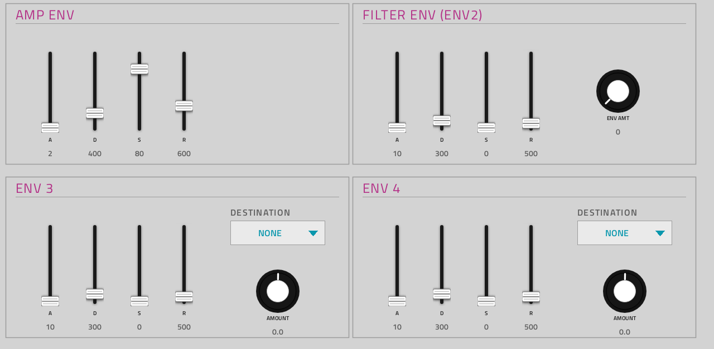
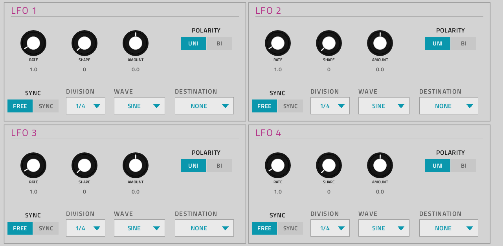
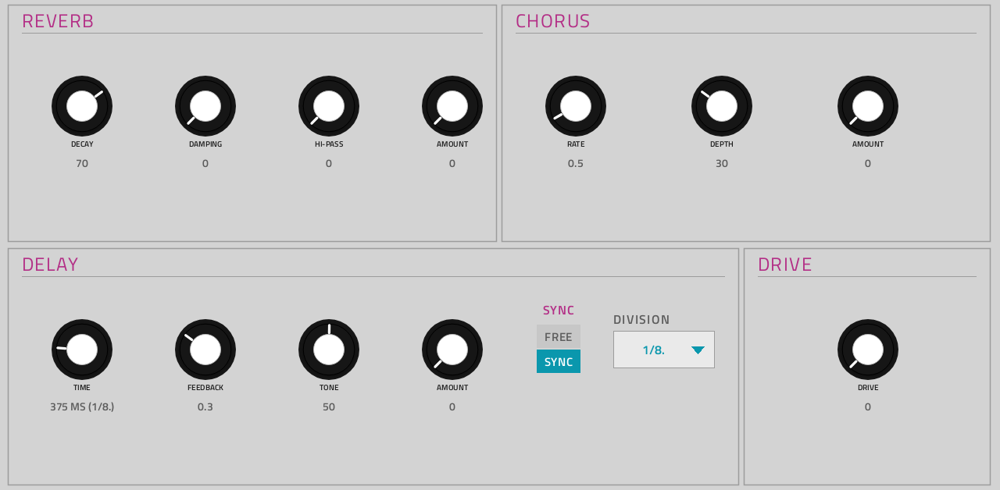
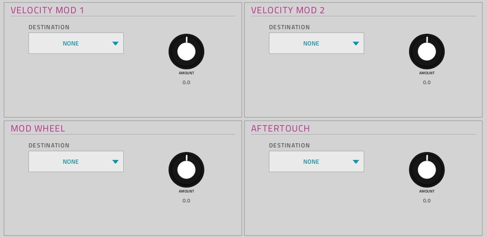

# Mutable Vibe

**Synth** · Mutable Instruments Rings and Plaits in one polyphonic instrument, with a filter, four LFOs, four envelopes and effects. · maker in MPC: nachtaktiv303 · licence: MIT


nachtaktiv303's MPC instrument: 20 engines, six Rings resonator modes (`R:`) and 14 Plaits models (`P:`), behind one
set of four macro knobs that take each engine's own names (STRUCTURE, BRIGHTNESS, DAMPING, POSITION on Rings;
HARMONICS, TIMBRE, MORPH, LPG COLOR on Plaits). Around them: a state-variable filter with its own envelope, two
assignable envelopes, four LFOs (free or synced to MPC's tempo), velocity, mod wheel and aftertouch routing, and
reverb, tape delay, chorus and drive.

It was written for MPC OS by nachtaktiv303 on sd88me's framework, like the ports here; this repo builds it from the
author's source with its own copy of the framework, keeps the author's screen, and changes what its Q-Links do (one
column per panel, see below and `DESIGN-QA.md`). Upstream has no presets, so the PRESET menu is empty for now.

## On the MPC

- In the plugin browser: **[SYN] Mutable Vibe** by **nachtaktiv303** (Synth)
- Files: `/sdcard/vst/mutablevibe.so`, screen in `/sdcard/Synths/nachtaktiv303 - VST - [SYN] Mutable Vibe/`
- 95 parameters (all automatable) on 5 pages; ENVELOPES and LFOS have two Q-Link sub-pages each

## Playing it

Add it to a **plugin track** and play it from the pads, a keyboard or a MIDI clip. POLY sets how many Rings voices
sound at once (the Plaits engines are always four-voice). Every control can be turned with the Q-Links and automated,
and the settings are saved with your project. MIDI CC 20-35 move the OVERVIEW page's Q-Links (CC 20 = MODEL), as on
every plugin here.

## Pages

Screenshots are rendered from the built skin with the engine's real values right after it's inserted. On the MPC each page is a tab under the plugin header. The Q-Links follow the page column by column: on a 4-knob MPC the Q-Link button steps through the columns, and MPC outlines the active one.

### 1. OVERVIEW


Q-Link columns: **1** MODEL, STRUCTURE, BRIGHTNESS, DAMPING  ·  **2** POSITION, LPG DECAY, POLYPHONY, OCTAVE  ·  **3** SLOPE, CUTOFF, RESONANCE, FILTER ENV  ·  **4** REVERB AMT, DELAY AMT, CHORUS AMT, DRIVE

### 2. ENVELOPES



Q-Link columns (bank 1): **1** ATTACK, DECAY, SUSTAIN, RELEASE  ·  **2** ATTACK, DECAY, SUSTAIN, RELEASE  ·  **3** FILTER ENV

Q-Link columns (bank 2): **1** ATTACK, DECAY, SUSTAIN, RELEASE  ·  **2** DEST, AMOUNT  ·  **3** ATTACK, DECAY, SUSTAIN, RELEASE  ·  **4** DEST, AMOUNT

### 3. LFOS



Q-Link columns (bank 1): **1** LFO1 RATE, LFO1 SHAPE, LFO1 AMOUNT, LFO1 POLARITY  ·  **2** LFO1 SYNC, LFO1 DIV, LFO1 WAVE, LFO1 DEST  ·  **3** LFO2 RATE, LFO2 SHAPE, LFO2 AMOUNT, LFO2 POLARITY  ·  **4** LFO2 SYNC, LFO2 DIV, LFO2 WAVE, LFO2 DEST

Q-Link columns (bank 2): **1** LFO3 RATE, LFO3 SHAPE, LFO3 AMOUNT, LFO3 POLARITY  ·  **2** LFO3 SYNC, LFO3 DIV, LFO3 WAVE, LFO3 DEST  ·  **3** LFO4 RATE, LFO4 SHAPE, LFO4 AMOUNT, LFO4 POLARITY  ·  **4** LFO4 SYNC, LFO4 DIV, LFO4 WAVE, LFO4 DEST

### 4. EFFECTS



Q-Link columns: **1** REVERB DECAY, REVERB DAMPING, REVERB HI-PASS, REVERB AMT  ·  **2** CHORUS RATE, CHORUS DEPTH, CHORUS AMT  ·  **3** DELAY TIME, DELAY FEEDBACK, DELAY TONE, DELAY AMT  ·  **4** DELAY SYNC, DELAY DIV, DRIVE

### 5. MOD



Q-Link columns: **1** VEL1 DEST, VEL1 AMT  ·  **2** VEL2 DEST, VEL2 AMT  ·  **3** MW DEST, MW AMT  ·  **4** AT DEST, AT AMT

## Install

From the top of this repo (see [INSTALL.md](../../INSTALL.md)):

```
./install.sh <mpc-address> mutablevibe
```

## Where it comes from

- [nachtaktiv303/mpc-vst-mutable-vibe](https://github.com/nachtaktiv303/mpc-vst-mutable-vibe) v0.9 (commit in
  `UPSTREAM`): the engine, the DSP glue and the screen, by nachtaktiv303; tested by its author on an MPC One.
- DSP: Mutable Instruments Rings and Plaits by Emilie Gillet (MIT), vendored in `src/dsp/eurorack/`
  (`src/VENDORED.md` says what and how).
- Licence: MIT ([LICENSE](LICENSE), with the Mutable Instruments notice).

## Changes for the MPC

What this repo changed from upstream (the diff is in `upstream-changes.diff`):

- Name and files: **[SYN] Mutable Vibe**, `mutablevibe.so` (upstream: "Mutable Vibe MPC", `mutable_vibe_mpc.so`); the
  same plugin ID (`MtVb`) and maker.
- Q-Links: one column per panel on every page (they ran across panels). On LFOS each LFO's two columns are its two
  rows, so POLARITY moved up beside the knobs and SYNC down beside DIVISION. POLY, SLOPE and the SYNC switches are on
  the Q-Links now too.
- The four effect levels were all named AMOUNT, which is what MPC shows under a knob and on its Q-Link: now REVERB AMT,
  DELAY AMT, CHORUS AMT and DRIVE. LPG DECAY's own name was blank (the engine names it on the Plaits models only, where
  it does something); it reads LPG DECAY wherever MPC lists parameters by their fixed names.
- Touch boxes: the envelope sliders' and MODEL's no longer overlap their neighbours'; on LFOS and ENV 3-4 a few
  controls moved 10-20 px so no Q-Link outline touches another.
- POLY and the LFO DIVISION lists tell the wrapper the engine reports them by position (`send`): with this repo's
  framework a reported `2` read as the label "2" (2 bars), not 1/4.
- Built with this repo's framework, which gained what the port uses from newer upstream builds: per-model names and
  value text (`dynamic_name`, `dynamic_display`); `mpc/engine.h` is a copy of the framework's engine interface.

## Files

| Path | What |
|---|---|
| `screenshots/` | the pages as MPC draws them |
| `deploy/` | ready to install: `vst/` → `/sdcard/vst/`, `Synths/` → `/sdcard/Synths/`, plus the plugin-list entry |
| `vst.json` | build settings: name, maker, sources, compiler flags |
| `params.json` | the plugin's parameters as MPC sees them (VST index = order) |
| `layout.conf` | the screen: control positions, Q-Links |
| `mutablevibe.css` | the artwork stylesheet |
| `mpc/engine.h` | the framework's engine interface the engine implements |
| `src/` | the engine and DSP, vendored from upstream |
| `design/upstream/` | the author's README, screenshots and test record, for reference |
| `UPSTREAM`, `upstream-changes.diff` | where it comes from, and what this repo changed |

To rebuild from source see [BUILDING.md](../../BUILDING.md); to change the screen, [RESKINNING.md](../../RESKINNING.md).
