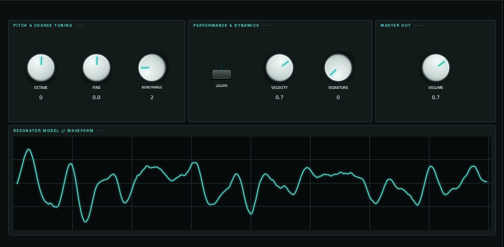

# Elements

**Synth** · Mutable Instruments Elements: a modal synthesis voice you bow, blow and strike, with 12 presets. · maker in MPC: Mutable Instruments · licence: MIT


Elements models an acoustic instrument in two halves. The exciter bows, blows (with a flow of noise through a tube) or strikes (mallets, plectrums, particles); the resonator is a bank of modes that rings like a string, a plate, a bar or a bell, with GEOMETRY, BRIGHTNESS, DAMPING and POSITION shaping it, followed by a stereo reverb space. This port runs Mutable's own Elements DSP: MIDI notes become the module's gate, pitch and strike strength (velocity), and LEGATO lets a held note glide without re-striking. MODEL's fourth entry is the module's hidden "Ominous" voice. Page 1 is laid out like the module's panel.

## On the MPC

- In the plugin browser: **[SYN] Elements** by **Mutable Instruments** (Synth)
- Files: `/sdcard/vst/elements.so`, screen in `/sdcard/Synths/Mutable Instruments - VST - [SYN] Elements/`
- 22 parameters (all automatable) on 2 pages

## Playing it

Add it to a **plugin track** and play it from the pads, a keyboard or a MIDI clip. Every control can be turned with the Q-Links and automated, and the settings are saved with your project.

## Pages

Screenshots are rendered from the built skin with the engine's real values right after it's inserted. On the MPC each page is a tab under the plugin header. The Q-Links follow the page column by column: on a 4-knob MPC the Q-Link button steps through the columns, and MPC outlines the active one.

### 1. ELEMENTS


Q-Link columns (bank 1): **1** BOW, BOW TIMBRE  ·  **2** BLOW, FLOW, BLOW TIMBRE  ·  **3** STRIKE, MALLET, STRK TIMBRE  ·  **4** GEOMETRY, BRIGHTNESS, DAMPING, POSITION

Q-Link columns (bank 2): **1** CONTOUR  ·  **2** MODEL  ·  **3** SPACE

### 2. PLAY



Q-Link columns: **1** OCTAVE, FINE, BEND RANGE  ·  **2** LEGATO, VELOCITY, SIGNATURE  ·  **3** VOLUME

## Install

From the top of this repo (see [INSTALL.md](../../INSTALL.md)):

```
./install.sh <mpc-address> elements
```

## Where it comes from

- Upstream: https://github.com/pichenettes/eurorack (elements/)
- Vendored at commit 08460a69a7e1f7a81c5a2abcc7189c9a6b7208d4 2023-08-16
- Licence: MIT ([`LICENSE`](LICENSE))
- MPC port and screen: this repo, built on [sd88me's mpc-vst-plugins](https://github.com/sd88me/mpc-vst-plugins) (wrapper, Schwung adapter, skin tools).

## Changes for the MPC

- Not a Move module: `mpc/elements_engine.cc` drives Mutable's `elements::Part`: MIDI notes are GATE (held while any note is down, last note priority), V/OCT and STRENGTH (velocity); LEGATO skips the re-strike. Panel smoothing as the module's. SIGNATURE reseeds the per-unit variations the module takes from its serial number. Runs at Elements' own 32 kHz, resampled to 44.1 kHz.
- `src/elements/drivers/debug_pin.h` is vendored only because `resonator.cc` includes it (a no-op with `-DTEST`).
- `src/stmlib/dsp/dsp.h` (`-DMPC_PORT`, 2026-10-02): `Interpolate` clamps its index; a control at exactly 100% read one past a lookup table (found with dev-tools/fuzz). Diff: `upstream-changes.diff`.
- New touchscreen page from its Google Stitch design (`design/`): the design's artwork as the background, its own knob art, live names and values, and controls the design left out added in its style (see RESKINNING.md).

## Files

| Path | What |
|---|---|
| `screenshots/` | the pages as MPC draws them |
| `deploy/` | ready to install: `vst/` → `/sdcard/vst/`, `Synths/` → `/sdcard/Synths/`, plus the plugin-list entry (its presets/kits are in the repo's `presets/` folder, not here) |
| `vst.json` | build settings: name, maker, sources, compiler flags |
| `params.json` | the plugin's parameters as MPC sees them (VST index = order) |
| `params.base.json` | the engine's own parameter list it was derived from |
| `layout.conf` | the screen: control positions, art, Q-Links (generated from the Stitch design) |
| `layout.grid.conf` | the plan of pages and controls the Stitch conversion fills in |
| `elements.css` | the artwork stylesheet |
| `images/` | artwork: backgrounds, knobs, displays |
| `design/` | the Google Stitch design this screen was converted from (`stitch.html`, as Stitch wrote it) |
| `src/` | the engine's source, vendored from upstream |
| `mpc/` | MPC-side glue: the engine wrapper or MIDI/audio adapter, and headers |
| `upstream-changes.diff` | every local change to the upstream source |
| `UPSTREAM` | where the source came from, and at which commit |

To rebuild from source see [BUILDING.md](../../BUILDING.md); to change the screen, [RESKINNING.md](../../RESKINNING.md).
