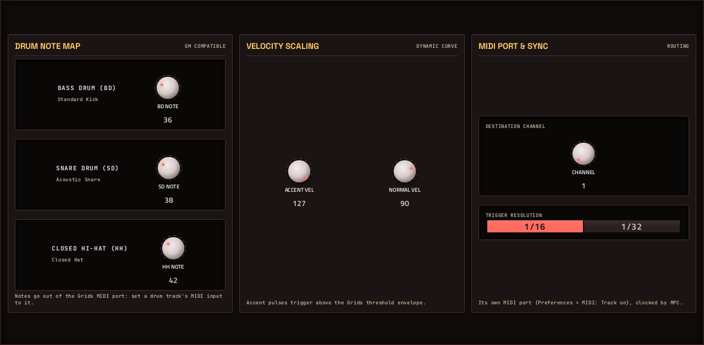

# Grids

**MIDI sequencer** · Mutable Instruments Grids: a topographic drum sequencer that plays a drum track from MPC's clock. · maker in MPC: Mutable Instruments · licence: GPL-3.0


Grids holds a map of drum patterns learned from real grooves. MAP X and MAP Y pick a spot on the map, the three FILL knobs set how busy the kick, snare and hi-hat parts are, and CHAOS perturbs the pattern so it breathes. Switch to EUCLIDEAN mode and the fills and three LENGTHs make Euclidean rhythms instead. It needs no notes: press play and it sends kick/snare/hat notes (with accents) out of its own MIDI port to a drum program, locked to MPC's tempo and bar. Ported from Mutable's original AVR code, rewritten so each instance has its own state.

## On the MPC

- In the plugin browser: **Grids** by **Mutable Instruments** (Sequencer)
- Files: `/sdcard/vst/grids.so`, screen in `/sdcard/Synths/Mutable Instruments - VST - Grids/`
- 18 parameters (all automatable) on 2 pages

## Playing it

MPC OS ignores a plugin's own MIDI output, so Grids opens its own MIDI port (named **Grids**, port **MIDI Out**), the way a USB MIDI device would appear. MPC picks the port up without a restart:

1. Put Grids on a plugin track. It needs no notes: it plays when MPC's transport runs.
2. **Menu → Preferences → MIDI**: switch **Track** on for the Grids port.
3. On the track(s) that should play, set **MIDI input** to that port (not *All*, and not on Grids's own track, or it hears itself).
4. Press play: it follows MPC's tempo and transport (MIDI clock from the plugin host).

Grids makes no sound of its own.

## Pages

Screenshots are rendered from the built skin with the engine's real values right after it's inserted. On the MPC each page is a tab under the plugin header. The Q-Links follow the page column by column: on a 4-knob MPC the Q-Link button steps through the columns, and MPC outlines the active one.

### 1. GRIDS


Q-Link columns: **1** MAP X, MAP Y, CHAOS  ·  **2** BD FILL, SD FILL, HH FILL  ·  **3** MODE, SWING  ·  **4** BD LEN, SD LEN, HH LEN

### 2. NOTES



Q-Link columns: **1** BD NOTE, SD NOTE, HH NOTE  ·  **2** ACCENT VEL, NORMAL VEL  ·  **3** CHANNEL, RESOLUTION

## Install

From the top of this repo (see [INSTALL.md](../../INSTALL.md)):

```
./install.sh <mpc-address> grids
```

## Where it comes from

- Upstream: https://github.com/pichenettes/eurorack (grids/)
- Vendored at commit 08460a69a7e1f7a81c5a2abcc7189c9a6b7208d4 2023-08-16
- Licence: GPL-3.0 ([`LICENSE`](LICENSE))
- MPC port and screen: this repo, built on [sd88me's mpc-vst-plugins](https://github.com/sd88me/mpc-vst-plugins) (wrapper, Schwung adapter, skin tools).

## Changes for the MPC

- Not a Move module: `src/grids_fx.c` is Grids' pattern generator rewritten as a per-instance Schwung MIDI FX module (the original is a single static AVR class); `src/grids_maps.h` holds its drum maps and Euclidean table unchanged. GPL-3.0, like Grids' AVR code.
- Steps follow the MIDI clock from MPC's transport: RESOLUTION 1/16 reads every other map step (the module on a 4 PPQN clock), 1/32 all of them. Start lines up with MPC's bar. Accents = ACCENT VEL.
- `mpc/` = the MIDI FX adapter (`dev-tools/midifx/schwung_midi_fx.c`), Schwung's host headers and `wrapper/engine.h`. The adapter opens an ALSA MIDI port named after the plugin, sends the module's notes there, and turns MPC's transport (tempo, position, play/stop) into the 24-PPQN MIDI clock and Start/Stop the module expects.
- `mpc/host/plugin_api_v1.h`: its `offsetof(reserved) == 120` assert is a 64-bit (Move) layout check, so it is skipped on the MPC's 32-bit ARM (the module and adapter share the one header).
- New touchscreen page from its Google Stitch design (`design/`): the design's artwork as the background, its own knob art, live names and values, and controls the design left out added in its style (see RESKINNING.md).
- Reports itself to MPC as a **Sequencer** (vst.json `"category"`), so the plugin browser can group it with sequencers instead of synths. Not yet checked on a device; the other sequencers still report Synth.

## Files

| Path | What |
|---|---|
| `screenshots/` | the pages as MPC draws them |
| `deploy/` | ready to install: `vst/` → `/sdcard/vst/`, `Synths/` → `/sdcard/Synths/`, plus the plugin-list entry (its presets/kits are in the repo's `presets/` folder, not here) |
| `vst.json` | build settings: name, maker, sources, compiler flags |
| `params.json` | the plugin's parameters as MPC sees them (VST index = order) |
| `params.base.json` | the engine's own parameter list it was derived from |
| `params.pre-stitch.json` | the parameter list before the Stitch screen renamed controls |
| `layout.conf` | the screen: control positions, art, Q-Links (generated from the Stitch design) |
| `layout.grid.conf` | the plan of pages and controls the Stitch conversion fills in |
| `grids.css` | the artwork stylesheet |
| `images/` | artwork: backgrounds, knobs, displays |
| `design/` | the Google Stitch design this screen was converted from (`stitch.html`, as Stitch wrote it) |
| `src/` | the engine's source, vendored from upstream |
| `mpc/` | MPC-side glue: the engine wrapper or MIDI/audio adapter, and headers |
| `UPSTREAM` | where the source came from, and at which commit |

To rebuild from source see [BUILDING.md](../../BUILDING.md); to change the screen, [RESKINNING.md](../../RESKINNING.md).
