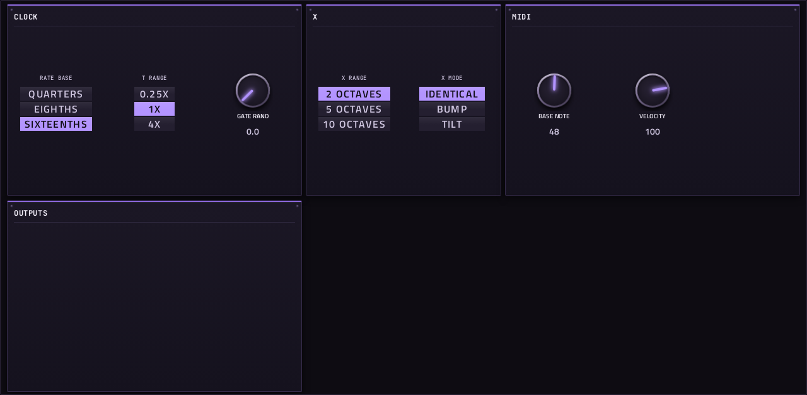

# Marbles

**MIDI sequencer** · Mutable Instruments Marbles: a random sampler that plays up to three tracks. · maker in MPC: Mutable Instruments · licence: MIT


Marbles generates random rhythms and melodies you can steer. The T section makes three related gate streams (T1, T2, T3) with controllable rate, bias and jitter; the X section makes random voltages quantised to a scale, with SPREAD, BIAS and STEPS shaping their distribution. DEJA VU makes both loop: turn it up and the randomness repeats. This port runs Mutable's own T and X generators clocked from MPC's tempo, and plays T1/T2/T3 as notes of pitch X1/X2/X3 on MIDI channels 1, 2 and 3 (or all on 1), out of its own MIDI port. SETUP holds what the module keeps in its menus (scales, ranges, clock ratio).

## On the MPC

- In the plugin browser: **[SEQ] Marbles** by **Mutable Instruments** (Sequencer)
- Files: `/sdcard/vst/marbles.so`, screen in `/sdcard/Synths/Mutable Instruments - VST - [SEQ] Marbles/`
- 24 parameters (all automatable) on 2 pages

## Playing it

MPC OS ignores a plugin's own MIDI output, so Marbles opens its own MIDI port (named **Marbles**, port **MIDI Out**), the way a USB MIDI device would appear. MPC picks the port up without a restart:

1. Put Marbles on a plugin track. It needs no notes: it plays when MPC's transport runs.
2. **Menu → Preferences → MIDI**: switch **Track** on for the Marbles port.
3. On the track(s) that should play, set **MIDI input** to that port (not *All*, and not on Marbles's own track, or it hears itself).
4. Press play: it follows MPC's tempo and transport (MIDI clock from the plugin host).

Marbles makes no sound of its own.

## Pages

Screenshots are rendered from the built skin with the engine's real values right after it's inserted. On the MPC each page is a tab under the plugin header. The Q-Links follow the page column by column: on a 4-knob MPC the Q-Link button steps through the columns, and MPC outlines the active one.

### 1. MARBLES


Q-Link columns: **1** T MODEL, CLOCK DIV, T BIAS, JITTER  ·  **2** DEJA VU, LENGTH, T DEJA VU, X DEJA VU  ·  **3** SCALE, SPREAD, X BIAS, STEPS  ·  **4** CHANNELS, GATE LEN

### 2. SETUP



Q-Link columns: **1** RATE BASE, T RANGE, GATE RAND  ·  **2** X RANGE, X MODE  ·  **3** BASE NOTE, VELOCITY

## Install

From the top of this repo (see [INSTALL.md](../../INSTALL.md)):

```
./install.sh <mpc-address> marbles
```

## Where it comes from

- Upstream: https://github.com/pichenettes/eurorack (marbles/)
- Vendored at commit 08460a69a7e1f7a81c5a2abcc7189c9a6b7208d4 2023-08-16
- Licence: MIT ([`LICENSE`](LICENSE))
- MPC port and screen: this repo, built on [sd88me's mpc-vst-plugins](https://github.com/sd88me/mpc-vst-plugins) (wrapper, Schwung adapter, skin tools).

## Changes for the MPC

- Not a Move module: `src/marbles_fx.cc` runs Mutable's T and X/Y generators (unchanged, at 44.1 kHz) as a Schwung MIDI FX module. Their external clock is MPC's (RATE BASE pulses from the MIDI clock). T1/T2/T3 gates play X1/X2/X3 as notes (1 V = 1 octave above BASE NOTE) on channels 1/2/3. `src/marbles_scales.h` = the module's six preset scales.
- `mpc/` = the MIDI FX adapter (`dev-tools/midifx/schwung_midi_fx.c`), Schwung's host headers and `wrapper/engine.h`. The adapter opens an ALSA MIDI port named after the plugin, sends the module's notes there, and turns MPC's transport (tempo, position, play/stop) into the 24-PPQN MIDI clock and Start/Stop the module expects.
- `mpc/host/plugin_api_v1.h`: its `offsetof(reserved) == 120` assert is a 64-bit (Move) layout check, so it is skipped on the MPC's 32-bit ARM (the module and adapter share the one header).
- `src/stmlib/dsp/dsp.h` (`-DMPC_PORT`, 2026-10-02): `Interpolate` clamps its index; a control at exactly 100% read one past a lookup table (found with dev-tools/fuzz). Diff: `upstream-changes.diff`.
- New touchscreen page from its Google Stitch design (`design/`): the design's artwork as the background, its own knob art, live names and values, and controls the design left out added in its style (see RESKINNING.md).

## Files

| Path | What |
|---|---|
| `screenshots/` | the pages as MPC draws them |
| `deploy/` | ready to install: `vst/` → `/sdcard/vst/`, `Synths/` → `/sdcard/Synths/`, plus the plugin-list entry (its presets/kits are in the repo's `presets/` folder, not here) |
| `vst.json` | build settings: name, maker, sources, compiler flags |
| `params.json` | the plugin's parameters as MPC sees them (VST index = order) |
| `params.base.json` | the engine's own parameter list it was derived from |
| `layout.conf` | the screen: control positions, art, Q-Links (generated from the Stitch design) |
| `layout.grid.conf` | the plan of pages and controls the Stitch conversion fills in |
| `marbles.css` | the artwork stylesheet |
| `images/` | artwork: backgrounds, knobs, displays |
| `design/` | the Google Stitch design this screen was converted from (`stitch.html`, as Stitch wrote it) |
| `src/` | the engine's source, vendored from upstream |
| `mpc/` | MPC-side glue: the engine wrapper or MIDI/audio adapter, and headers |
| `upstream-changes.diff` | every local change to the upstream source |
| `UPSTREAM` | where the source came from, and at which commit |

To rebuild from source see [BUILDING.md](../../BUILDING.md); to change the screen, [RESKINNING.md](../../RESKINNING.md).
