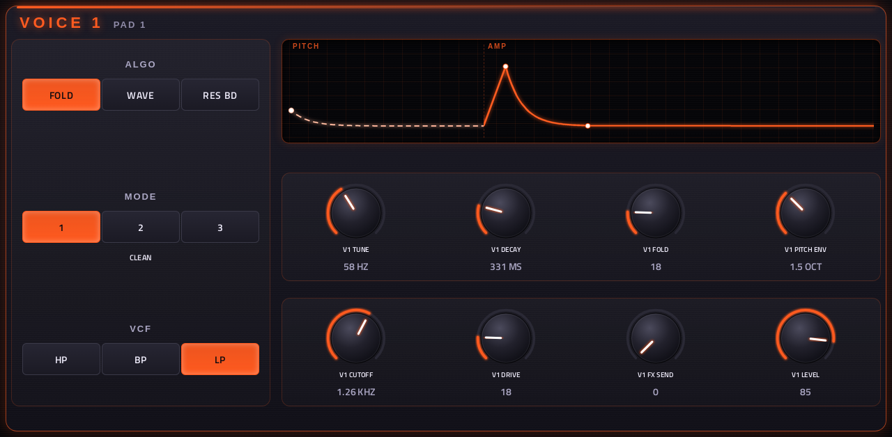
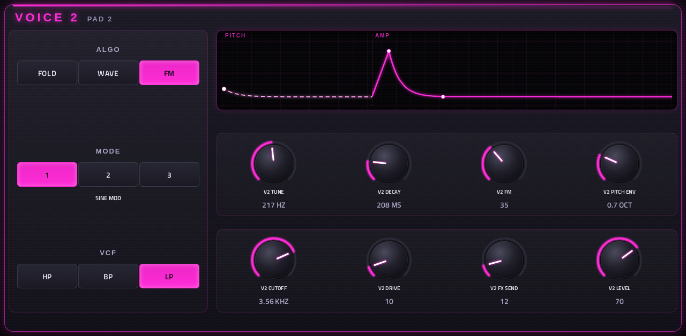
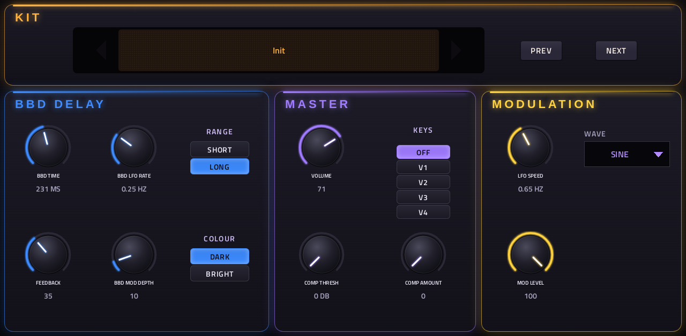
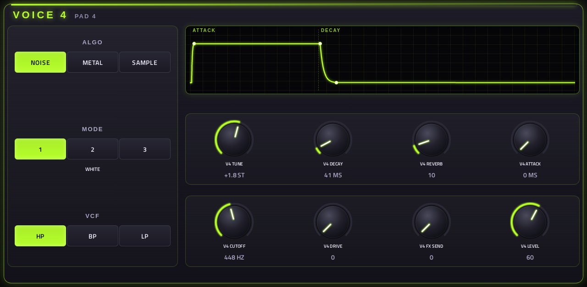

# Percolator

**Drum synth** · Four-voice percussion synth laid out like the Erica Synths Pērkons HD-01, with envelope displays; it plays the Pērkons' free kit packs. · maker in MPC: Steve A · written for this repo · licence: MIT ([`LICENSE`](LICENSE))



The Pērkons HD-01 is a four-voice hybrid drum machine: a digital engine per voice, then an analogue HP/BP/LP filter
and an overdrive, a BBD-style delay, a compressor and one LFO that can reach every knob. Percolator copies that
architecture and its panel (each voice has TUNE, DECAY, PARAM 1, PARAM 2, CUTOFF, DRIVE, FX SEND and LEVEL, plus ALGO,
MODE and VCF switches), and leaves out the sequencer: you play it from MPC's pads and sequencer.

**It is not an emulation.** The Pērkons firmware is a compiled binary for its own chip, and its DSP can't be read out
of it, so every algorithm here is written from scratch. The algorithm and parameter names follow the published
manuals for the HD-01 and the Perkons Voice module. A kit from a Pērkons pack keeps its structure (which algorithm,
which mode, where each knob is, the LFO, the delay), but it won't sound exactly like the hardware.

## On the MPC

- In the plugin browser: **[DRUM] Percolator** by **Steve A** (Drum Machine)
- Files: the release installs one folder, `/sdcard/Synths/Steve A - VST - [DRUM] Percolator/`, holding `percolator.so`, its screen. The vst_instruments installer puts `percolator.so` in `/sdcard/vst/` instead.
- Data folder: `percolator/` next to `percolator.so` (with the vst_instruments installer, `/sdcard/vst/percolator/`):
  where the kit packs go
- 93 parameters (all automatable) on 5 pages, one Q-Link page each
- 8 kits built in, in MPC's PRESET menu; Erica Synths' four free Pērkons kit packs add 169 more ([below](#pērkons-kit-packs))

## Playing it

- **Pads 1-4 of bank A (notes 20-23, G#-1-B-1)** play voices 1-4; other notes are silent unless KEYS is on (then every other note plays the chosen voice chromatically). Velocity sets the level.
- **KEYS** (MASTER page): pick a voice and every other note plays it pitched (C3 = as tuned); pitch bend bends it ±2
  semitones. OFF by default.
- **DECAY at the top = DRONE**: the voice sounds for as long as its note is held, then fades in 0.35 s (on the
  hardware a drone never stops; here the note length decides).
- CC 120 (all sound off) and 123 (all notes off) stop everything. MIDI CC 20-35 move the first page's Q-Links, and
  NRPN reaches any parameter (the wrapper's, as in every plugin here).

## The voices

| Voice | ALGO 1 | ALGO 2 | ALGO 3 |
|---|---|---|---|
| **1** (low, 12 Hz-770 Hz) | **FOLD**: sine through a wavefolder. P1 fold, P2 pitch envelope. Modes: clean, noise hit, pulse hit | **WAVE**: wavetable. P1 position, P2 pitch envelope. Modes: analog, formant, digital tables | **RES BD**: a pitched resonator struck like an 808. P1 pitch-envelope time, P2 pitch envelope. Modes: soft, punch, hard |
| **2** (mid, 25 Hz-2.3 kHz) | **FOLD** (as voice 1) | **WAVE** (as voice 1) | **FM**: two operators. P1 FM amount and ratio, P2 pitch envelope. Modes: sine, triangle, square modulator |
| **3** (snare) | **SNARE**: two resonators and filtered noise. P1 noise tone, P2 noise decay. Modes: classic, tight, metallic | **SLAP**: a clap, bursts of band-passed noise and a tail. P1 reverb, P2 filter. Modes: 3, 4 or 5 claps | **TOM**: a resonator with self-FM. P1 FM, P2 tone (click). Modes: flat, drop, deep drop |
| **4** (metal) | **NOISE**: P1 reverb, P2 attack. Modes: white, pulse stack (six square waves, 808 hat), crush | **METAL**: P1 reverb (PCM: size), P2 attack. Modes: cymbal, bell (FM), PCM noise | **SAMPLE**: three slots. P1 crush (sample rate and bits), P2 attack, or start/slice with a pack's samples. Modes: sample 1-3 |

PARAM 1 and PARAM 2 rename themselves on the MPC as the algorithm changes ("V1 FOLD", "V3 NOISE DECAY"), and TUNE,
DECAY, CUTOFF and the time-like params show their real units (Hz, ms, octaves, slice 3 / 8). The selected mode's name shows in
the panel's title bar.

After the engine, every voice has the same end: the filter (HP / BP / LP, 20 Hz-20 kHz, no resonance control, like
the hardware's), the overdrive, then LEVEL and the FX SEND to the delay.

**Voice 4's samples.** Without a pack, the three slots hold a closed hat, an open hat and a ride, synthesised at
start-up. A pack that comes with `SAMPLES/1.wav 2.wav 3.wav` (Pērkons pack 2 and 4) replaces them for its own kits.
Then PARAM 2 picks the start point or, when the WAV has cue points (pack 4's breaks), the slice. On the Pērkons this
needs two settings (Voice 4 / Algo 3 PARAM 2 = start, slicing on); here it follows from the pack having samples.

## Pages

Screenshots are rendered from the built skin with the engine's real values right after it's inserted (the Init kit).
Five tabs, each with one Q-Link page (no sub-pages to swipe between). Each voice has its own colour: 1 orange,
2 magenta, 3 cyan, 4 lime.

### 1-2. V1+V2, V3+V4




Two voices per page. At the top of each panel, the **envelope display** redraws as you turn its knobs: AMP follows
DECAY (a flat line at the top = DRONE), PITCH (voices 1-2) follows PARAM 2's pitch envelope, voice 4's ATTACK follows
its PARAM 2. Next to it ALGO, MODE and VCF; the mode's name is in the title bar. Then two rows of four knobs, each row
one Q-Link column: TUNE, DECAY, PARAM 1, PARAM 2 / CUTOFF, DRIVE, FX SEND, LEVEL, voice 1's rows on Q-Link columns
1-2, voice 2's on 3-4 (voices 3 and 4 the same on their page).

### 3. MASTER



**KIT**: every kit, built-in and loaded, also in MPC's PRESET menu. **BBD DELAY**: time (SHORT 8-200 ms, LONG 60 ms-1.2
s; moving it bends the pitch as a BBD clock would), feedback (it can run away), its own LFO rate and depth, and
COLOUR (dark or bright repeats). **MASTER**: volume, the compressor's threshold and amount, KEYS. **MODULATION**: the
LFO's speed (0.05-30 Hz), MOD LEVEL and wave (sine, triangle, ramp, saw, square, S&H, drift). Q-Link columns: BBD,
MASTER, MODULATION, then KIT.

### 4-5. MOD 1+2, MOD 3+4



How far the LFO moves each knob of each voice: OFF or 10 %-80 % (the hardware's MODULATION DESTINATION / DEPTH
buttons), laid out where the knobs are on the voice pages, with the LFO's wave, speed and MOD LEVEL shown live above
(MOD LEVEL scales them all).

## Kits

**Built in (8):** Init, Analog, Industrial, Clap Room, Tonal, Lo-Fi, Drone, Thunder.

### Pērkons kit packs

Erica Synths gives away four kit packs for the Pērkons, 169 kits in all. They aren't shipped with Percolator (they're
Erica's and their authors', and come without a licence to pass them on), but it reads them as they are: download,
unzip, copy the folder in.

| Pack | Kits | Download (Erica Synths) |
|---|---|---|
| Kit Pack 1 by Hrtl (2023) | 32: drums, bonks, polys, SFX | [Perkons_Kit_Pack_01_GuSQDTL1.zip](https://www.ericasynths.lv/service/file/download/product_id/1167/file_id/525/) (27 KB) |
| Kit Pack 2 by Hrtl (2025) | 32, and three samples for voice 4 | [PERKONS_KIT_PACK_2_kfMSLW4.zip](https://www.ericasynths.lv/service/file/download/product_id/1167/file_id/584/) (3 MB) |
| Kit Pack 3 by Pijus Džiugas Meižis (2025) | 59 (drones, sequences, chains) | [PERKONS_KIT_PACK_3.zip](https://www.ericasynths.lv/service/file/download/product_id/1167/file_id/616/) (3.8 MB) |
| Kit Pack 4 by Fat Frumos (2026) | 46 from the Thunder Cats EP, with sliced breaks | [PERKONS_KIT_PACK_4.zip](https://www.ericasynths.lv/service/file/download/product_id/1167/file_id/660/) (8 MB) |

The links are the Downloads on Erica's [Pērkons HD-01 page](https://www.ericasynths.lv/perkons-hd-01-black-2520/)
(checked 2026-10-10); if one moves, the page has them.

**To add them:**

1. Download the zips and unzip them on your computer. Each gives one folder (`Perkons Kit Pack 01`,
   `PERKONS KIT PACK 2`, ...). Leave its insides as they are; the `__MACOSX` folder and `.jpg`/`.png` files can go.
2. Copy those folders into Percolator's data folder on the MPC:
   - installed from this plugin's release: `/sdcard/Synths/Steve A - VST - [DRUM] Percolator/percolator/`
   - installed with vst_instruments' `install.sh`: `/sdcard/vst/percolator/`

   For example over SSH (as root, as for installing), from the folder you unzipped into; the first line makes the
   folder if it isn't there yet:
   ```
   ssh root@<mpc-address> 'mkdir -p "/sdcard/vst/percolator"'
   scp -r "PERKONS KIT PACK 2" root@<mpc-address>:"/sdcard/vst/percolator/"
   ```
   (for the release, the path in quotes is `/sdcard/Synths/Steve A - VST - [DRUM] Percolator/percolator`)
3. Remove Percolator from its track and insert it again (it reads the kits when it's inserted). The kits are in
   MPC's PRESET menu and on the MASTER page's KIT, after the built-in ones, as **Pack 1 01**, **Pack 2 05** and so on.

Updating or uninstalling the release keeps what you added in `percolator/`.

Notes on the packs:
- **Pack 2 and Pack 4** bring their own samples for voice 4's SAMPLE algorithm (they replace the built-in hats for
  that pack's kits). With Pack 4's, PARAM 2 picks a slice of the break (its WAVs carry slice markers).
- **Pack 3**: some kits have every LEVEL at 0 on purpose: Pijus's patterns bring the voices in with per-step
  automation, which a kit alone doesn't carry. Turn the LEVELs up, or sequence them.
- Only the kits are read: the packs' patterns (`.PAT`) are for the Pērkons' own sequencer.
- **Your own names:** a `names.txt` in a bank's folder (next to its `KITS/`) names its kits, one `NN Name` per line,
  e.g. `05 Dub Chord` lists kit 05 as "Pack 2 Dub Chord".

**Folders it reads** (in its data folder), so you can also lay kits out yourself:

```
<pack>/BANKS/NN/KITS/*.KIT   a pack as it unzips (2, 3) or a Pērkons SD card copied as it is
<pack>/NN/KITS/*.KIT         a pack as it unzips (1, 4)
<pack>/SAMPLES/1.wav 2.wav 3.wav   that pack's samples for voice 4 (16-bit WAV; cue points = slices)
<bank>/KITS/*.KIT            a bank of your own, listed as "<bank> NN" (its samples in <bank>/SAMPLES)
BANKS/NN/KITS/*.KIT          a whole Pērkons SD card copied into the data folder
```

What a kit file holds (protobuf, worked out from the packs; see `src/kits.c`): per voice the eight knobs (16 bits),
algorithm, mode and filter; the LFO's speed, wave and level, and a depth per knob; and, when the kit saved its FX,
the delay's time, feedback, LFO rate, depth and range. A kit without FX leaves the delay as it is (the hardware's
KIT FX off). Not read: patterns (`.PAT`), the sequencer, accent, the master volume and compressor.

## Install

Needs a standalone MPC or Force on MPC OS 3.x with root SSH access (checked on an MPC Live II).

**From the release:** download `DRUM-Percolator-<version>-mpc-armv7.zip` from [Releases](https://github.com/saustin2010/mpc-vst-percolator/releases),
copy it to the MPC, unzip it and run `sh install.sh` in its folder as root. The installer stops MPC, backs up
`MPC.settings`, installs the plugin folder and starts MPC again; `INSTALL.md` in the zip has the details and a by-hand route.
Your own files in `percolator/` are kept when you update or uninstall.

**With the rest of the collection:** from [vst_instruments](https://github.com/saustin2010/vst_instruments) ([INSTALL.md](https://github.com/saustin2010/vst_instruments/blob/main/INSTALL.md)):

```
./install.sh <mpc-address> percolator
```

Use one or the other for this plugin: both register the same plugin (same uid), so the last one run wins.

## How it's made

- `src/percolator.c`: parameters, MIDI, the LFO, the BBD delay, compressor and state; `src/voices.c`: the twelve
  algorithms and each voice's filter, drive and level; `src/kits.c`: the built-in kits, the `.KIT` reader, WAV and
  cue loading; `src/dsp.h`. The engine is plain C (`mpc_engine` API), with no upstream code.
- `mpc/gen.py` writes `params.json`, `src/params_def.h`, `layout.conf` and `build/skin.json` from one list
  (parameters are append-only). `mpc/skin.py` draws the artwork from that in the `mpc-vst-html-art` container (page
  backgrounds from HTML, a knob filmstrip per colour, the switch segments), and `mpc/displays.py` the envelope
  displays (one frame per knob position, so nothing animates). Change those, not their output:
  ```
  python3 mpc/gen.py
  docker run --rm -v "$PWD:$PWD" -w "$PWD" mpc-vst-html-art python3 mpc/skin.py build/skin.json
  ```
- `mpc/render.c` renders kits offline to WAV (each voice alone, then a groove), no MPC needed:
  ```
  cc -O2 -Isrc mpc/render.c src/percolator.c src/voices.c src/kits.c -lm -lpthread -o build/render
  build/render <data folder> build/demo [kit numbers]
  ```
- Sources for the design: [Sound On Sound's HD-01 review](https://www.soundonsound.com/reviews/erica-synths-perkons-hd-01),
  the [Perkons Voice manual](https://www.analoguehaven.com/erica-synths/perkons-voice/manual.pdf) (its algorithm
  table) and the [HD-01 manual](https://www.manualslib.com/manual/2588218/Erica-Synths-Perkons-Hd-01.html). The kit
  format was worked out from the packs themselves.

## Status (2026-10-10)

- Build and offline host test PASSED (ARM `.so`, the x86 test under ASan/UBSan with the four packs mounted: two
  instances, every parameter, Q-Links, pop-ups, CC and NRPN, chunk restore, 177 kits named in the PRESET menu);
  `check_skin.py`: OK. Every algorithm and mode measured offline (level, DC, clicks).
- On an MPC Live II (as "Perculator", the first screen): `bench.sh` idle 1.1 %, playing 1.9 %, Q-Link sweep p99 4.0 %,
  worst block 4.3 %: PASS.
- To check on the device with this screen: the per-voice knob filmstrips, lit switches and envelope displays.

## Files

| Path | What |
|---|---|
| `screenshots/` | the pages as MPC draws them |
| `.github/workflows/release.yml` | the release build (GitHub Actions, a draft release) |
| `FRAMEWORK.md` | the changes to sd88me's tools this plugin is built with, and why |
| `deploy/` | ready to install: `vst/` → `/sdcard/vst/`, `Synths/` → `/sdcard/Synths/`, plus the plugin-list entry |
| `vst.json` | build settings: name, maker, sources, the kit list in the PRESET menu |
| `params.json` | the plugin's parameters as MPC sees them (VST index = order; append-only once released) |
| `layout.conf` | the screen: five pages, Q-Links (generated) |
| `percolator.css` | the artwork stylesheet |
| `images/skin/` | artwork: page backgrounds, knob filmstrips, switch segments, envelope displays (generated) |
| `src/`, `mpc/` | the engine, the generators, the offline renderer |

## Building

With Docker (32-bit ARM emulation for the build), Python 3 and the tools from
[saustin2010/mpc-vst-plugins](https://github.com/saustin2010/mpc-vst-plugins/tree/steve-features) (sd88me's [mpc-vst-plugins](https://github.com/sd88me/mpc-vst-plugins)
plus changes offered to it, until they're merged there; the commit is the one in `.github/workflows/release.yml`, and [FRAMEWORK.md](FRAMEWORK.md) says which changes this plugin uses and why):

```
git clone -b steve-features https://github.com/saustin2010/mpc-vst-plugins
MPC_VST=$PWD/mpc-vst-plugins
bash "$MPC_VST/tools/build_port.sh" vst.json        # build/: percolator.so, the screen, the plugin-list entry
bash "$MPC_VST/tools/test_port.sh" vst.json         # the offline host test (ASan/UBSan): must print PASSED
```

Releases are built by GitHub Actions (`.github/workflows/release.yml`, "Release (draft)") as a draft, installed and checked
on a device, then published. More: [BUILDING.md](https://github.com/saustin2010/vst_instruments/blob/main/BUILDING.md), and to change the screen, [RESKINNING.md](https://github.com/saustin2010/vst_instruments/blob/main/RESKINNING.md).

## Development

This plugin is developed in [vst_instruments](https://github.com/saustin2010/vst_instruments) (`originals/percolator`), next to the other plugins
and the tools that made its screen, and published to [mpc-vst-percolator](https://github.com/saustin2010/mpc-vst-percolator) for its
releases. Issues and pull requests are welcome in either.
