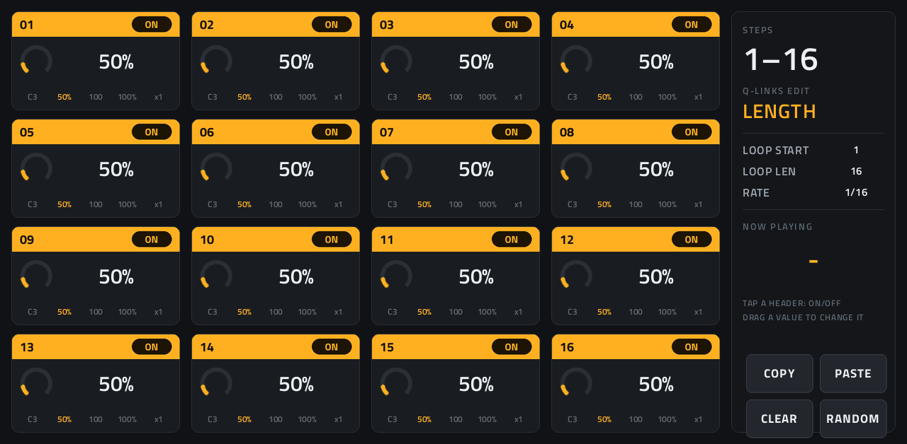
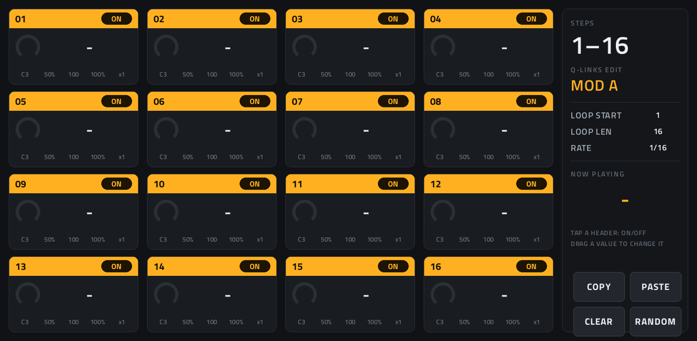
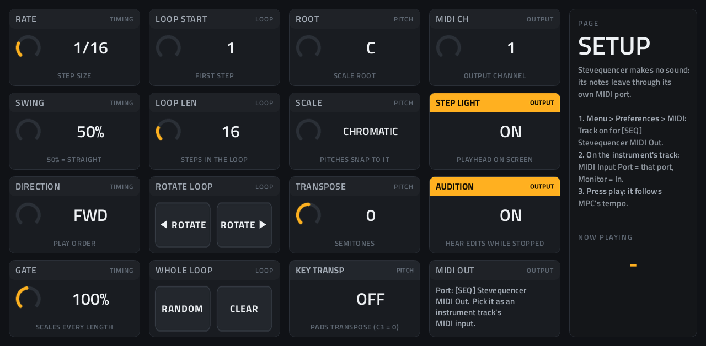
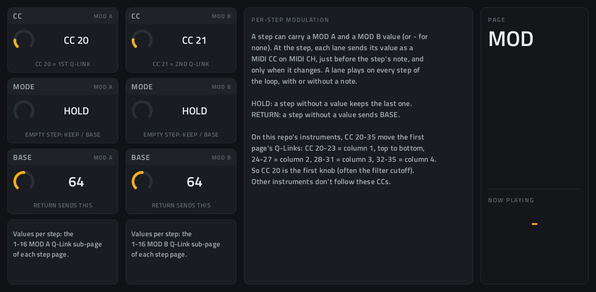

# Stevequencer

**MIDI step sequencer** · 16 steps on a 4x4 grid, up to four pages (64 steps), edited from the Q-Links. · maker in MPC: Steve A · written for this repo


A melodic step sequencer in the spirit of the ZAQ Audio Zaquencer (the sequencer in Behringer's BCR32). Every step has
a pitch, a length, on/off, a velocity, a chance and ratchets, plus two modulation values (MOD A, MOD B) that move the
instrument's controls per step, and the Q-Links edit one of them at a time for 16 steps at once. The loop can cover one page or run across all four; a scale keeps the pitches in key; swing, play directions,
transpose and a key transpose from the pads shape it further. It makes no sound itself: its notes go out of its own
MIDI port to whatever track you point at it.

## On the MPC

- In the plugin browser: **[SEQ] Stevequencer** by **Steve A** (Sequencer)
- Files: `/sdcard/vst/stevequencer.so`, screen in `/sdcard/Synths/Steve A - VST - [SEQ] Stevequencer/`
- 552 parameters (all automatable) on 6 pages; each step page has 8 Q-Link sub-pages
- 20 patterns in MPC's PRESET menu: Init, Bass Line, Acid Line, Arp Climb, Offbeat Stabs, Drunk Walk, and 14 seeded
  random ones (2026-10-04): Minor Pulse, Pentatonic Rain, Dorian Groove, Phrygian Run, Lydian Float, Blues Shuffle,
  Whole Tone Drift, Ratchet Stabs, Pendulum Arp, Garden Chance, Harmonic Steps, Low Slow Bass, Five of Eight,
  Sixty-Four Walk. Acid Line, Dorian Groove, Lydian Float, Harmonic Steps, Five of Eight and Sixty-Four Walk use the
  MOD lanes.
- Installed and working on the Live II (2026-10-04); a few things still to measure there: see "To check on the device"

## Playing it

The walk-through, with what to check when nothing plays: [docs/sequencers.md](../../docs/sequencers.md). In short: put
Stevequencer and an instrument on two tracks; **Menu → Preferences → MIDI**: **Track** on for
**[SEQ] Stevequencer MIDI Out**; on the instrument's track, **MIDI Input Port** = that port and **Monitor** = **In**;
press play. Stevequencer plays by itself while the transport runs (no notes needed) and follows MPC's tempo, locked to
its bars: starting mid-song or looping lands on the right step.

## Pages

Screenshots are rendered from the built skin with the engine's real values right after it's inserted (every step on,
C3). On the MPC each page is a tab under the plugin header.

### 1–4. Steps 1-16, 17-32, 33-48, 49-64


Each step is a cell: **tap its header** to switch it on or off; **drag its big value** up or down to change it; the
footer shows its pitch, length, velocity, chance and ratchets. The playing step is outlined (STEP LIGHT), and **NOW
PLAYING** on the right shows it from any page. The right strip also has the loop and rate, and the page tools: **COPY**
and **PASTE** a page (one clipboard), **CLEAR** (all its steps off) and **RANDOM** (new pitches in the scale, new gates
and velocities).

**Q-Link sub-pages.** Each step page has eight, in this order: **PITCH, LENGTH, ON/OFF, VELO, CHANCE, RATCHET, MOD A,
MOD B** (MPC's tab shows which: `1-16 PITCH`, `1-16 LENGTH` …). They change what the Q-Links edit, and with it the cells' big value
and the highlighted footer value, so touch and the knobs always edit the same thing:



Q-Link columns (every sub-page, its value of): **1** steps 1, 5, 9, 13  ·  **2** 2, 6, 10, 14  ·  **3** 3, 7, 11, 15  ·
**4** 4, 8, 12, 16 (on the other pages, the same cells: 17, 21, 25, 29 …). On a 4-knob MPC the Q-Link button steps
through the columns and MPC outlines the active one.

On **MOD A** and **MOD B** a cell's big value is the step's modulation value, **-** for none (see "Per-step
modulation" below):



### 5. SETUP



Q-Link columns: **1** RATE, SWING, DIRECTION, GATE  ·  **2** LOOP START, LOOP LEN  ·  **3** ROOT, SCALE, TRANSPOSE,
KEY TRANSP  ·  **4** MIDI CH, STEP LIGHT, AUDITION. Touch only: ROTATE the loop left or right, RANDOM or CLEAR the
whole loop.

### 6. MOD



Q-Link columns: **1** MOD A CC, MOD A MODE, MOD A BASE  ·  **2** MOD B CC, MOD B MODE, MOD B BASE.

## How it plays

- **Rate and swing:** RATE 1/32 to 1 bar, triplets included. SWING 50-75% delays every second step (66% = triplet feel).
- **Loop:** LOOP START and LOOP LEN (1-64) pick the steps; a loop can cross pages and wraps past 64. DIRECTION: FWD, REV,
  PEND (back and forth, ends not repeated), RANDOM, DRUNK (one step either way).
- **Per step:** PITCH C1-C6 (MPC note names, C3 = 60); LENGTH 5-400% of a step (over 100% holds into the next step,
  legato on a mono synth; the same note again is retriggered); VELO 1-127; CHANCE 0-100% (rolled once per pass);
  RATCHET x1-x4 (repeats inside the step). GATE scales every length.
- **Scale:** ROOT + SCALE (chromatic, major, minor, the modes, harmonic/melodic minor, pentatonics, blues, whole tone).
  A pitch you set lands on the scale, and a one-step Q-Link turn moves to the next scale note (no dead ticks). Changing
  the scale re-maps the pattern as it plays.
- **Transpose:** TRANSPOSE ±24 semitones. With KEY TRANSP on, a note played on Stevequencer's own track transposes the
  sequence from C3 (latched, like a 303 or SQ-1).
- **AUDITION:** with the transport stopped, editing a step's pitch or switching it on plays its note.
- **MIDI CH:** the channel it sends on (1-16).

## Per-step modulation (MOD A, MOD B)

Each step can carry a MOD A and a MOD B value, 0-127, or **-** for none. At the step, each lane sends its value as a
MIDI CC on MIDI CH, just before the step's note (so the note starts with it), and only when the value changes. A lane
plays on every step of the loop, with or without a note, so it can also run on its own. On the MOD page:

- **CC:** the controller each lane sends (default MOD A = CC 20, MOD B = CC 21; OFF = the lane sends nothing).
- **MODE:** HOLD keeps the last value on a step without one; RETURN sends **BASE** there.

**What they move:** this repo's instruments and effects take **CC 20-35** as their first page's Q-Links, in Q-Link
order: CC 20-23 = column 1, top to bottom, 24-27 = column 2, 28-31 = column 3, 32-35 = column 4 (the wrapper's CC map,
2026-10-04). So MOD A on CC 20 moves the instrument's first knob, which on most of the synths is the filter cutoff.
It needs no MIDI learn and no setting in MPC: the instrument's track already takes Stevequencer's port as its MIDI input
for the notes. Akai's own instruments don't follow these CCs. The **Acid Line** preset has a MOD A sweep to try.

## Try it in a browser

[`design/prototype.html`](design/prototype.html) (open it in Chrome) is the design it was built from: the same screen,
Q-Links (16 knobs, or 4 and the Q-Link button), and the same sequencing logic in JavaScript, playing a small synth.
It predates the MOD lanes and doesn't have them.

## Install

From the top of this repo (see [INSTALL.md](../../INSTALL.md)):

```
./install.sh <mpc-address> stevequencer
```

## How it's made

- `src/stevequencer.c`: the engine, a Schwung `midi_fx_api_v1` module. Each block it reads MPC's song position and
  tempo, works out which step boundaries fall in the block, and schedules notes (swing, ratchets, lengths) and the
  MOD lanes' CCs in samples. `mpc/mod_test.c` tests the MOD lanes offline (the engine alone, a fake transport).
- `mpc/`: the MIDI FX adapter (`dev-tools/midifx/schwung_midi_fx.c`: its own ALSA MIDI port, the host transport),
  Schwung's host headers and `wrapper/engine.h`.
- `mpc/gen.py` writes `params.json`, `presets.json`, `layout.conf` and the SVG artwork; `mpc/make_png.py` (Pillow, in the
  `mpc-vst-html-art` container) the step headers, the value arc and the buttons. Change those, not their output.
- It uses three framework additions (`framework/mpc-vst-plugins.patch`, NOTES 2026-10-04): vst.json `"live"` (the wrapper
  tells MPC when the engine moves the playing step, for the step light), `banks=` on layout lines (controls on some
  Q-Link sub-pages only) and a side-value knob (`lay=side`).

## To check on the device

- The step light: MPC's screen thread while playing (`dev-tools/screengrab/cpuwatch.sh`; STEP LIGHT off if it's heavy),
  and that recording with automation doesn't record PLAY STEP.
- Six Q-Link sub-pages per tab: how MPC names and switches them (25 pages in all; the skin is twice Helm's size).
- That 552 parameters load and save with a project, and that a project reopens with its pattern (and its MOD values).
- MOD lanes: that MPC passes the CCs from a track's MIDI input on to the instrument, so its first page's Q-Links move
  (checked offline only: the engine's CCs, and the wrapper's CC map in every plugin's offline test). 33 Q-Link
  sub-pages in all now.

## Files

| Path | What |
|---|---|
| `screenshots/` | the pages as MPC draws them |
| `deploy/` | ready to install: `vst/` → `/sdcard/vst/`, `Synths/` → `/sdcard/Synths/`, plus the plugin-list entry |
| `vst.json` | build settings: name, maker, sources, presets, the live parameter |
| `params.json` | the plugin's parameters as MPC sees them (VST index = order; append-only once released) |
| `presets.json` | the 20 patterns in MPC's PRESET menu (`mpc/gen.py`: the random ones are seeded, so they come out the same every run) |
| `layout.conf` | the screen: cells, sub-page controls, Q-Links (generated) |
| `stevequencer.css` | the artwork stylesheet (button labels) |
| `images/` | artwork: backgrounds, step headers, value arc, step light, buttons (generated) |
| `src/`, `mpc/` | the engine, the adapter, the generators |
| `design/prototype.html` | the browser prototype |
