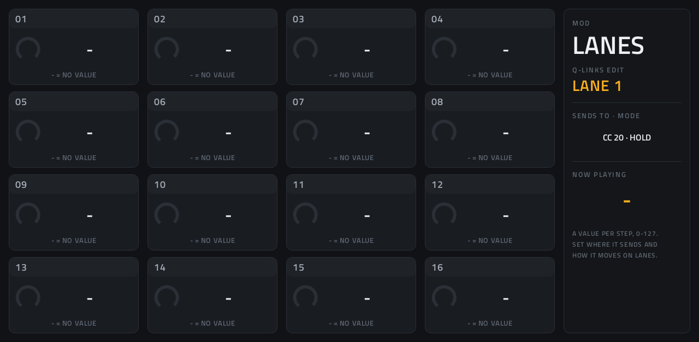
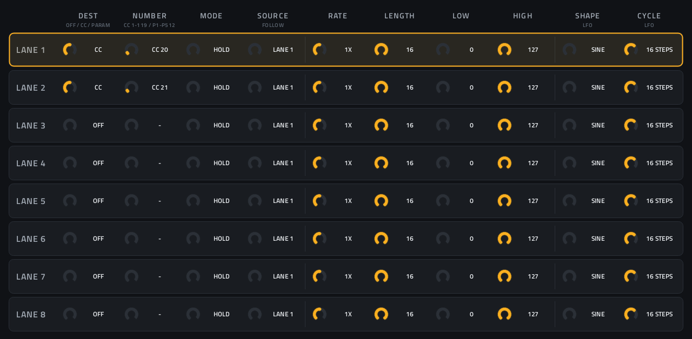
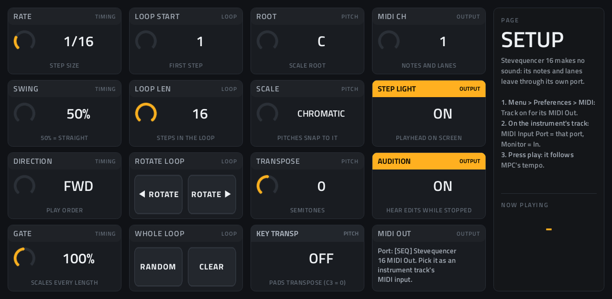

# Stevequencer 16

**MIDI step sequencer** · 16 steps on a 4x4 grid and eight modulation lanes that can move any parameter of the instrument, on any page. · maker in MPC: Steve A · written for this repo · licence: MIT ([`LICENSE`](LICENSE))


Stevequencer's notes (pitch, length, on/off, velocity, chance and ratchets per step, a scale, swing, play directions,
transpose and a key transpose from the pads) on one page of 16 steps, with **eight modulation lanes** in the spirit of
Elektron's parameter locks: each lane has a value per step and sends it to a parameter of the instrument you choose,
by number, on any of its pages. A lane can hold its values, return to a resting value, **slide** between them across
steps, run as an **LFO**, run at its own **rate and length** against the notes, or **follow** another lane, so one row
of values can move several parameters together (a modulation group). It makes no sound itself: its notes and lane
values go out of its own MIDI port to whatever track you point at it.

It's a separate plugin from **[Stevequencer](https://github.com/saustin2010/vst_instruments/tree/main/originals/stevequencer)** (64 steps, two CC lanes), which stays as it is for
projects that use it.

## On the MPC

- In the plugin browser: **[SEQ] Stevequencer 16** by **Steve A** (Sequencer)
- Files: the release installs one folder, `/sdcard/Synths/Steve A - VST - [SEQ] Stevequencer 16/`, holding `stevequencer16.so`, its screen. The vst_instruments installer puts `stevequencer16.so` in `/sdcard/vst/` instead.
- 330 parameters (all automatable) on 4 pages: STEPS, MOD, LANES, SETUP
- 14 patterns in MPC's PRESET menu, most with lanes: Init, Acid Slide, Bass Sweep Group, LFO Pulse, Random Steps,
  Half-Time Mod, Group of Three, Accent Return, Bass Line, Arp Climb, Blues Shuffle, Ratchet Stabs, Pendulum Arp, Drunk
  Garden. Their lanes go to CC 20 and CC 21 (the first two Q-Links of this repo's instruments) until you nominate other
  targets.
- Built and tested offline, and installed on the Live II (2026-10-05); the checks under "To check on the device" are next.

## Playing it

Set up as for Stevequencer ([docs/sequencers.md](https://github.com/saustin2010/vst_instruments/blob/main/docs/sequencers.md)): put Stevequencer 16 and an instrument on
two tracks; **Menu → Preferences → MIDI**: **Track** on for **[SEQ] Stevequencer 16 MIDI Out**; on the instrument's
track, **MIDI Input Port** = that port and **Monitor** = **In**; press play. It follows MPC's tempo, locked to its bars.

## Pages

Screenshots are rendered from the built skin with the engine's real values right after it's inserted (every step on,
C3; lanes 1 and 2 on CC 20 and CC 21, no values yet). On the MPC each page is a tab under the plugin header; the
Q-Link sub-pages change what the Q-Links edit, and the screen follows.

### 1. STEPS


The 16 steps as in Stevequencer: **tap a step's header** to switch it on or off, **drag its big value** to change it;
the footer shows its pitch, length, velocity, chance and ratchets. Six Q-Link sub-pages: **PITCH, LENGTH, ON/OFF,
VELO, CHANCE, RATCHET**. Q-Link columns: **1** steps 1, 5, 9, 13 · **2** 2, 6, 10, 14 · **3** 3, 7, 11, 15 · **4** 4,
8, 12, 16. The strip on the right: the loop and rate, NOW PLAYING, and ◀ ROT / ROT ▶ (rotate the loop), RANDOM, CLEAR.

### 2. MOD



Each step's value for one lane, 0-127, or **-** for none. Eight Q-Link sub-pages, **LANE 1** to **LANE 8**; the strip
shows where the lane sends and how it moves (`CC 20 · HOLD`). Same Q-Link columns as STEPS.

### 3. LANES



The eight lanes' settings, a row each; the Q-Link sub-page (**LANE 1** to **LANE 8**) lights its row and puts it on the
Q-Links: **1** DEST, NUMBER, MODE, SOURCE · **2** RATE, LENGTH, LOW, HIGH · **3** SHAPE, CYCLE.

### 4. SETUP



Q-Link columns: **1** RATE, SWING, DIRECTION, GATE · **2** LOOP START, LOOP LEN · **3** ROOT, SCALE, TRANSPOSE, KEY
TRANSP · **4** MIDI CH, STEP LIGHT, AUDITION.

## Lanes

Each lane sends its values on MIDI CH (the notes' channel), at the step's start just before its note, and only when
the value changes. Its settings:

| Setting | What it does |
|---|---|
| **DEST** | **OFF** (the lane sends nothing; it can still lead others, see FOLLOW), **CC** (a MIDI CC: NUMBER 1-119) or **PARAM** (a parameter of the instrument: NUMBER = its P number) |
| **NUMBER** | The CC or the parameter. It shows as `CC 20` or `P12` |
| **MODE** | How the values move, below |
| **SOURCE** | For FOLLOW: the lane it follows |
| **RATE** | The lane's speed against the notes: 1/4X, 1/2X, 1X, 2X, 4X (2X: two lane values per step) |
| **LENGTH** | The lane's own loop, 1-16 values: a 3-value lane against 16 notes drifts across the bar, Elektron-style |
| **LOW / HIGH** | The range for LFO and FOLLOW, and RETURN's resting value (LOW). HIGH below LOW turns them upside down |
| **SHAPE / CYCLE** | For LFO: SINE, TRIANGLE, SAW UP, SAW DOWN, SQUARE or RANDOM (a new value every cycle); one cycle every 1-64 lane steps |

The modes, chosen per lane:

- **HOLD**: a step without a value keeps the last one (as Stevequencer's MOD lanes).
- **RETURN**: a step without a value goes back to LOW (accents: values on a few steps, LOW everywhere else).
- **SLIDE**: the value glides from one value to the next, across the empty steps between: 0 on step 1 and 127 on
  step 9 is a ramp over eight steps (Elektron's parameter slide, stretched over as many steps as you leave empty).
- **LFO**: the SHAPE between LOW and HIGH, one cycle every CYCLE lane steps. A value on a step overrides the LFO there.
- **FOLLOW**: the SOURCE lane's value, mapped onto LOW..HIGH. **Modulation groups:** let lane 1 carry the values and
  set lanes 2, 3, 4 to FOLLOW lane 1, each with its own target and range, so one row of values moves cutoff up,
  resonance down and decay up together (the Group of Three preset). A leading lane can be DEST OFF and only lead.

Slides and LFOs move eight times a step, sending only when the value changes.

### Which parameter? (PARAM)

Set **DEST** to **PARAM** and **NUMBER** to the parameter's **P** number, from
**[docs/parameter-numbers.md](https://github.com/saustin2010/vst_instruments/blob/main/docs/parameter-numbers.md)**, which lists every instrument in this repo by page
(Hera: P3 VCF FREQ, P4 RESONANCE, P6-P9 the ADSR...). The numbers follow MPC's own parameter list for the plugin and
never change. Any parameter on any page works, with no MIDI learn: the lane sends NRPN P-1 (CC 99/98 with the number,
CC 6 with the value), which every plugin here takes as that parameter. Akai's own instruments don't follow these.

**CC** still works for anything that listens to CCs: on this repo's instruments CC 20-35 are the first page's
Q-Links (CC 20-23 = column 1, top to bottom, and so on).

## Install

Needs a standalone MPC or Force on MPC OS 3.x with root SSH access (checked on an MPC Live II).

**From the release:** download `SEQ-Stevequencer-16-<version>-mpc-armv7.zip` from [Releases](https://github.com/saustin2010/mpc-vst-stevequencer16/releases),
copy it to the MPC, unzip it and run `sh install.sh` in its folder as root. The installer stops MPC, backs up
`MPC.settings`, installs the plugin folder and starts MPC again; `INSTALL.md` in the zip has the details and a by-hand route.

**With the rest of the collection:** from [vst_instruments](https://github.com/saustin2010/vst_instruments) ([INSTALL.md](https://github.com/saustin2010/vst_instruments/blob/main/INSTALL.md)):

```
./install.sh <mpc-address> stevequencer16
```

Use one or the other for this plugin: both register the same plugin (same uid), so the last one run wins.

## How it's made

- `src/stevequencer16.c`: the engine, a Schwung `midi_fx_api_v1` module, from Stevequencer's with 16 steps and the lanes
  (`lane_value()`: the modes; `lane_send()`: CC or NRPN). `mpc/lane_test.c` tests the lanes offline (every mode, RATE,
  LENGTH, FOLLOW, NRPN, the state).
- `mpc/`: the MIDI FX adapter (its own ALSA MIDI port, the host transport; this copy sends up to 64 messages a block),
  Schwung's host headers and `wrapper/engine.h`.
- `mpc/gen.py` writes `params.json`, `presets.json`, `layout.conf` and the SVG artwork; `mpc/make_png.py` (Pillow, in
  the mpc-vst-html-art container) the PNG pictures.

## To check on the device

- That MPC passes NRPN (CC 99/98/6) from a track's MIDI input on to the instrument (CCs pass: Stevequencer's MOD lanes
  work on the Live II, 2026-10-05).
- How MPC names and switches eight Q-Link sub-pages on MOD and LANES.
- Slides and LFOs on several lanes at once: MPC's load and the instrument's screen following.
