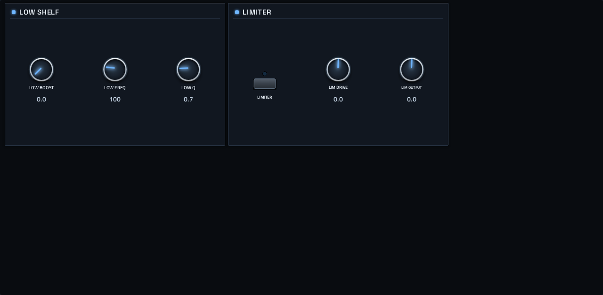

# Verglas

**Audio effect** · Mutable Instruments Clouds: a granular texture processor as an audio effect. · maker in MPC: Mutable Instruments · licence: MIT


Clouds (here Verglas) records the track's audio into a buffer and plays it back as grains: POSITION, SIZE, PITCH, DENSITY and TEXTURE shape the cloud, FREEZE holds the buffer, and MODE switches between granular, stretch, looper and spectral processing. DRY/WET, SPREAD, FEEDBACK and REVERB blend it, high- and low-pass filters and a lo-fi QUALITY switch colour it, and the TONE page adds a low boost and a limiter. Ambient washes, frozen pads and glitchy textures from any sound.

## On the MPC

- In the plugin browser: **Verglas** by **Mutable Instruments** (Effect)
- Files: `/sdcard/vst/verglas.so`, screen in `/sdcard/Synths/Mutable Instruments - VST - Verglas/`
- 20 parameters (all automatable) on 2 pages

## Playing it

An audio effect: insert it in a track's or program's insert effects (it reports two inputs and outputs and the Effect category). It processes 128-sample blocks, about 3 ms of latency at 44.1 kHz.

**Not yet tried on a device:** whether MPC OS offers third-party VST effects in its insert list. The plugin builds and passes the offline test with audio in; please report what you find.

## Pages

Screenshots are rendered from the built skin with the engine's real values right after it's inserted. On the MPC each page is a tab under the plugin header. The Q-Links follow the page column by column: on a 4-knob MPC the Q-Link button steps through the columns, and MPC outlines the active one.

### 1. VERGLAS


Q-Link columns: **1** POSITION, SIZE, PITCH, DENSITY  ·  **2** TEXTURE, MODE, FREEZE, QUALITY  ·  **3** DRY/WET, FEEDBACK, REVERB, SPREAD  ·  **4** HIGH PASS, LOW PASS

### 2. TONE



Q-Link columns: **1** LOW BOOST, LOW FREQ, LOW Q, LIMITER  ·  **2** LIM DRIVE, LIM OUTPUT

## Install

From the top of this repo (see [INSTALL.md](../../../INSTALL.md)):

```
./install.sh <mpc-address> verglas
```

## Where it comes from

- Upstream: https://github.com/filliformes/verglas-move
- Vendored at commit 581d671da6a754a015e60773067210ec19cd20d2 2026-09-15
- Schwung module "Verglas" v1.2.3 by Emilie Gillet (DSP) / fillioning (port)
- Licence: MIT ([`LICENSE`](LICENSE))
- MPC port and screen: this repo, built on [sd88me's mpc-vst-plugins](https://github.com/sd88me/mpc-vst-plugins) (wrapper, Schwung adapter, skin tools).

## Changes for the MPC

- `src/clouds_move.cpp`: the port drives Clouds fully wet with `dry_wet = 1.0`, which makes the crossfade lookup read one past its table; now 0.99999 (ASan, 2026-10-01).
- `src/clouds/dsp/grain.h` (Mutable's code): a grain at exactly its peak reads `lut_window[4097]`, one past the table; the index is clamped. Harmless on the module (reads the next flash word), still fixed. Diff: `upstream-changes.diff`.
- `mpc/schwung_audio_fx.c` = `dev-tools/audiofx` (Schwung audio FX -> the MPC engine interface).
- `src/stmlib/dsp/dsp.h` (`-DMPC_PORT`, 2026-10-02): `Interpolate` clamps its index; a control at exactly 100% read one past a lookup table (found with dev-tools/fuzz). Diff: `upstream-changes.diff`.
- New touchscreen page from its Google Stitch design (`design/`): the design's artwork as the background, its own knob art, live names and values, and controls the design left out added in its style (see RESKINNING.md).

## Files

| Path | What |
|---|---|
| `screenshots/` | the pages as MPC draws them |
| `deploy/` | ready to install: `vst/` → `/sdcard/vst/`, `Synths/` → `/sdcard/Synths/`, plus the plugin-list entry (its presets/kits are in the repo's `presets/` folder, not here) |
| `vst.json` | build settings: name, maker, sources, compiler flags |
| `params.json` | the plugin's parameters as MPC sees them (VST index = order) |
| `params.base.json` | the engine's own parameter list it was derived from |
| `layout.conf` | the screen: control positions, art, Q-Links (generated from the Stitch design) |
| `layout.grid.conf` | the plan of pages and controls the Stitch conversion fills in |
| `verglas.css` | the artwork stylesheet |
| `images/` | artwork: backgrounds, knobs, displays |
| `design/` | the Google Stitch design this screen was converted from (`stitch.html`, as Stitch wrote it) |
| `src/` | the engine's source, vendored from upstream |
| `mpc/` | MPC-side glue: the engine wrapper or MIDI/audio adapter, and headers |
| `upstream-changes.diff` | every local change to the upstream source |
| `UPSTREAM` | where the source came from, and at which commit |

To rebuild from source see [BUILDING.md](../../../BUILDING.md); to change the screen, [RESKINNING.md](../../../RESKINNING.md).
