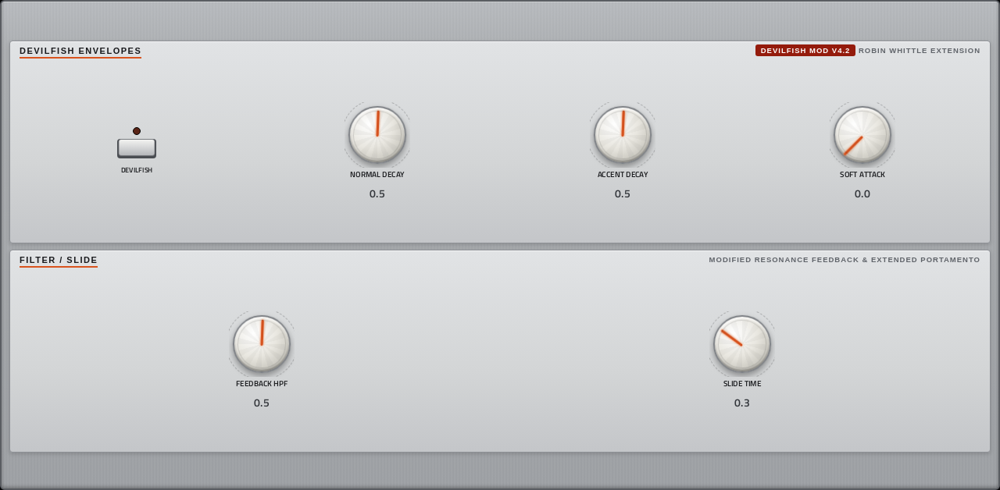

# 303

**Synth** · TB-303 bass line: Open303 with the Devilfish mods, a drive stage and 13 presets. · maker in MPC: Robin Schmidt · licence: GPL-3.0


A Roland TB-303 emulation built on Robin Schmidt's Open303 engine, with the "Devilfish" modifications (separate normal and accent decay, filter tracking, slide time, overdriven sub) and a soft/RAT-style drive after the filter. Play it from MPC's pads, keys or a clip: overlapping notes slide, high velocities accent. Monophonic, as the original. Turn CUTOFF, RESONANCE, ENV MOD and DECAY while a pattern runs for the classic acid squelch; the DEVILFISH page holds the extra envelope, filter and slide controls.

## On the MPC

- In the plugin browser: **[SYN] 303** by **Robin Schmidt** (Synth)
- Files: the release installs one folder, `/sdcard/Synths/Robin Schmidt - VST - [SYN] 303/`, holding `acid303.so` and its screen. The vst_instruments installer puts `acid303.so` in `/sdcard/vst/` instead.
- 18 parameters (all automatable) on 2 pages

## Playing it

Add it to a **plugin track** and play it from the pads, a keyboard or a MIDI clip. Every control can be turned with the Q-Links and automated, and the settings are saved with your project.

## Pages

Screenshots are rendered from the built skin with the engine's real values right after it's inserted. On the MPC each page is a tab under the plugin header. The Q-Links follow the page column by column: on a 4-knob MPC the Q-Link button steps through the columns, and MPC outlines the active one.

### 1. 303 MAIN


Q-Link columns: **1** WAVEFORM, TUNING  ·  **2** CUTOFF, RESONANCE, ENV MOD, DECAY  ·  **3** ACCENT, VOLUME  ·  **4** DRIVE MODEL, DRIVE, DRIVE MIX, SHAPER DRIVE

### 2. DEVILFISH MOD



Q-Link columns: **1** DEVILFISH, NORMAL DECAY, ACCENT DECAY, SOFT ATTACK  ·  **2** FEEDBACK HPF, SLIDE TIME

## Install

Needs a standalone MPC or Force on MPC OS 3.x with root SSH access (checked on an MPC Live II).

**From the release:** download `SYN-303-<version>-mpc-armv7.zip` from [Releases](https://github.com/saustin2010/mpc-vst-303/releases),
copy it to the MPC, unzip it and run `sh install.sh` in its folder as root. The installer stops MPC, backs up
`MPC.settings`, installs the plugin folder and starts MPC again; `INSTALL.md` in the zip has the details and a by-hand route.

**With the rest of the collection:** from [vst_instruments](https://github.com/saustin2010/vst_instruments) ([INSTALL.md](https://github.com/saustin2010/vst_instruments/blob/main/INSTALL.md)):

```
./install.sh <mpc-address> 303
```

Use one or the other for this plugin: both register the same plugin (same uid), so the last one run wins.

## Where it comes from

- Schwung module "303" v0.3.3 by Robin Schmidt / midilab / davemollen / Charles Vestal (Open303 + Devilfish)
- Licence: GPL-3.0, as declared in the module's `src/module.json` (text: [LICENSE](LICENSE))
- MPC port and screen: [vst_instruments](https://github.com/saustin2010/vst_instruments) (`schwung/instruments/303`), built on [sd88me's mpc-vst-plugins](https://github.com/sd88me/mpc-vst-plugins) (wrapper, Schwung adapter, skin tools).

## Changes for the MPC

- Every parameter renamed readably (e.g. NORMAL DECAY, SHAPER DRIVE); WAVEFORM and DRIVE MODEL as switches.
- **Wavetable init (2026-10-02)**: Open303 cleared four entries past its prototype table at start-up (into the next member, which is filled afterwards, so harmless, but undefined). `rosic_MipMappedWaveTable.cpp` under `MPC_PORT`; diff in `upstream-changes.diff`. Found with `dev-tools/fuzz`.
- New touchscreen page from its Google Stitch design (`design/`): the design's artwork as the background, its own knob art, live names and values, and controls the design left out added in its style (see RESKINNING.md).
- Presets (2026-10-03): the engine has none, so the port brings 13 (`presets.json`: Classic Acid, Squelch Lead, Deep Sub,
  Rubber Square, Plucky Saw, Long Sweep, Rat Acid, Distorted Square, Acid Screamer, three Devilfish patches and Init),
  in MPC's PRESET menu. Each sets every control; levels matched within about 4.5 dB.
- Q-Links (2026-10-03, design QA): one column per panel on the main page, VCO | VCF | ACCENT + OUT | DRIVE, so the
  outline MPC draws round the active column frames one panel (it used to split the VCF across two columns).

## Files

| Path | What |
|---|---|
| `screenshots/` | the pages as MPC draws them |
| `LICENSE` | the licence (GPL-3.0) |
| `.github/workflows/release.yml` | the release build (GitHub Actions, a draft release) |
| `deploy/` | ready to install: `vst/` → `/sdcard/vst/`, `Synths/` → `/sdcard/Synths/`, plus the plugin-list entry (not used by the release) |
| `vst.json` | build settings: name, maker, sources, compiler flags |
| `params.json` | the plugin's parameters as MPC sees them (VST index = order) |
| `params.base.json` | the engine's own parameter list it was derived from |
| `layout.conf` | the screen: control positions, art, Q-Links (generated from the Stitch design) |
| `layout.grid.conf` | the plan of pages and controls the Stitch conversion fills in |
| `303.css` | the artwork stylesheet |
| `images/` | artwork: backgrounds, knobs, displays |
| `design/` | the Google Stitch design this screen was converted from (`stitch.html`, as Stitch wrote it) |
| `src/` | the engine's source, vendored from upstream |
| `upstream-changes.diff` | every local change to the upstream source |

## Building

With Docker (32-bit ARM emulation for the build), Python 3 and the tools from
[saustin2010/mpc-vst-plugins](https://github.com/saustin2010/mpc-vst-plugins/tree/steve-features) (sd88me's [mpc-vst-plugins](https://github.com/sd88me/mpc-vst-plugins)
plus changes offered to it, until they're merged there; the commit is the one in `.github/workflows/release.yml`):

```
git clone -b steve-features https://github.com/saustin2010/mpc-vst-plugins
MPC_VST=$PWD/mpc-vst-plugins
bash "$MPC_VST/tools/build_port.sh" vst.json        # build/: acid303.so, the screen, the plugin-list entry
bash "$MPC_VST/tools/test_port.sh" vst.json         # the offline host test (ASan/UBSan): must print PASSED
```

Releases are built by GitHub Actions (`.github/workflows/release.yml`, "Release (draft)") as a draft, installed and checked
on a device, then published. More: [BUILDING.md](https://github.com/saustin2010/vst_instruments/blob/main/BUILDING.md), and to change the screen, [RESKINNING.md](https://github.com/saustin2010/vst_instruments/blob/main/RESKINNING.md).

## Development

This plugin is developed in [vst_instruments](https://github.com/saustin2010/vst_instruments) (`schwung/instruments/303`), next to the other plugins
and the tools that made its screen, and published to [mpc-vst-303](https://github.com/saustin2010/mpc-vst-303) for its
releases. Issues and pull requests are welcome in either.
