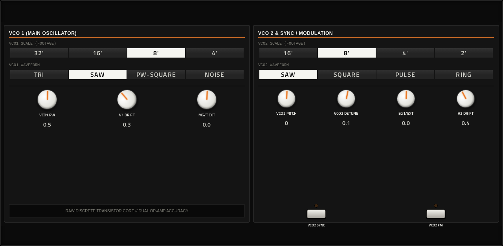
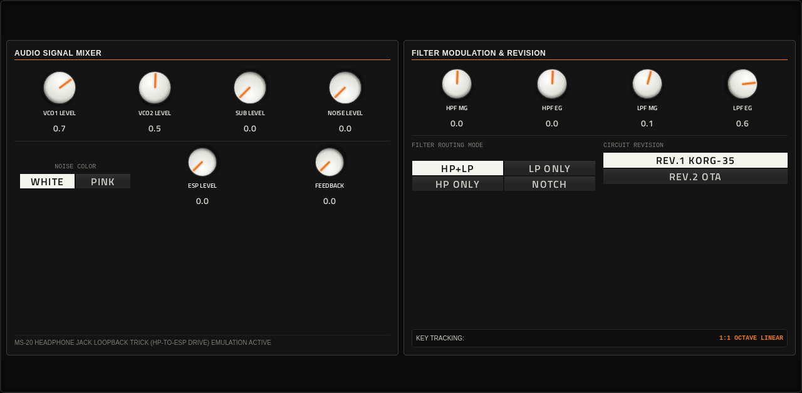
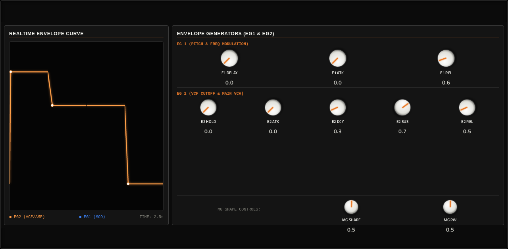
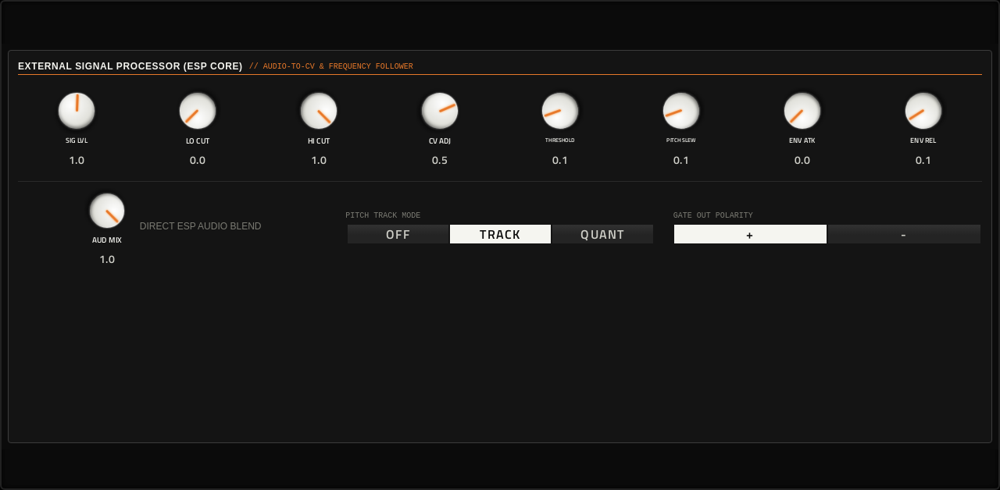
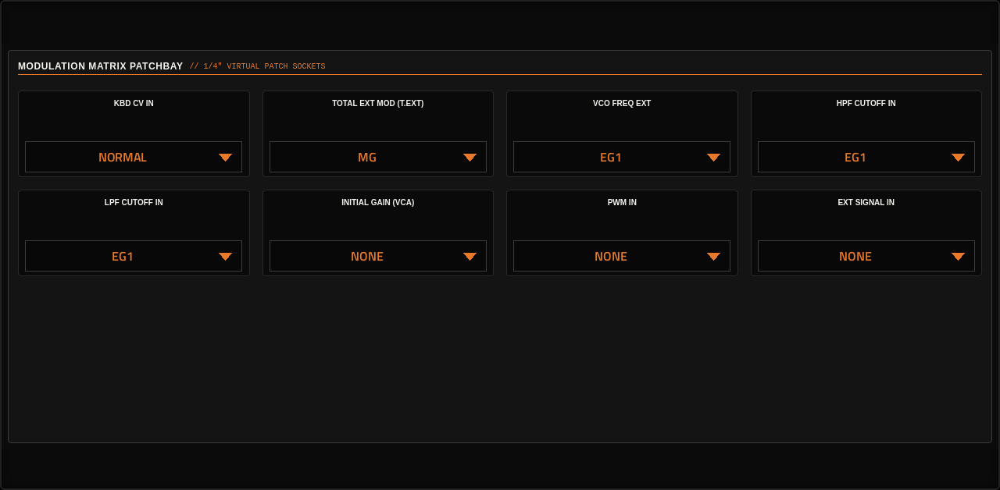
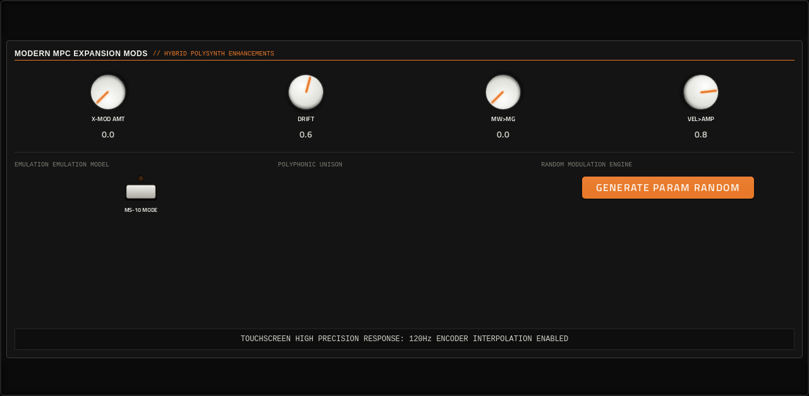

# Aphex

**Synth** · Korg MS-10/MS-20 style mono synth with a patch bay, an ESP section and both MS filters. · maker in MPC: Filliformes · licence: MIT


A semi-modular, MS-20-flavoured mono synth: two VCOs with footage switches, both classic MS filter circuits (the KORG-35 of the REV.1 and the OTA of the REV.2), two envelopes, a mixer, a source-side patch bay for routing modulation, and the External Signal Processor (envelope follower, pitch tracking) that lets the synth follow another sound. A MODERN page adds trims and extras the original never had. 41 named presets, plus randomise / mutate / reset buttons for happy accidents. Black-panel look with white legends and orange patch-cable accents.

## On the MPC

- In the plugin browser: **Aphex** by **Filliformes** (Synth)
- Files: `/sdcard/vst/aphex.so`, screen in `/sdcard/Synths/Filliformes - VST - Aphex/`
- 83 parameters (all automatable) on 7 pages

## Playing it

Add it to a **plugin track** and play it from the pads, a keyboard or a MIDI clip. Every control can be turned with the Q-Links and automated, and the settings are saved with your project.

## Pages

Screenshots are rendered from the built skin with the engine's real values right after it's inserted. On the MPC each page is a tab under the plugin header. The Q-Links follow the page column by column: on a 4-knob MPC the Q-Link button steps through the columns, and MPC outlines the active one.

### 1. MAIN


Q-Link columns: **1** PRESET, RANDOM, MUTATE, LPF CUTOFF  ·  **2** LPF PEAK, HPF CUTOFF, HPF PEAK, MG FREQ  ·  **3** MG DEPTH, VOLUME, OCTAVE, PORTAMENTO  ·  **4** TUNE, DRIVE, TRIGGER, RESET

### 2. VCO



Q-Link columns: **1** VCO1 SCALE, VCO1 WAVE, VCO1 PW, V1 DRIFT  ·  **2** MG/T.EXT, VCO2 SCALE, VCO2 WAVE, VCO2 PITCH  ·  **3** VCO2 DETUNE, EG1/EXT, V2 DRIFT, VCO2 SYNC  ·  **4** VCO2 FM

### 3. MIXER



Q-Link columns: **1** VCO1 LEVEL, VCO2 LEVEL, SUB LEVEL, NOISE LEVEL  ·  **2** NOISE COLOR, ESP LEVEL, FEEDBACK, HPF MG  ·  **3** HPF EG, LPF MG, LPF EG, FILTER MODE  ·  **4** FILTER REV

### 4. ENVELOPES



Q-Link columns: **1** E1 DELAY, E1 ATK, E1 REL, E2 HOLD  ·  **2** E2 ATK, E2 DCY, E2 SUS, E2 REL  ·  **3** MG SHAPE, MG PW

### 5. ESP



Q-Link columns: **1** SIG LVL, LO CUT, HI CUT, CV ADJ  ·  **2** THRESHOLD, PITCH SLEW, ENV ATK, ENV REL  ·  **3** AUD MIX, PITCH MODE, GATE POL

### 6. PATCHBAY



Q-Link columns: **1** KBD CV IN, T.EXT, VCO FREQ, HPF EG/EXT  ·  **2** LPF EG/EXT, INITIAL GAIN, PWM IN, EXT SIG

### 7. MODERN



Q-Link columns: **1** X-MOD AMT, DRIFT, MW>MG, VEL>AMP  ·  **2** MS-10 MODE, RANDOM MOD

## Install

From the top of this repo (see [INSTALL.md](../../../INSTALL.md)):

```
./install.sh <mpc-address> aphex
```

## Where it comes from

- Upstream: https://github.com/filliformes/aphex-move
- Vendored at commit 77798462f7a643c93e175aa46afe7694c5337085 2026-09-15
- Schwung module "Aphex" v0.1.1 by Filliformes
- Licence: MIT ([`LICENSE`](LICENSE))
- MPC port and screen: this repo, built on [sd88me's mpc-vst-plugins](https://github.com/sd88me/mpc-vst-plugins) (wrapper, Schwung adapter, skin tools).

## Changes for the MPC

- Footage switches report labels like `8'`: the wrapper now matches an option's label before reading a number (generic wrapper fix, `framework/`).
- New touchscreen page from its Google Stitch design (`design/`): the design's artwork as the background, its own knob art, live names and values, and controls the design left out added in its style (see RESKINNING.md).
- Presets in MPC's PRESET menu (2026-10-03): its 41 presets are VST programs (vst.json `programs`), so the PRESET
  dropdown in the plugin header, also on the arrangement screen, lists and loads them.

## Files

| Path | What |
|---|---|
| `screenshots/` | the pages as MPC draws them |
| `deploy/` | ready to install: `vst/` → `/sdcard/vst/`, `Synths/` → `/sdcard/Synths/`, plus the plugin-list entry (its presets/kits are in the repo's `presets/` folder, not here) |
| `vst.json` | build settings: name, maker, sources, compiler flags |
| `params.json` | the plugin's parameters as MPC sees them (VST index = order) |
| `params.base.json` | the engine's own parameter list it was derived from |
| `layout.conf` | the screen: control positions, art, Q-Links (generated from the Stitch design) |
| `layout.grid.conf` | the plan of pages and controls the Stitch conversion fills in |
| `aphex.css` | the artwork stylesheet |
| `images/` | artwork: backgrounds, knobs, displays |
| `design/` | the Google Stitch design this screen was converted from (`stitch.html`, as Stitch wrote it) |
| `src/` | the engine's source, vendored from upstream |
| `UPSTREAM` | where the source came from, and at which commit |

To rebuild from source see [BUILDING.md](../../../BUILDING.md); to change the screen, [RESKINNING.md](../../../RESKINNING.md).
