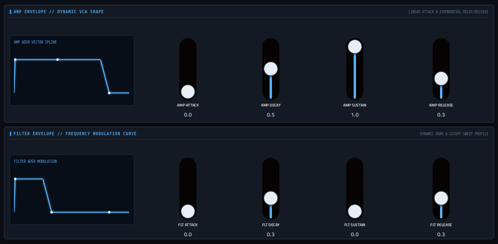

# Braids

**Synth** · Mutable Instruments Braids: a macro oscillator with 47 synthesis models. · maker in MPC: Mutable Instruments · licence: MIT


Emilie Gillet's Braids "macro oscillator" as a playable synth voice. One knob picks the model (classic analog waveforms, vowel/formant synthesis, FM, wavetables, physical models of plucked strings and drums, granular clouds, noise...) and TIMBRE and COLOR shape it. Around the oscillator this port adds a filter, an amp envelope, a filter envelope and modulation, so it plays like a complete synth. Ten preset files ship with it.

## On the MPC

- In the plugin browser: **[SYN] Braids** by **Mutable Instruments** (Synth)
- Files: `/sdcard/vst/braids.so`, presets/data in `/sdcard/vst/braids/` (from this repo's `presets/braids/`, which `tools/fetch-presets.py` fills; install.sh does that for you), screen in `/sdcard/Synths/Mutable Instruments - VST - [SYN] Braids/`
- 21 parameters (all automatable) on 2 pages

## Playing it

Add it to a **plugin track** and play it from the pads, a keyboard or a MIDI clip. Every control can be turned with the Q-Links and automated, and the settings are saved with your project.

## Pages

Screenshots are rendered from the built skin with the engine's real values right after it's inserted. On the MPC each page is a tab under the plugin header. The Q-Links follow the page column by column: on a 4-knob MPC the Q-Link button steps through the columns, and MPC outlines the active one.

### 1. BRAIDS


Q-Link columns: **1** ALGORITHM, TIMBRE, COLOR  ·  **2** CUTOFF, RESONANCE, FILTER ENV, FM  ·  **3** OCTAVE, VOLUME  ·  **4** PATCH

### 2. ENVELOPES



Q-Link columns: **1** AMP ATTACK, AMP DECAY, AMP SUSTAIN, AMP RELEASE  ·  **2** FLT ATTACK, FLT DECAY, FLT SUSTAIN, FLT RELEASE

## Install

From the top of this repo (see [INSTALL.md](../../../INSTALL.md)):

```
./install.sh <mpc-address> braids
```

## Where it comes from

- Schwung module "Braids" v0.2.8 by Emilie Gillet (port: charlesvestal)
- Licence: MIT, as declared in the module's `src/module.json` (text: [licenses/](../../../licenses/))
- MPC port and screen: this repo, built on [sd88me's mpc-vst-plugins](https://github.com/sd88me/mpc-vst-plugins) (wrapper, Schwung adapter, skin tools).

## Changes for the MPC

- Presets work: the build never pointed the engine at its presets folder (MODULE_DIR); now a PATCH browser shows the preset name.
- **Pitch clamped (2026-10-02)**: the module's firmware keeps pitch in 0..16383, but this port's note + 44.1 kHz correction + FM + bend reached ~19800, and high notes on FLUTED read past the flute's body-filter table. `src/dsp/braids/macro_oscillator.h` under `MPC_PORT`; diff in `upstream-changes.diff`. Also `-fwrapv` (stmlib's fixed-point maths relies on wrap-around, as on the module's ARM). Found with `dev-tools/fuzz`.
- New touchscreen page from its Google Stitch design (`design/`): the design's artwork as the background, its own knob art, live names and values, and controls the design left out added in its style (see RESKINNING.md).
- Presets in MPC's PRESET menu (2026-10-03): its 10 presets are VST programs (vst.json `programs`), so the PRESET
  dropdown in the plugin header, also on the arrangement screen, lists and loads them.

## Files

| Path | What |
|---|---|
| `screenshots/` | the pages as MPC draws them |
| `deploy/` | ready to install: `vst/` → `/sdcard/vst/`, `Synths/` → `/sdcard/Synths/`, plus the plugin-list entry (its presets/kits are in the repo's `presets/` folder, not here) |
| `vst.json` | build settings: name, maker, sources, compiler flags |
| `params.json` | the plugin's parameters as MPC sees them (VST index = order) |
| `params.base.json` | the engine's own parameter list it was derived from |
| `layout.conf` | the screen: control positions, art, Q-Links (generated from the Stitch design) |
| `layout.grid.conf` | the plan of pages and controls the Stitch conversion fills in |
| `braids.css` | the artwork stylesheet |
| `images/` | artwork: backgrounds, knobs, displays |
| `design/` | the Google Stitch design this screen was converted from (`stitch.html`, as Stitch wrote it) |
| `src/` | the engine's source, vendored from upstream |
| `upstream-changes.diff` | every local change to the upstream source |

To rebuild from source see [BUILDING.md](../../../BUILDING.md); to change the screen, [RESKINNING.md](../../../RESKINNING.md).
