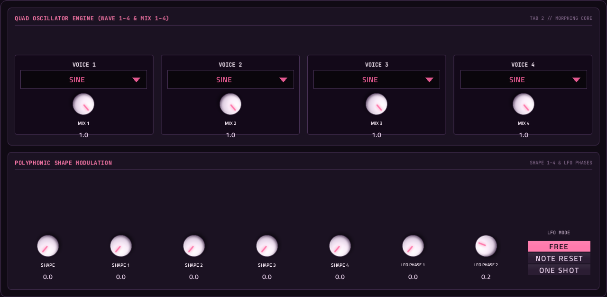
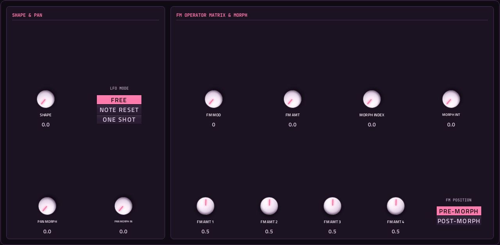
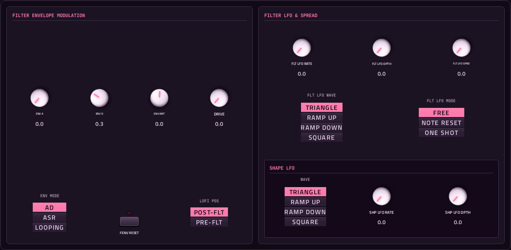
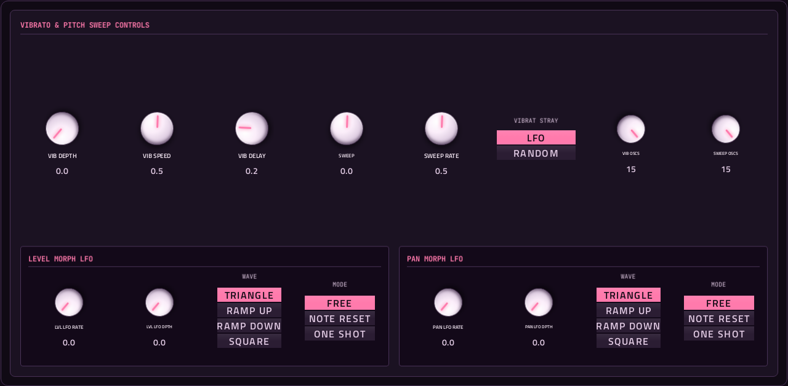
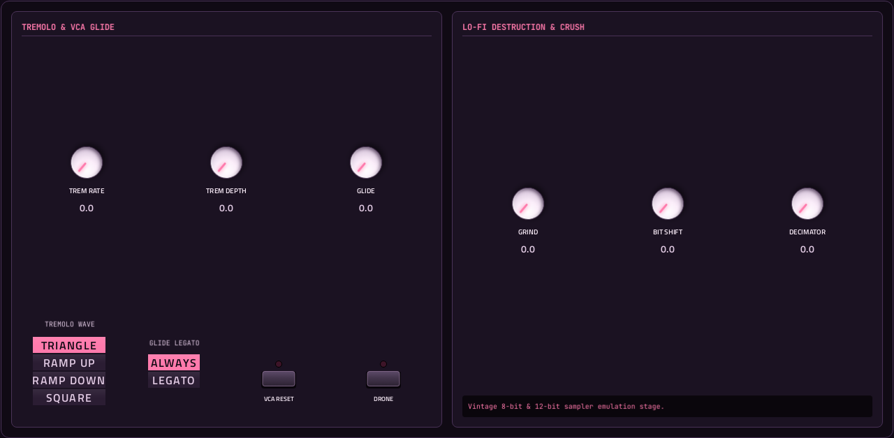
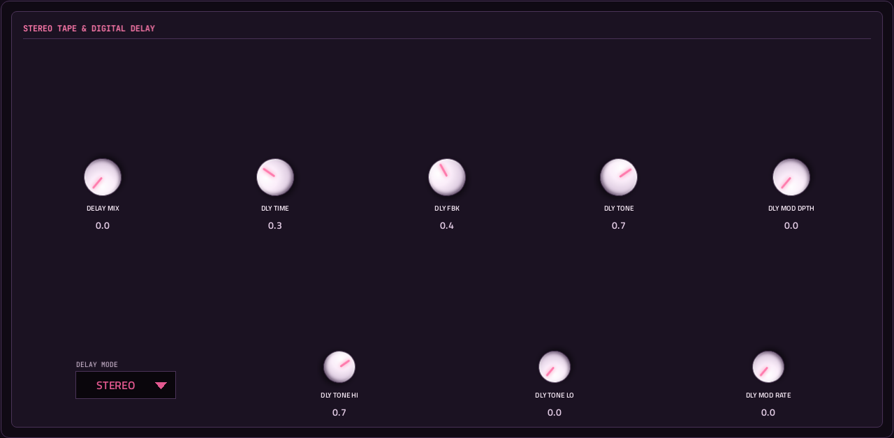
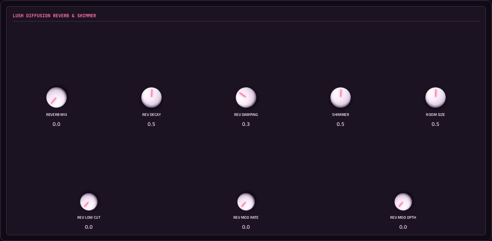
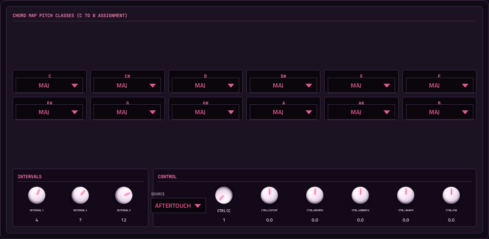
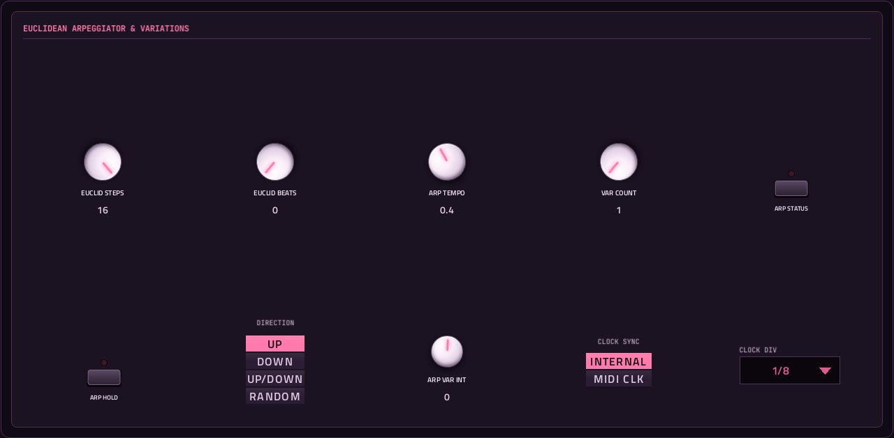

# Chordism

**Synth** · One key in, a four-voice chord out: morphing oscillators, FM, filter, lo-fi, delay, reverb and an arpeggiator. · maker in MPC: Charles Vestal · licence: MIT


A chord machine: every note you play becomes a four-voice chord (octaves, fifths, minor, major, sevenths, ninths, elevenths and more). Each voice has its own waveform (sine, triangle, saw, square, pulse or wavetable) and shape; MORPH and PAN MORPH move the level and stereo position across the voices, and FM and a shape LFO animate them. Then a 12/24 dB multimode filter with its own envelope and LFO, vibrato, a pitch sweep, a lo-fi section (grind, bit shift, decimator), delay, reverb, glide and an arpeggiator that plays the chord's notes for you. Ten pages, 135 parameters; the MAIN page gathers what you reach for most.

## On the MPC

- In the plugin browser: **[SYN] Chordism** by **Charles Vestal** (Synth)
- Files: the release installs one folder, `/sdcard/Synths/Charles Vestal - VST - [SYN] Chordism/`, holding `chordism.so`, its screen. The vst_instruments installer puts `chordism.so` in `/sdcard/vst/` instead.
- 137 parameters (all automatable) on 10 pages

## Playing it

Add it to a **plugin track** and play it from the pads, a keyboard or a MIDI clip. Every control can be turned with the Q-Links and automated, and the settings are saved with your project.

## Pages

Screenshots are rendered from the built skin with the engine's real values right after it's inserted. On the MPC each page is a tab under the plugin header. The Q-Links follow the page column by column: on a 4-knob MPC the Q-Link button steps through the columns, and MPC outlines the active one.

### 1. MAIN


Q-Link columns: **1** CHORD, TUNING, SCALE, ROOT  ·  **2** DETUNE, WIDTH, SPREAD, ROTATION  ·  **3** CUTOFF, RESONANCE, FILTER MODE, SLOPE  ·  **4** ATTACK, RELEASE, VCA MODE, VOLUME

### 2. OSCILLATORS



Q-Link columns: **1** WAVE 1, MIX 1, SHAPE 1, LFO PHASE 1  ·  **2** WAVE 2, MIX 2, SHAPE 2, LFO PHASE 2  ·  **3** WAVE 3, MIX 3, SHAPE 3, LFO PHASE 3  ·  **4** WAVE 4, MIX 4, SHAPE 4, LFO PHASE 4

### 3. SHAPE



Q-Link columns: **1** SHAPE, LFO MODE, PAN MORPH, PAN MORPH IN  ·  **2** FM MOD, FM AMT, MORPH INDEX, MORPH INT  ·  **3** FM AMT 1, FM AMT 2, FM AMT 3, FM AMT 4  ·  **4** FM POSITION

### 4. FILTER ENV



Q-Link columns: **1** ENV A, ENV D, ENV AMT, DRIVE  ·  **2** FLT LFO RATE, FLT LFO DPTH, FLT LFO SPRD, FLT LFO WAVE  ·  **3** SHP LFO WAVE, SHP LFO RATE, SHP LFO DPTH  ·  **4** FLT ENV MODE, FENV RESET, LOFI POS

### 5. VIBRATO



Q-Link columns: **1** VIB DEPTH, VIB SPEED, VIB DELAY, SWEEP  ·  **2** SWEEP RATE, VIBRAT STRAY, VIB OSCS, SWEEP OSCS  ·  **3** LVL LFO RATE, LVL LFO DPTH, LVL LFO WAVE, LVL LFO MODE  ·  **4** PAN LFO RATE, PAN LFO DPTH, PAN LFO WAVE, PAN LFO MODE

### 6. TREMOLO



Q-Link columns: **1** TREM RATE, TREM DEPTH, GLIDE  ·  **2** TREMOLO WAVE, GLIDE LEGATO, VCA RESET, DRONE  ·  **3** GRIND, BIT SHIFT, DECIMATOR

### 7. DELAY



Q-Link columns: **1** DELAY MIX, DLY TIME, DLY FBK, DLY TONE  ·  **2** DELAY MODE, DLY TONE HI, DLY TONE LO  ·  **3** DLY MOD DPTH, DLY MOD RATE

### 8. REVERB



Q-Link columns: **1** REVERB MIX, REV DECAY, REV DAMPING, SHIMMER  ·  **2** ROOM SIZE  ·  **3** REV LOW CUT, REV MOD RATE, REV MOD DPTH

### 9. CHORD MAP



Q-Link columns (bank 1): **1** C, C#, D, D#  ·  **2** E, F  ·  **3** F#, G, G#, A  ·  **4** A#, B

Q-Link columns (bank 2): **1** INTERVAL 1, INTERVAL 2, INTERVAL 3  ·  **2** CTRL SRC, CTRL CC, CTRL>CUTOFF, CTRL>MORPH  ·  **3** CTRL>VIBRATO, CTRL>SHAPE, CTRL>FM

### 10. ARPEGGIATOR



Q-Link columns: **1** EUCLID STEPS, EUCLID BEATS, ARP TEMPO, VAR COUNT  ·  **2** ARP HOLD, ARP DIRECTIO, ARP VAR INT  ·  **3** CLOCK SYNC, CLOCK DIVISI  ·  **4** ARP STATUS

## Install

Needs a standalone MPC or Force on MPC OS 3.x with root SSH access (checked on an MPC Live II).

**From the release:** download `SYN-Chordism-<version>-mpc-armv7.zip` from [Releases](https://github.com/saustin2010/mpc-vst-chordism/releases),
copy it to the MPC, unzip it and run `sh install.sh` in its folder as root. The installer stops MPC, backs up
`MPC.settings`, installs the plugin folder and starts MPC again; `INSTALL.md` in the zip has the details and a by-hand route.

**With the rest of the collection:** from [vst_instruments](https://github.com/saustin2010/vst_instruments) ([INSTALL.md](https://github.com/saustin2010/vst_instruments/blob/main/INSTALL.md)):

```
./install.sh <mpc-address> chordism
```

Use one or the other for this plugin: both register the same plugin (same uid), so the last one run wins.

## Where it comes from

- Upstream: https://github.com/charlesvestal/schwung-chordism
- Vendored at commit 1ddbe63a64db89fbd316d9a1150d0d051e0e1f38 2026-08-31
- Schwung module "Chordism" v0.3.15 by charlesvestal
- Licence: MIT ([`LICENSE`](LICENSE))
- MPC port and screen: [vst_instruments](https://github.com/saustin2010/vst_instruments) (`schwung/instruments/chordism`), built on [sd88me's mpc-vst-plugins](https://github.com/sd88me/mpc-vst-plugins) (wrapper, Schwung adapter, skin tools).

## Changes for the MPC

- `params.base.json` comes from the module's `chain_params` (what the engine actually takes, saved as `chain_params.engine.json`), not its menu tree.
- New touchscreen page from its Google Stitch design (`design/`): the design's artwork as the background, its own knob art, live names and values, and controls the design left out added in its style (see RESKINNING.md).
- Presets (2026-10-03): its 57 built-in presets were never exposed. New parameters `preset` and `preset_name`
  (appended, indices 135-136, so saved projects keep working) make them VST programs, so the PRESET dropdown in
  the plugin header, also on the arrangement screen, lists and loads them. No control on the pages yet.

## Files

| Path | What |
|---|---|
| `screenshots/` | the pages as MPC draws them |
| `.github/workflows/release.yml` | the release build (GitHub Actions, a draft release) |
| `FRAMEWORK.md` | the changes to sd88me's tools this plugin is built with, and why |
| `deploy/` | ready to install: `vst/` → `/sdcard/vst/`, `Synths/` → `/sdcard/Synths/`, plus the plugin-list entry (not used by the release) |
| `vst.json` | build settings: name, maker, sources, compiler flags |
| `params.json` | the plugin's parameters as MPC sees them (VST index = order) |
| `params.base.json` | the engine's own parameter list it was derived from |
| `params.pre-stitch.json` | the parameter list before the Stitch screen renamed controls |
| `chain_params.engine.json` | what the engine reports it takes (its `chain_params`) |
| `layout.conf` | the screen: control positions, art, Q-Links (generated from the Stitch design) |
| `layout.grid.conf` | the plan of pages and controls the Stitch conversion fills in |
| `chordism.css` | the artwork stylesheet |
| `images/` | artwork: backgrounds, knobs, displays |
| `design/` | the Google Stitch design this screen was converted from (`stitch.html`, as Stitch wrote it) |
| `src/` | the engine's source, vendored from upstream |
| `UPSTREAM` | where the source came from, and at which commit |

## Building

With Docker (32-bit ARM emulation for the build), Python 3 and the tools from
[saustin2010/mpc-vst-plugins](https://github.com/saustin2010/mpc-vst-plugins/tree/steve-features) (sd88me's [mpc-vst-plugins](https://github.com/sd88me/mpc-vst-plugins)
plus changes offered to it, until they're merged there; the commit is the one in `.github/workflows/release.yml`, and [FRAMEWORK.md](FRAMEWORK.md) says which changes this plugin uses and why):

```
git clone -b steve-features https://github.com/saustin2010/mpc-vst-plugins
MPC_VST=$PWD/mpc-vst-plugins
bash "$MPC_VST/tools/build_port.sh" vst.json        # build/: chordism.so, the screen, the plugin-list entry
bash "$MPC_VST/tools/test_port.sh" vst.json         # the offline host test (ASan/UBSan): must print PASSED
```

Releases are built by GitHub Actions (`.github/workflows/release.yml`, "Release (draft)") as a draft, installed and checked
on a device, then published. More: [BUILDING.md](https://github.com/saustin2010/vst_instruments/blob/main/BUILDING.md), and to change the screen, [RESKINNING.md](https://github.com/saustin2010/vst_instruments/blob/main/RESKINNING.md).

## Development

This plugin is developed in [vst_instruments](https://github.com/saustin2010/vst_instruments) (`schwung/instruments/chordism`), next to the other plugins
and the tools that made its screen, and published to [mpc-vst-chordism](https://github.com/saustin2010/mpc-vst-chordism) for its
releases. Issues and pull requests are welcome in either.
