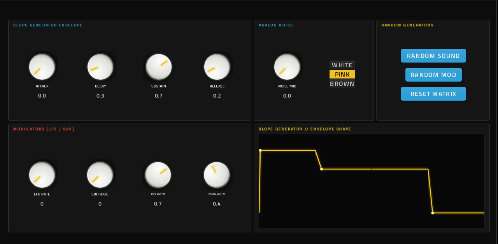
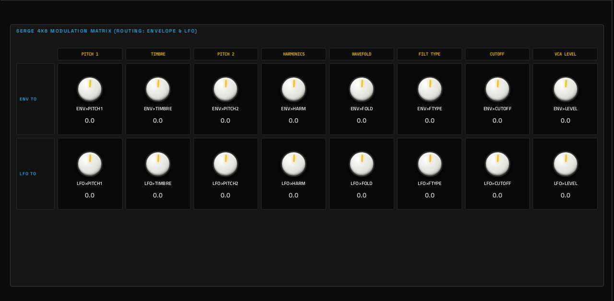
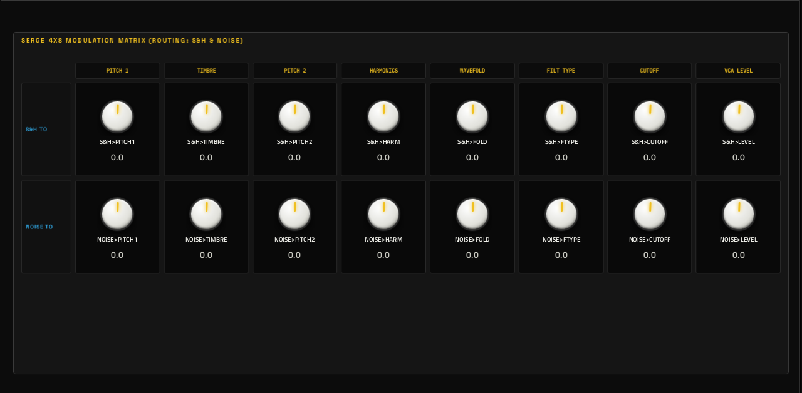

# Denis

**Synth** · West Coast / Serge-inspired mono synth: complex oscillators, a wavefolder and a modulation matrix. · maker in MPC: Filliformes · licence: MIT


A West Coast voice in the Serge / Buchla tradition: two oscillators (frequency, timbre and harmonics) mixed into a wavefolder with several fold types for bright, harmonically rich timbres, a multimode filter (low-pass, band-pass, high-pass, notch), an ADSR, and a noise source (white, pink, brown). A modulation matrix sends the envelope, an LFO, sample & hold and noise to eight destinations each (pitch, timbre, harmonics, fold, filter type, cutoff, level). 30 named presets plus randomise and reset buttons. Panel look: Serge black with banana-jack colours.

## On the MPC

- In the plugin browser: **Denis** by **Filliformes** (Synth)
- Files: `/sdcard/vst/denis.so`, screen in `/sdcard/Synths/Filliformes - VST - Denis/`
- 61 parameters (all automatable) on 4 pages

## Playing it

Add it to a **plugin track** and play it from the pads, a keyboard or a MIDI clip. Every control can be turned with the Q-Links and automated, and the settings are saved with your project.

## Pages

Screenshots are rendered from the built skin with the engine's real values right after it's inserted. On the MPC each page is a tab under the plugin header. The Q-Links follow the page column by column: on a 4-knob MPC the Q-Link button steps through the columns, and MPC outlines the active one.

### 1. DENIS


Q-Link columns: **1** OSC1 FREQ, OSC1 TIMBRE  ·  **2** OSC2 FREQ, HARMONICS, OSC MIX  ·  **3** FOLD DEPTH, FOLD TYPE, CUTOFF, Q (RESO)  ·  **4** VEL>FILTER, PORTAMENTO, LEGATO

### 2. ENV / MOD



Q-Link columns: **1** ATTACK, DECAY, SUSTAIN, RELEASE  ·  **2** NOISE MIX, NOISE TYPE  ·  **3** LFO RATE, S&H RATE, ENV DEPTH, NOISE DEPTH

### 3. ENV LFO



Q-Link columns: **1** ENV>PITCH1, ENV>TIMBRE, ENV>PITCH2, ENV>HARM  ·  **2** ENV>FOLD, ENV>FTYPE, ENV>CUTOFF, ENV>LEVEL  ·  **3** LFO>PITCH1, LFO>TIMBRE, LFO>PITCH2, LFO>HARM  ·  **4** LFO>FOLD, LFO>FTYPE, LFO>CUTOFF, LFO>LEVEL

### 4. S&H NOISE



Q-Link columns: **1** S&H>PITCH1, S&H>TIMBRE, S&H>PITCH2, S&H>HARM  ·  **2** S&H>FOLD, S&H>FTYPE, S&H>CUTOFF, S&H>LEVEL  ·  **3** NOISE>PITCH1, NOISE>TIMBRE, NOISE>PITCH2, NOISE>HARM  ·  **4** NOISE>FOLD, NOISE>FTYPE, NOISE>CUTOFF, NOISE>LEVEL

## Install

From the top of this repo (see [INSTALL.md](../../../INSTALL.md)):

```
./install.sh <mpc-address> denis
```

## Where it comes from

- Upstream: https://github.com/filliformes/denis-move
- Vendored at commit c440d8ada537074a7b3dfa9611a0a027ef5f52c2 2026-09-15
- Schwung module "Denis" v0.1.2 by Vincent Fillion
- Licence: MIT ([`LICENSE`](LICENSE))
- MPC port and screen: this repo, built on [sd88me's mpc-vst-plugins](https://github.com/sd88me/mpc-vst-plugins) (wrapper, Schwung adapter, skin tools).

## Changes for the MPC

- `params.base.json` comes from the module's `chain_params` (what the engine actually takes, saved as `chain_params.engine.json`), not its menu tree.
- New touchscreen page from its Google Stitch design (`design/`): the design's artwork as the background, its own knob art, live names and values, and controls the design left out added in its style (see RESKINNING.md).
- Presets in MPC's PRESET menu (2026-10-03): its 30 presets are VST programs (vst.json `programs`), so the PRESET
  dropdown in the plugin header, also on the arrangement screen, lists and loads them.

## Files

| Path | What |
|---|---|
| `screenshots/` | the pages as MPC draws them |
| `deploy/` | ready to install: `vst/` → `/sdcard/vst/`, `Synths/` → `/sdcard/Synths/`, plus the plugin-list entry (its presets/kits are in the repo's `presets/` folder, not here) |
| `vst.json` | build settings: name, maker, sources, compiler flags |
| `params.json` | the plugin's parameters as MPC sees them (VST index = order) |
| `params.base.json` | the engine's own parameter list it was derived from |
| `params.pre-stitch.json` | the parameter list before the Stitch screen renamed controls |
| `chain_params.engine.json` | what the engine reports it takes (its `chain_params`) |
| `layout.conf` | the screen: control positions, art, Q-Links (generated from the Stitch design) |
| `layout.grid.conf` | the plan of pages and controls the Stitch conversion fills in |
| `denis.css` | the artwork stylesheet |
| `images/` | artwork: backgrounds, knobs, displays |
| `design/` | the Google Stitch design this screen was converted from (`stitch.html`, as Stitch wrote it) |
| `src/` | the engine's source, vendored from upstream |
| `UPSTREAM` | where the source came from, and at which commit |

To rebuild from source see [BUILDING.md](../../../BUILDING.md); to change the screen, [RESKINNING.md](../../../RESKINNING.md).
