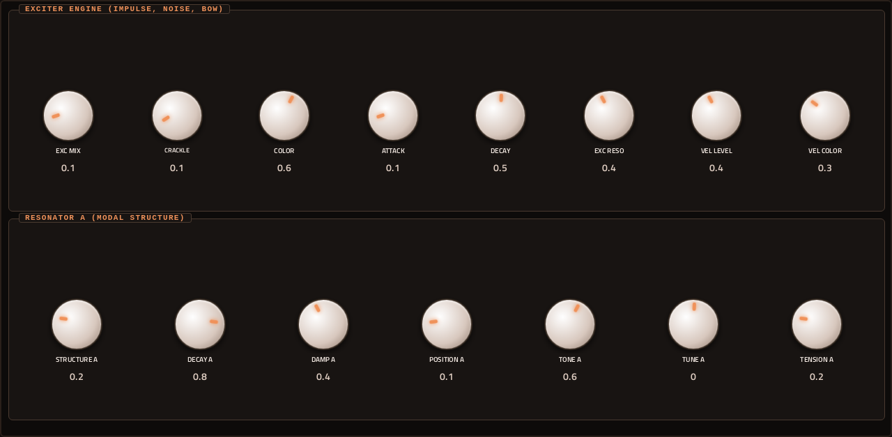
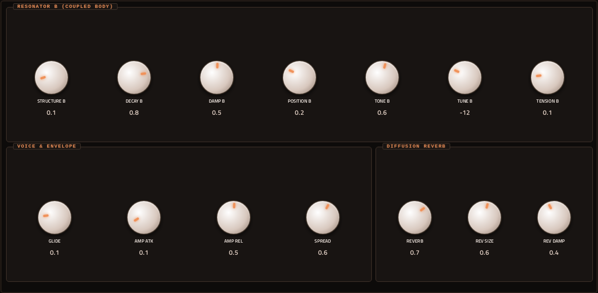
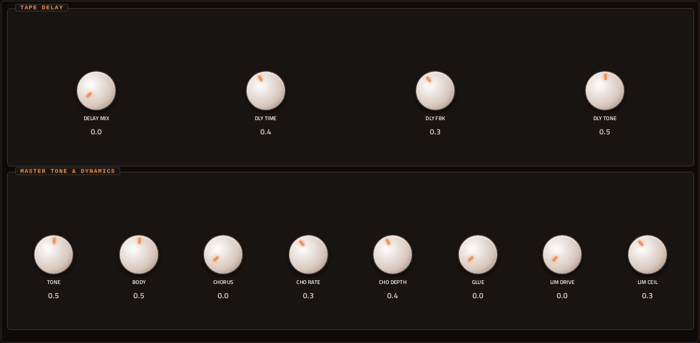
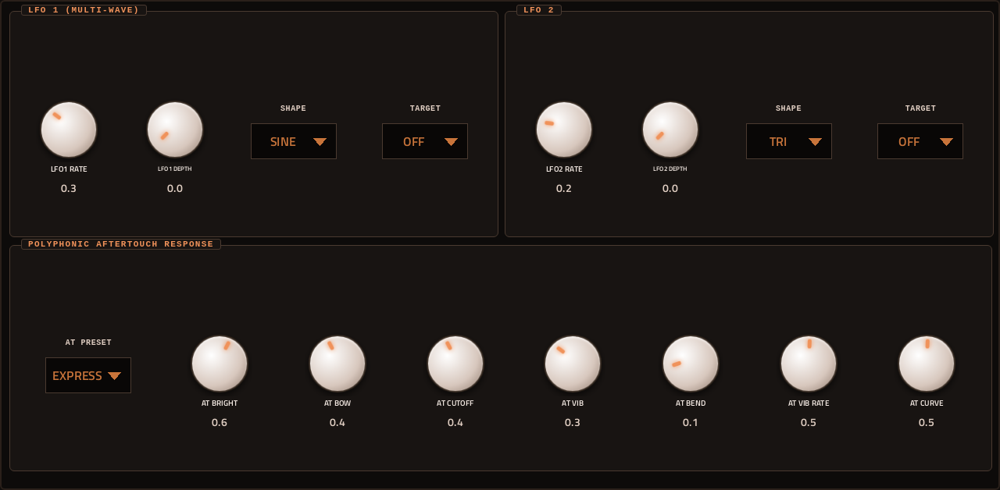

# Fizzik

**Synth** · Physical modelling: an exciter and two coupled resonators (string, beam, plate, membrane). · maker in MPC: Filliformes · licence: MIT


A physical-modelling instrument. An exciter (an impulse and noise mix with crackle, colour, its own envelope and resonance, velocity-sensitive) sets two resonators ringing; each can be a string, a beam, a plate or a membrane, with its own structure, decay, damping, position, tuning and tension, and COUPLE lets the two feed each other. After them: a filter with six voicings (SVF, SEM, MS-20, Steiner, two ladders), drive, chorus, delay, reverb and a limiter, two LFOs and aftertouch presets (bow, swell, vibrato...). 31 named presets and three randomise buttons. Plucked and struck tones, bowed glass, bells, metal and wood that react to how hard you play.

## On the MPC

- In the plugin browser: **[SYN] Fizzik** by **Filliformes** (Synth)
- Files: the release installs one folder, `/sdcard/Synths/Filliformes - VST - [SYN] Fizzik/`, holding `fizzik.so`, its screen. The vst_instruments installer puts `fizzik.so` in `/sdcard/vst/` instead.
- 72 parameters (all automatable) on 5 pages

## Playing it

Add it to a **plugin track** and play it from the pads, a keyboard or a MIDI clip. Every control can be turned with the Q-Links and automated, and the settings are saved with your project.

## Pages

Screenshots are rendered from the built skin with the engine's real values right after it's inserted. On the MPC each page is a tab under the plugin header. The Q-Links follow the page column by column: on a 4-knob MPC the Q-Link button steps through the columns, and MPC outlines the active one.

### 1. MAIN


Q-Link columns: **1** MODEL A, MODEL B, COUPLE, BALANCE  ·  **2** CUTOFF, RESONANCE, FILTER TYPE, VOICING  ·  **3** DRIVE, WIDTH, LEVEL  ·  **4** PRESET

### 2. EXCITER



Q-Link columns: **1** EXC MIX, CRACKLE, COLOR, ATTACK  ·  **2** DECAY, EXC RESO, VEL LEVEL, VEL COLOR  ·  **3** STRUCTURE A, DECAY A, DAMP A, POSITION A  ·  **4** TONE A, TUNE A, TENSION A

### 3. RESONATOR B



Q-Link columns: **1** STRUCTURE B, DECAY B, DAMP B, POSITION B  ·  **2** TONE B, TUNE B, TENSION B  ·  **3** GLIDE, AMP ATK, AMP REL, SPREAD  ·  **4** REVERB, REV SIZE, REV DAMP

### 4. DELAY / FX



Q-Link columns: **1** DELAY MIX, DLY TIME, DLY FBK, DLY TONE  ·  **2** TONE, BODY, CHORUS, CHO RATE  ·  **3** CHO DEPTH, GLUE, LIM DRIVE, LIM CEIL

### 5. LFO / AT



Q-Link columns: **1** LFO1 RATE, LFO1 DEPTH, LFO1 SHAPE, LFO1 TARGET  ·  **2** LFO2 RATE, LFO2 DEPTH, LFO2 SHAPE, LFO2 TARGET  ·  **3** AT PRESET, AT BRIGHT, AT BOW, AT CUTOFF  ·  **4** AT VIB, AT BEND, AT VIB RATE, AT CURVE

## Install

Needs a standalone MPC or Force on MPC OS 3.x with root SSH access (checked on an MPC Live II).

**From the release:** download `SYN-Fizzik-<version>-mpc-armv7.zip` from [Releases](https://github.com/saustin2010/mpc-vst-fizzik/releases),
copy it to the MPC, unzip it and run `sh install.sh` in its folder as root. The installer stops MPC, backs up
`MPC.settings`, installs the plugin folder and starts MPC again; `INSTALL.md` in the zip has the details and a by-hand route.

**With the rest of the collection:** from [vst_instruments](https://github.com/saustin2010/vst_instruments) ([INSTALL.md](https://github.com/saustin2010/vst_instruments/blob/main/INSTALL.md)):

```
./install.sh <mpc-address> fizzik
```

Use one or the other for this plugin: both register the same plugin (same uid), so the last one run wins.

## Where it comes from

- Upstream: https://github.com/filliformes/fizzik-move
- Vendored at commit ff9148897d44090e4887c31871f9cd846cbb9f90 2026-09-18
- Schwung module "Fizzik" v0.1.1 by Filliformes
- Licence: MIT ([`LICENSE`](LICENSE))
- MPC port and screen: [vst_instruments](https://github.com/saustin2010/vst_instruments) (`schwung/instruments/fizzik`), built on [sd88me's mpc-vst-plugins](https://github.com/sd88me/mpc-vst-plugins) (wrapper, Schwung adapter, skin tools).

## Changes for the MPC

- `src/dsp/fizzik.c` (`-DMPC_PORT`, 2026-10-02): the waveguide's fractional read wraps a position that float rounding left at exactly the delay length (one past the line; found with dev-tools/fuzz). Diff: `upstream-changes.diff`.
- New touchscreen page from its Google Stitch design (`design/`): the design's artwork as the background, its own knob art, live names and values, and controls the design left out added in its style (see RESKINNING.md).
- Presets in MPC's PRESET menu (2026-10-03): its 31 presets are VST programs (vst.json `programs`), so the PRESET
  dropdown in the plugin header, also on the arrangement screen, lists and loads them.

## Files

| Path | What |
|---|---|
| `screenshots/` | the pages as MPC draws them |
| `.github/workflows/release.yml` | the release build (GitHub Actions, a draft release) |
| `deploy/` | ready to install: `vst/` → `/sdcard/vst/`, `Synths/` → `/sdcard/Synths/`, plus the plugin-list entry (not used by the release) |
| `vst.json` | build settings: name, maker, sources, compiler flags |
| `params.json` | the plugin's parameters as MPC sees them (VST index = order) |
| `params.base.json` | the engine's own parameter list it was derived from |
| `params.pre-stitch.json` | the parameter list before the Stitch screen renamed controls |
| `layout.conf` | the screen: control positions, art, Q-Links (generated from the Stitch design) |
| `layout.grid.conf` | the plan of pages and controls the Stitch conversion fills in |
| `fizzik.css` | the artwork stylesheet |
| `images/` | artwork: backgrounds, knobs, displays |
| `design/` | the Google Stitch design this screen was converted from (`stitch.html`, as Stitch wrote it) |
| `src/` | the engine's source, vendored from upstream |
| `upstream-changes.diff` | every local change to the upstream source |
| `UPSTREAM` | where the source came from, and at which commit |

## Building

With Docker (32-bit ARM emulation for the build), Python 3 and the tools from
[saustin2010/mpc-vst-plugins](https://github.com/saustin2010/mpc-vst-plugins/tree/steve-features) (sd88me's [mpc-vst-plugins](https://github.com/sd88me/mpc-vst-plugins)
plus changes offered to it, until they're merged there; the commit is the one in `.github/workflows/release.yml`):

```
git clone -b steve-features https://github.com/saustin2010/mpc-vst-plugins
MPC_VST=$PWD/mpc-vst-plugins
bash "$MPC_VST/tools/build_port.sh" vst.json        # build/: fizzik.so, the screen, the plugin-list entry
bash "$MPC_VST/tools/test_port.sh" vst.json         # the offline host test (ASan/UBSan): must print PASSED
```

Releases are built by GitHub Actions (`.github/workflows/release.yml`, "Release (draft)") as a draft, installed and checked
on a device, then published. More: [BUILDING.md](https://github.com/saustin2010/vst_instruments/blob/main/BUILDING.md), and to change the screen, [RESKINNING.md](https://github.com/saustin2010/vst_instruments/blob/main/RESKINNING.md).

## Development

This plugin is developed in [vst_instruments](https://github.com/saustin2010/vst_instruments) (`schwung/instruments/fizzik`), next to the other plugins
and the tools that made its screen, and published to [mpc-vst-fizzik](https://github.com/saustin2010/mpc-vst-fizzik) for its
releases. Issues and pull requests are welcome in either.
