# Helm

**Synth** · Matt Tytel's Helm polysynth with its factory patches (275 with Move Organ). · maker in MPC: Matt Tytel · licence: GPL-3.0


Helm is a full polyphonic subtractive synth: two oscillators with unison and cross-modulation, a sub oscillator and noise, a multimode filter with a formant section, filter and modulation envelopes, mono and poly LFOs, a 32-step sequencer, an arpeggiator, distortion, delay, reverb and a stutter effect. This port runs Helm's own DSP engine headless and comes with its 274 factory patches (CC BY 4.0, by Matt Tytel and contributors) plus the Schwung port's Move Organ. Twelve pages; steps 17-32 of the step sequencer are automatable but not on a page.

## On the MPC

- In the plugin browser: **Helm** by **Matt Tytel** (Synth)
- Files: `/sdcard/vst/helm.so`, presets/data in `/sdcard/vst/helm/` (from this repo's `presets/helm/`, which `tools/fetch-presets.py` fills; install.sh does that for you), screen in `/sdcard/Synths/Matt Tytel - VST - Helm/`
- 164 parameters (all automatable) on 12 pages

## Playing it

Add it to a **plugin track** and play it from the pads, a keyboard or a MIDI clip. Every control can be turned with the Q-Links and automated, and the settings are saved with your project.

## Pages

Screenshots are rendered from the built skin with the engine's real values right after it's inserted. On the MPC each page is a tab under the plugin header. The Q-Links follow the page column by column: on a 4-knob MPC the Q-Link button steps through the columns, and MPC outlines the active one.

### 1. MAIN


Q-Link columns: **1** PATCH, VOLUME, POLYPHONY, OCTAVE  ·  **2** LEGATO, CUTOFF, RESONANCE, FILTER TYPE  ·  **3** AMP ATTACK, AMP DECAY, AMP SUSTAIN, AMP RELEASE

### 2. OSC

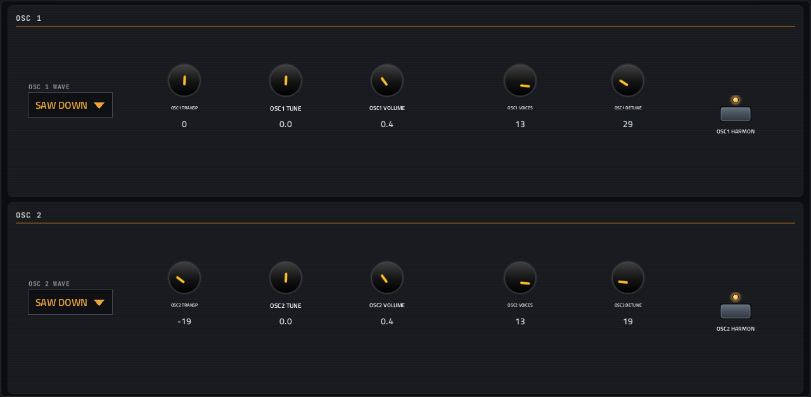

Q-Link columns: **1** OSC 1 TRANSP, OSC 1 TUNE, OSC 1 UNI DT, OSC 1 UNI VO  ·  **2** OSC 1 VOLUME, OSC 1 WAVE, OSC 1 HARM, OSC 2 TRANSP  ·  **3** OSC 2 TUNE, OSC 2 UNI DT, OSC 2 UNI VO, OSC 2 VOLUME  ·  **4** OSC 2 WAVE, OSC 2 HARM

### 3. OSC MIX

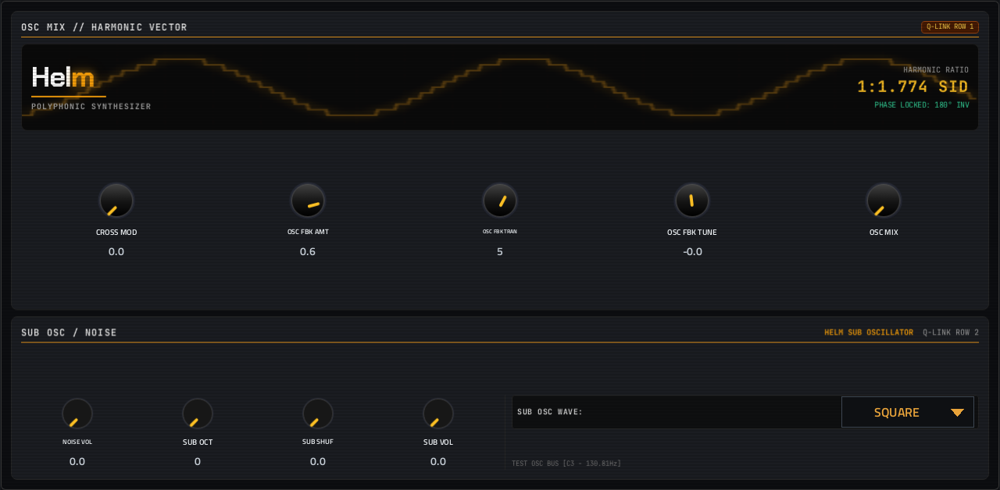

Q-Link columns: **1** CROSS MOD, OSC FBK AMT, OSC FBK TRAN, OSC FBK TUNE  ·  **2** OSC MIX, NOISE VOL, SUB OCT, SUB SHUF  ·  **3** SUB VOL, SUB OSC WAVE

### 4. FILTER

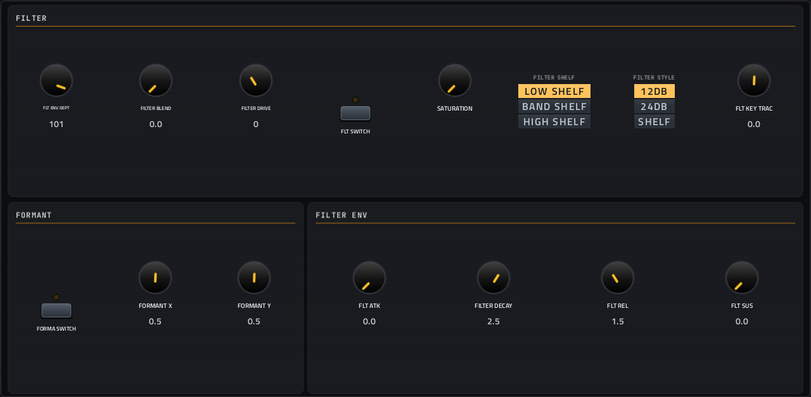

Q-Link columns: **1** FLT ENV DEPT, FILTER BLEND, FILTER DRIVE, FLT SWITCH  ·  **2** SATURATION, FILTER SHELF, FILTER STYLE, FLT KEY TRAC  ·  **3** FORMA SWITCH, FORMANT X, FORMANT Y, FLT ATK  ·  **4** FILTER DECAY, FLT REL, FLT SUS

### 5. MOD ENV

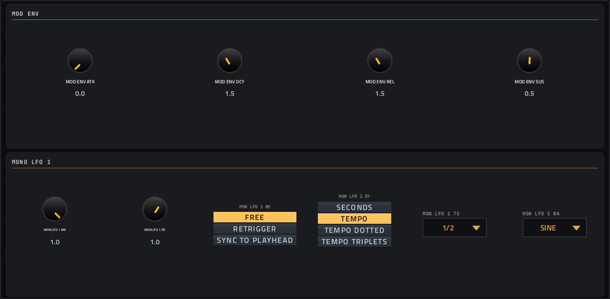

Q-Link columns: **1** MOD ENV ATK, MOD ENV DCY, MOD ENV REL, MOD ENV SUS  ·  **2** MON LFO 1 AM, MON LFO 1 FR, MON LFO 1 RE, MON LFO 1 SY  ·  **3** MON LFO 1 TE, MON LFO 1 WA

### 6. MONO LFO

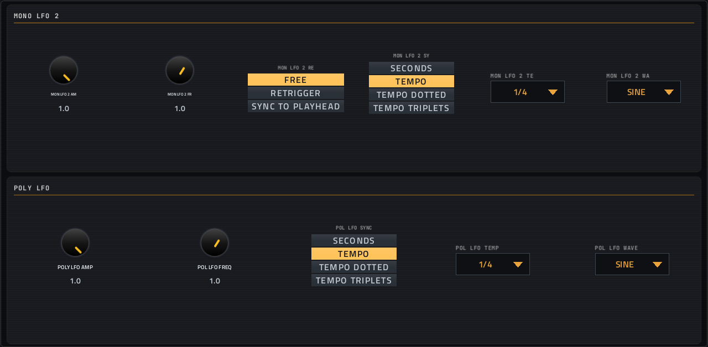

Q-Link columns: **1** MON LFO 2 AM, MON LFO 2 FR, MON LFO 2 RE, MON LFO 2 SY  ·  **2** MON LFO 2 TE, MON LFO 2 WA, POLY LFO AMP, POL LFO FREQ  ·  **3** POL LFO SYNC, POL LFO TEMP, POL LFO WAVE

### 7. STEP SEQ

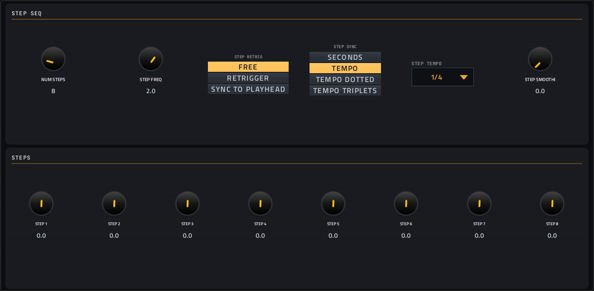

Q-Link columns: **1** NUM STEPS, STEP FREQ, STEP RETRIG, STEP SYNC  ·  **2** STEP TEMPO, STEP SMOOTHI, STEP 1, STEP 2  ·  **3** STEP 3, STEP 4, STEP 5, STEP 6  ·  **4** STEP 7, STEP 8

### 8. STEPS

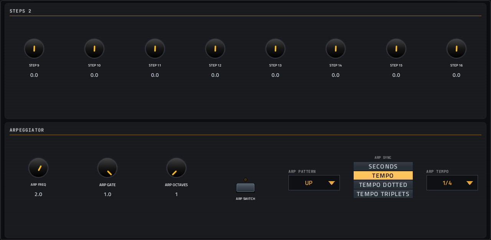

Q-Link columns: **1** STEP 9, STEP 10, STEP 11, STEP 12  ·  **2** STEP 13, STEP 14, STEP 15, STEP 16  ·  **3** ARP FREQ, ARP GATE, ARP OCTAVES, ARP SWITCH  ·  **4** ARP PATTERN, ARP SYNC, ARP TEMPO

### 9. DISTORTION

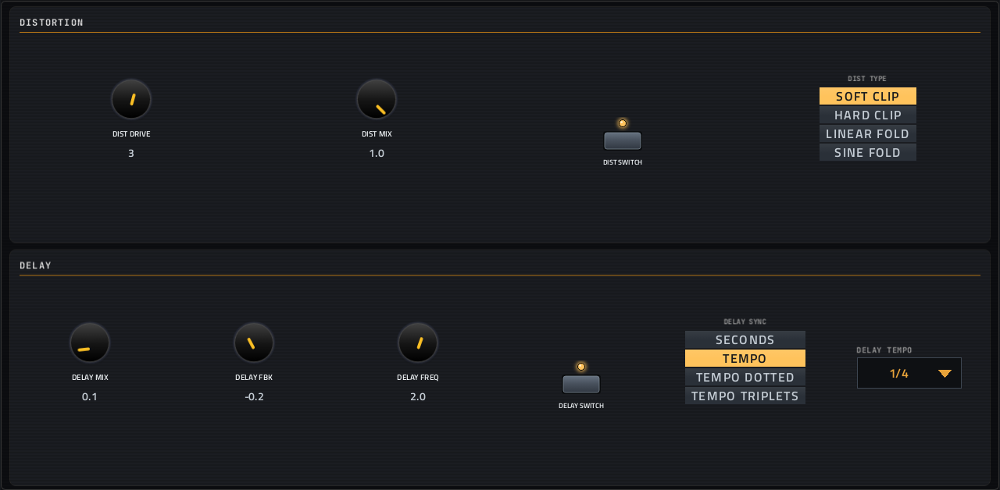

Q-Link columns: **1** DIST DRIVE, DIST MIX, DIST SWITCH, DIST TYPE  ·  **2** DELAY MIX, DELAY FBK, DELAY FREQ, DELAY SWITCH  ·  **3** DELAY SYNC, DELAY TEMPO

### 10. REVERB

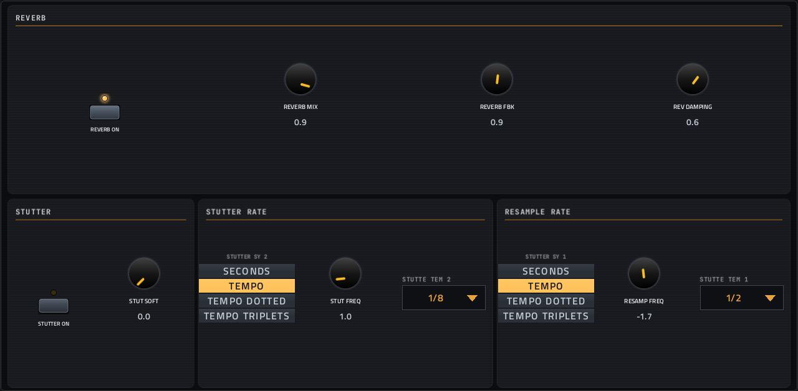

Q-Link columns: **1** REVER DAMPIN, REVERB MIX, REVERB FBK, REVER SWITCH  ·  **2** STUTTER FREQ, STUTT SWITCH, RESAMPL FREQ, STUTTER SY 1  ·  **3** STUTTE TEM 1, STUTT SOFTNE, STUTTER SY 2, STUTTE TEM 2

### 11. PLAYING

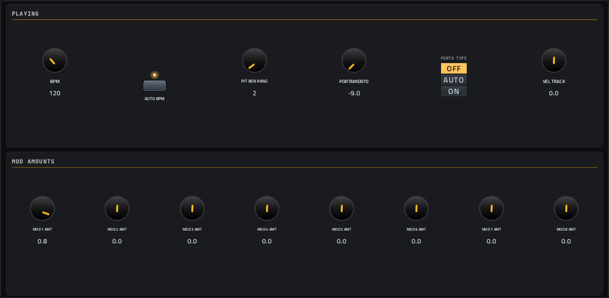

Q-Link columns: **1** BPM, AUTO BPM, PIT BEN RANG, PORTAMENTO  ·  **2** PORTA TYPE, VEL TRACK, MOD 1 AMT, MOD 2 AMT  ·  **3** MOD 3 AMT, MOD 4 AMT, MOD 5 AMT, MOD 6 AMT  ·  **4** MOD 7 AMT, MOD 8 AMT

### 12. MOD AMOUNTS

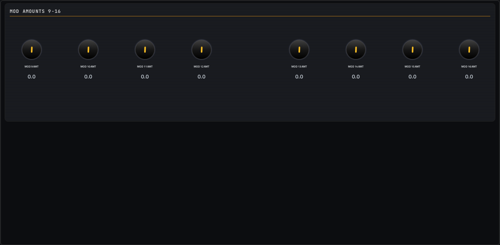

Q-Link columns: **1** MOD 9 AMT, MOD 10 AMT, MOD 11 AMT, MOD 12 AMT  ·  **2** MOD 13 AMT, MOD 14 AMT, MOD 15 AMT, MOD 16 AMT

## Install

From the top of this repo (see [INSTALL.md](../../../INSTALL.md)):

```
./install.sh <mpc-address> helm
```

## Where it comes from

- Upstream: https://github.com/andree182/schwung-helm
- Vendored at commit 10823a8ebc3a0e1a0cd43d0c459e8bae63996c9d 2026-06-11
- Schwung module "Helm" v1.5 by Matt Tytel (port: andree182 & antigravity)
- Licence: GPL-3.0 ([`LICENSE`](LICENSE))
- MPC port and screen: this repo, built on [sd88me's mpc-vst-plugins](https://github.com/sd88me/mpc-vst-plugins) (wrapper, Schwung adapter, skin tools).

## Changes for the MPC

- Adds `src/data/Move Organ.helm` (from upstream's `data/`) to the factory patch folder it ships.
- mopo (Helm's DSP library), found by the offline test: `Memory` frees a `new[]` buffer with `delete` (now `delete[]`), and `TriggerWait` copies an uninitialised flag (now initialised). Its oscillators wrap their phase by signed overflow, so the build adds `-fwrapv`. Diff: `upstream-changes.diff`.
- Vendored tree trimmed from 139 MB to 57 MB (2026-10-01): removed the unused second JUCE copy, JUCE's examples/extras/docs, concurrentqueue's benchmarks/tests, the GUI/standalone/builds folders and the bundled VST3_SDK (Steinberg's SDK is never kept here); the build and test pass without them.
- `params.base.json` comes from the module's `chain_params` (what the engine actually takes, saved as `chain_params.engine.json`), not its menu tree.
- New touchscreen page from its Google Stitch design (`design/`): the design's artwork as the background, its own knob art, live names and values, and controls the design left out added in its style (see RESKINNING.md).
- Presets in MPC's PRESET menu (2026-10-03): its 275 patches are VST programs, listed live from the engine (vst.json
  `programs` with `count` and `name_at`; the engine answers a preset's name by number, marked MPC port), named from their files without loading each one (stepping through them at every insert would take seconds).

## Files

| Path | What |
|---|---|
| `screenshots/` | the pages as MPC draws them |
| `deploy/` | ready to install: `vst/` → `/sdcard/vst/`, `Synths/` → `/sdcard/Synths/`, plus the plugin-list entry (its presets/kits are in the repo's `presets/` folder, not here) |
| `vst.json` | build settings: name, maker, sources, compiler flags |
| `params.json` | the plugin's parameters as MPC sees them (VST index = order) |
| `params.base.json` | the engine's own parameter list it was derived from |
| `params.pre-stitch.json` | the parameter list before the Stitch screen renamed controls |
| `chain_params.engine.json` | what the engine reports it takes (its `chain_params`) |
| `layout.conf` | the screen: control positions, art, Q-Links (generated from the Stitch design) |
| `layout.grid.conf` | the plan of pages and controls the Stitch conversion fills in |
| `helm.css` | the artwork stylesheet |
| `images/` | artwork: backgrounds, knobs, displays |
| `design/` | the Google Stitch design this screen was converted from (`stitch.html`, as Stitch wrote it) |
| `src/` | the engine's source, vendored from upstream |
| `upstream-changes.diff` | every local change to the upstream source |
| `UPSTREAM` | where the source came from, and at which commit |

To rebuild from source see [BUILDING.md](../../../BUILDING.md); to change the screen, [RESKINNING.md](../../../RESKINNING.md).
