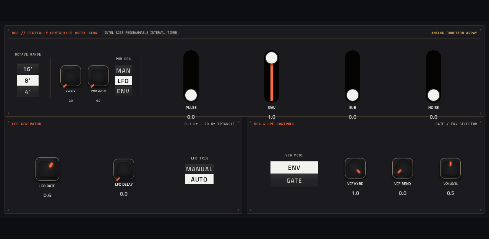

# Hera

**Synth** · Roland Juno-60: jpcima's Hera engine, with its 56 presets. · maker in MPC: jpcima · licence: GPL-3.0


A Juno-60 emulation: one DCO per voice with saw, pulse (PWM from the LFO or envelope), sub and noise, a high-pass filter, the 24 dB resonant low-pass VCF with envelope, LFO and keyboard tracking, an ADSR, and the famous BBD chorus (modes I, II and both). Polyphonic, warm and simple, as the original. 56 preset files ship with it. The MAIN page has the patch browser, chorus, filter and envelope faders; DCO / LFO has the oscillator section.

## On the MPC

- In the plugin browser: **[SYN] Hera** by **jpcima** (Synth)
- Files: the release installs one folder, `/sdcard/Synths/jpcima - VST - [SYN] Hera/`, holding `hera.so`, its screen and its presets (`hera/`). The vst_instruments installer puts `hera.so` in `/sdcard/vst/` and the presets in `/sdcard/vst/hera/` instead; the plugin finds them either way (its data folder is `hera/` next to the `.so`).
- 32 parameters (all automatable) on 2 pages

## Playing it

Add it to a **plugin track** and play it from the pads, a keyboard or a MIDI clip. Every control can be turned with the Q-Links and automated, and the settings are saved with your project.

## Pages

Screenshots are rendered from the built skin with the engine's real values right after it's inserted. On the MPC each page is a tab under the plugin header. The Q-Links follow the page column by column: on a 4-knob MPC the Q-Link button steps through the columns, and MPC outlines the active one.

### 1. MAIN


Q-Link columns: **1** VCF FREQ, RESONANCE, VCF ENV, VCF LFO  ·  **2** ATTACK, DECAY, SUSTAIN, RELEASE  ·  **3** OCTAVE, VOLUME, HPF  ·  **4** PATCH, CHORUS I, CHORUS II

### 2. DCO / LFO



Q-Link columns: **1** RANGE, DCO LFO, PWM DEPTH, PWM MODE  ·  **2** PULSE, SAW, SUB, NOISE  ·  **3** LFO RATE, LFO DELAY, LFO TRIG  ·  **4** VCA MODE, VCF KYBD, VCF BEND, VCA LEVEL

## Install

Needs a standalone MPC or Force on MPC OS 3.x with root SSH access (checked on an MPC Live II).

**From the release:** download `SYN-Hera-<version>-mpc-armv7.zip` from [Releases](https://github.com/saustin2010/mpc-vst-hera/releases),
copy it to the MPC, unzip it and run `sh install.sh` in its folder as root. The installer stops MPC, backs up
`MPC.settings`, installs the plugin folder and starts MPC again; `INSTALL.md` in the zip has the details and a by-hand route.

**With the rest of the collection:** from [vst_instruments](https://github.com/saustin2010/vst_instruments) ([INSTALL.md](https://github.com/saustin2010/vst_instruments/blob/main/INSTALL.md)):

```
./install.sh <mpc-address> hera
```

Use one or the other for this plugin: both register the same plugin (same uid), so the last one run wins.

## Where it comes from

- Schwung module "Hera" v0.1.7 by jpcima (port: charlesvestal)
- Licence: GPL-3.0, as declared in the module's `src/module.json` (text: [LICENSE](LICENSE))
- MPC port and screen: [vst_instruments](https://github.com/saustin2010/vst_instruments) (`schwung/instruments/hera`), built on [sd88me's mpc-vst-plugins](https://github.com/sd88me/mpc-vst-plugins) (wrapper, Schwung adapter, skin tools).

## Changes for the MPC

- All 26 engine parameters (the first build exposed 10): DCO levels, PWM + source, sub, noise, range, HPF, VCA mode/level, LFO delay/trigger, Chorus I/II, VCF LFO/KYBD/BEND, plus octave.
- Presets work (files shipped + MODULE_DIR) with a PATCH browser; new parameters appended so the first build's indices are unchanged.
- **`-fwrapv` (2026-10-02)**: Hera's noise generators rely on signed wrap-around; now defined behaviour. Found with `dev-tools/fuzz`, which otherwise ran clean.
- New touchscreen page from its Google Stitch design (`design/`): the design's artwork as the background, its own knob art, live names and values, and controls the design left out added in its style (see RESKINNING.md).
- **VOLUME restored (2026-10-03)**: the engine saved VOLUME in its state but never read it back, so a project reopened at the default level. `src/dsp/hera_plugin.cpp` now reads it.
- Presets in MPC's PRESET menu (2026-10-03): its 56 presets are VST programs (vst.json `programs`), so the PRESET
  dropdown in the plugin header, also on the arrangement screen, lists and loads them.
- **Data folder next to the plugin (2026-10-08)**: `MODULE_SUBDIR` `hera`, so the presets are found in `hera/` beside
  `hera.so` wherever it's installed (the release's plugin folder, or `/sdcard/vst/` with the collection's installer);
  `MODULE_DIR` stays as the fallback.
- **Preset names without loading them (2026-10-08)**: the engine answers `preset:<n>` with preset n's name (`MPC_PORT` in
  `src/dsp/hera_plugin.cpp`), which is how the current mpc-vst-plugins names the PRESET menu's entries.
- Both changes to `src/dsp/hera_plugin.cpp` (this and VOLUME) are in `upstream-changes.diff`, against charlesvestal/schwung-hera
  `255be06` (module v0.1.7).

## Files

| Path | What |
|---|---|
| `screenshots/` | the pages as MPC draws them |
| `LICENSE` | the licence (GPL-3.0) |
| `.github/workflows/release.yml` | the release build (GitHub Actions, a draft release) |
| `tested.json` | the devices each release was checked on (the catalogue shows it) |
| `release/` | `library.json` (where its presets come from, pinned) and `fetch-library.py` (fetches them) |
| `deploy/` | ready to install: `vst/` → `/sdcard/vst/`, `Synths/` → `/sdcard/Synths/`, plus the plugin-list entry (not used by the release) |
| `vst.json` | build settings: name, maker, sources, compiler flags |
| `params.json` | the plugin's parameters as MPC sees them (VST index = order) |
| `params.base.json` | the engine's own parameter list it was derived from |
| `params.pre-stitch.json` | the parameter list before the Stitch screen renamed controls |
| `layout.conf` | the screen: control positions, art, Q-Links (generated from the Stitch design) |
| `layout.grid.conf` | the plan of pages and controls the Stitch conversion fills in |
| `hera.css` | the artwork stylesheet |
| `images/` | artwork: backgrounds, knobs, displays |
| `design/` | the Google Stitch design this screen was converted from (`stitch.html`, as Stitch wrote it) |
| `src/` | the engine's source, vendored from upstream |
| `upstream-changes.diff` | every local change to the upstream source |

## Building

With Docker (32-bit ARM emulation for the build), Python 3 and the tools from
[saustin2010/mpc-vst-plugins](https://github.com/saustin2010/mpc-vst-plugins/tree/steve-features) (sd88me's [mpc-vst-plugins](https://github.com/sd88me/mpc-vst-plugins)
plus changes offered to it, until they're merged there; the commit is the one in `.github/workflows/release.yml`):

```
git clone -b steve-features https://github.com/saustin2010/mpc-vst-plugins
MPC_VST=$PWD/mpc-vst-plugins
python3 release/fetch-library.py library        # its presets, from their project at a pinned commit
bash "$MPC_VST/tools/build_port.sh" vst.json        # build/: hera.so, the screen, the plugin-list entry
bash "$MPC_VST/tools/test_port.sh" vst.json         # the offline host test (ASan/UBSan): must print PASSED
```

Releases are built by GitHub Actions (`.github/workflows/release.yml`, "Release (draft)") as a draft, installed and checked
on a device, then published. More: [BUILDING.md](https://github.com/saustin2010/vst_instruments/blob/main/BUILDING.md), and to change the screen, [RESKINNING.md](https://github.com/saustin2010/vst_instruments/blob/main/RESKINNING.md).

## Development

This plugin is developed in [vst_instruments](https://github.com/saustin2010/vst_instruments) (`schwung/instruments/hera`), next to the other plugins
and the tools that made its screen, and published to [mpc-vst-hera](https://github.com/saustin2010/mpc-vst-hera) for its
releases. Issues and pull requests are welcome in either.
