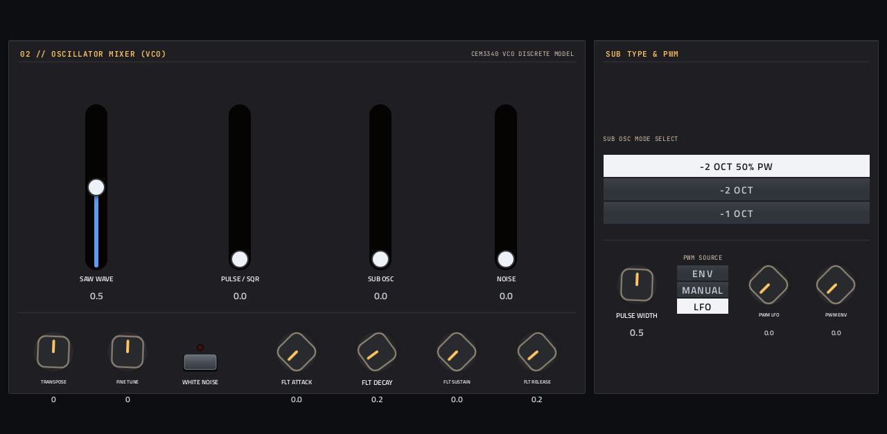
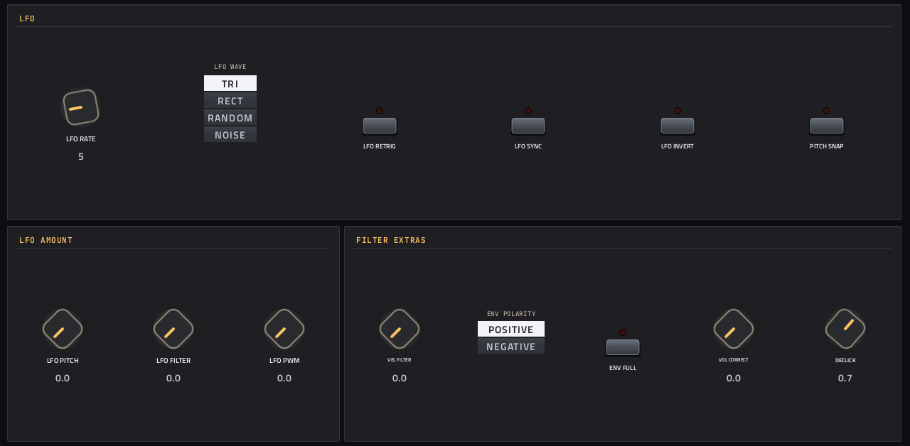
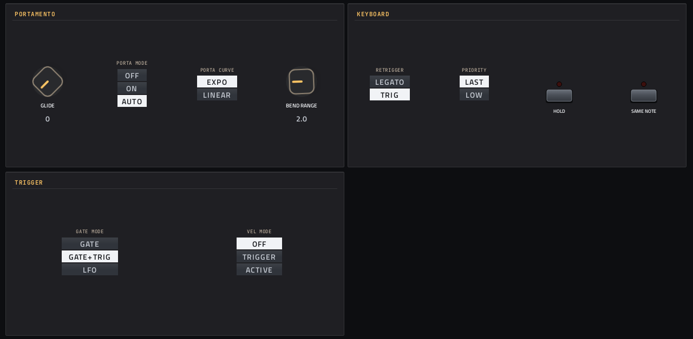

# Hush One

**Synth** · Roland SH-101: a monophonic bass and lead synth with 11 presets, plus TAL-BassLine-101 presets you add. · maker in MPC: Move Everything · licence: not stated upstream


An SH-101 emulation: one oscillator with saw, pulse (with PWM), sub-oscillator and noise mixed together, the resonant 4-pole filter with envelope and keyboard tracking, an ADSR, an LFO with its own routing, portamento and the 101's trigger modes. Built for basses, leads and acid lines. 11 built-in presets; TAL-BassLine-101 presets (`.bassline`, `.vstpreset`) you add follow them in PATCH.

## On the MPC

- In the plugin browser: **Hush One** by **Move Everything** (Synth)
- Files: `/sdcard/vst/hushone.so`, presets you add in `/sdcard/vst/hush1/presets/` (from this repo's `presets/hush1/`), screen in `/sdcard/Synths/Move Everything - VST - Hush One/`
- 56 parameters (all automatable) on 4 pages

## Playing it

Add it to a **plugin track** and play it from the pads, a keyboard or a MIDI clip. Every control can be turned with the Q-Links and automated, and the settings are saved with your project.

## Pages

Screenshots are rendered from the built skin with the engine's real values right after it's inserted. On the MPC each page is a tab under the plugin header. The Q-Links follow the page column by column: on a 4-knob MPC the Q-Link button steps through the columns, and MPC outlines the active one.

### 1. MAIN


Q-Link columns: **1** PATCH, CUTOFF, RESONANCE, ENV AMT  ·  **2** KEY TRACK, ATTACK, DECAY, SUSTAIN  ·  **3** RELEASE, VCA MODE, OCTAVE, VELO SENS  ·  **4** MASTER VOL

### 2. SOURCE



Q-Link columns: **1** SAW WAVE, PULSE / SQR, SUB OSC, NOISE  ·  **2** TRANSPOSE, FINE TUNE, WHITE NOISE, FLT ATTACK  ·  **3** FLT DECAY, FLT SUSTAIN, FLT RELEASE, SUB MODE  ·  **4** PULSE WIDTH, PWM SOURCE, PWM LFO, PWM ENV

### 3. MODULATOR



Q-Link columns: **1** LFO RATE, LFO WAVE, LFO RETRIG, LFO SYNC  ·  **2** LFO INVERT, PITCH SNAP, LFO PITCH, LFO FILTER  ·  **3** LFO PWM, VEL FILTER, ENV POLARITY, ENV FULL  ·  **4** VOL CORRECT, DECLICK

### 4. PERFORM



Q-Link columns: **1** GLIDE, PORTA MODE, PORTA CURVE, BEND RANGE  ·  **2** RETRIGGER, PRIORITY, HOLD, SAME NOTE  ·  **3** GATE MODE, VEL MODE

## Install

From the top of this repo (see [INSTALL.md](../../../INSTALL.md)):

```
./install.sh <mpc-address> hush1
```

## Where it comes from

- Schwung module "HUSH ONE" v0.2.8 by the Move Everything community
- Licence: **not stated upstream**. The source is included as published by its author; ask them before reusing it elsewhere.
- MPC port and screen: this repo, built on [sd88me's mpc-vst-plugins](https://github.com/sd88me/mpc-vst-plugins) (wrapper, Schwung adapter, skin tools).

## Changes for the MPC

- Presets work: the preset control only reached presets 0 and 1; now a PATCH browser over all 11.
- TAL-BassLine-101 presets (2026-10-03): `.bassline` / `.vstpreset` files in `/sdcard/vst/hush1/presets/` (subfolders included, up to 512) follow the 11 built-in presets in PATCH, which now runs to 522. They're read when the plugin is inserted, so re-insert it after adding files. vst.json sets `MODULE_DIR` (without it the engine looked nowhere), and one engine change, under `MPC_PORT` (`upstream-changes.diff`): a preset is named by its file, not by the name stored inside, which packs often leave stale ("02 - Softy" in `SY Softy.bassline`) and which scrambled their category order.
- Four SH-101-style pages (MAIN, SOURCE, MODULATOR, PERFORM): faders for the source mixer and envelopes.
- The engine reports option values as text, so option labels only changed case (matched case-insensitively).
- New touchscreen page from its Google Stitch design (`design/`): the design's artwork as the background, its own knob art, live names and values, and controls the design left out added in its style (see RESKINNING.md).

## Files

| Path | What |
|---|---|
| `screenshots/` | the pages as MPC draws them |
| `deploy/` | ready to install: `vst/` → `/sdcard/vst/`, `Synths/` → `/sdcard/Synths/`, plus the plugin-list entry (its presets/kits are in the repo's `presets/` folder, not here) |
| `vst.json` | build settings: name, maker, sources, compiler flags |
| `params.json` | the plugin's parameters as MPC sees them (VST index = order) |
| `params.base.json` | the engine's own parameter list it was derived from |
| `params.pre-stitch.json` | the parameter list before the Stitch screen renamed controls |
| `layout.conf` | the screen: control positions, art, Q-Links (generated from the Stitch design) |
| `layout.grid.conf` | the plan of pages and controls the Stitch conversion fills in |
| `hush1.css` | the artwork stylesheet |
| `images/` | artwork: backgrounds, knobs, displays |
| `design/` | the Google Stitch design this screen was converted from (`stitch.html`, as Stitch wrote it) |
| `src/` | the engine's source, vendored from upstream |
| `upstream-changes.diff` | every local change to the upstream source |

To rebuild from source see [BUILDING.md](../../../BUILDING.md); to change the screen, [RESKINNING.md](../../../RESKINNING.md).
