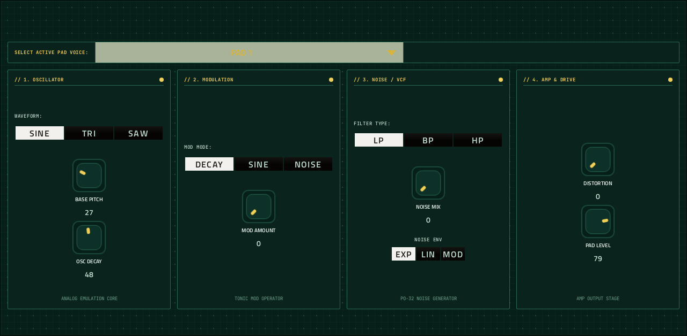
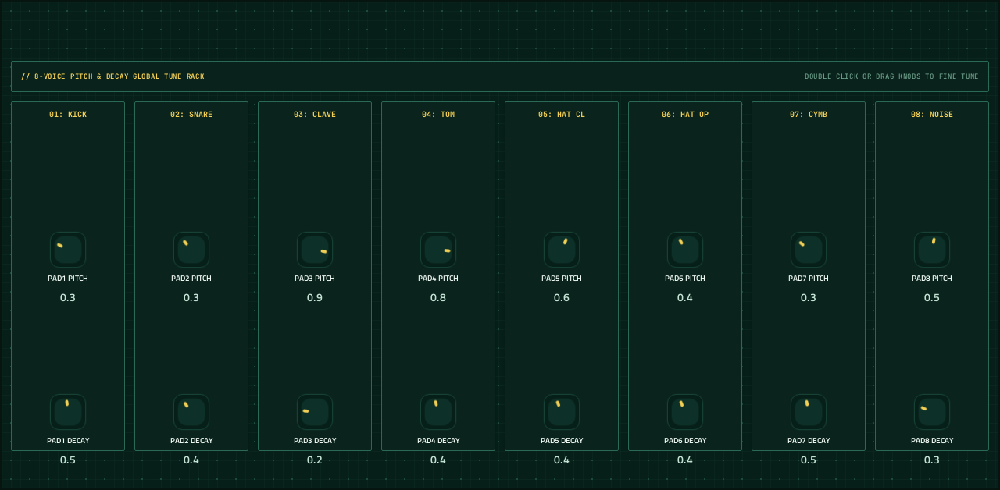

# Libpo32

**Drum synth** · PO-32-style drum synth: 16 synthesised drum sounds on pads 36-51. · maker in MPC: mestela · licence: not stated upstream


A drum synthesiser in the spirit of Teenage Engineering's PO-32 Tonic: every sound is synthesised (oscillator, pitch and noise envelopes, modulation), with 16 sounds on MIDI notes 36-51, so MPC's pads play it directly. Three kits ship with it (tonic, tape, acid). KIT holds the kit and level per pad; EDIT is a per-pad sound editor (pick a pad, shape its oscillator, modulation, noise and output); TUNE sets each pad's pitch and decay.

## On the MPC

- In the plugin browser: **Libpo32** by **mestela** (Synth)
- Files: `/sdcard/vst/libpo32.so`, presets/data in `/sdcard/vst/libpo32/` (from this repo's `presets/libpo32/`, which `tools/fetch-presets.py` fills; install.sh does that for you), screen in `/sdcard/Synths/mestela - VST - Libpo32/`
- 210 parameters (all automatable) on 3 pages

## Playing it

Add it to a **plugin track** and play it from the pads, a keyboard or a MIDI clip. Every control can be turned with the Q-Links and automated, and the settings are saved with your project.

Its 16 sounds sit on MIDI notes 36-51, one per pad.

## Pages

Screenshots are rendered from the built skin with the engine's real values right after it's inserted. On the MPC each page is a tab under the plugin header. The Q-Links follow the page column by column: on a 4-knob MPC the Q-Link button steps through the columns, and MPC outlines the active one.

### 1. KIT


Q-Link columns: **1** LEVEL, DECAY SCALE  ·  **2** 01: KICK, 02: SNARE, 03: CLAVE, 04: TOM  ·  **3** 05: HAT CL, 06: HAT OP, 07: CYMB, 08: NOISE  ·  **4** KIT

### 2. EDIT



Q-Link columns: **1** WAVE, BASE PITCH, OSC DECAY  ·  **2** MOD MODE, MOD AMOUNT  ·  **3** NOISE FILTER, NOISE MIX, NOISE ENV  ·  **4** DISTORTION, PAD LEVEL

### 3. TUNE



Q-Link columns: **1** PAD1 PITCH, PAD1 DECAY, PAD2 PITCH, PAD2 DECAY  ·  **2** PAD3 PITCH, PAD3 DECAY, PAD4 PITCH, PAD4 DECAY  ·  **3** PAD5 PITCH, PAD5 DECAY, PAD6 PITCH, PAD6 DECAY  ·  **4** PAD7 PITCH, PAD7 DECAY, PAD8 PITCH, PAD8 DECAY

## Install

From the top of this repo (see [INSTALL.md](../../../INSTALL.md)):

```
./install.sh <mpc-address> libpo32
```

## Where it comes from

- Schwung module "Libpo32" v1.1.0 by mestela
- Licence: **not stated upstream**. The source is included as published by its author; ask them before reusing it elsewhere.
- MPC port and screen: this repo, built on [sd88me's mpc-vst-plugins](https://github.com/sd88me/mpc-vst-plugins) (wrapper, Schwung adapter, skin tools).

## Changes for the MPC

- Kits work: they were never shipped and the kit control was a bare 0-31 knob; now a KIT browser shows the kit name.
- A per-pad EDIT page (pick any of 16 pads: wave, pitch, decay, mod, noise, distortion, level) instead of 195 auto knobs; a pad mixer (levels 1-8) and a TUNE page (pitch/decay 1-8).
- All 195 original per-pad parameters are still there (same indices) for automation; RANDOM KIT button.
- SAVE KIT (2026-10-04, KIT page, appended param): saves the current sound as `kit001`, `kit002`... in `/sdcard/vst/libpo32/presets/` (the engine's own `save_kit`) and selects it; saved kits follow the shipped ones in KIT and MPC's PRESET menu, which re-reads the names (`kit_name_at:<n>`, `src/dsp/po32_drum.c` under `-DMPC_PORT`; diff: `upstream-changes.diff`). KIT now reaches 64 kits (the engine's limit). Reinstalling or uninstalling keeps saved kits.
- Drums only sound on notes 36-51; the bundled kits fill pads 1-8 (tonic) or 1-4 (tape, acid).
- New touchscreen page from its Google Stitch design (`design/`): the design's artwork as the background, its own knob art, live names and values, and controls the design left out added in its style (see RESKINNING.md).
- Presets in MPC's PRESET menu (2026-10-03): its kits are VST programs (vst.json `programs`), so the PRESET
  dropdown in the plugin header, also on the arrangement screen, lists and loads them.

## Files

| Path | What |
|---|---|
| `screenshots/` | the pages as MPC draws them |
| `deploy/` | ready to install: `vst/` → `/sdcard/vst/`, `Synths/` → `/sdcard/Synths/`, plus the plugin-list entry (its presets/kits are in the repo's `presets/` folder, not here) |
| `vst.json` | build settings: name, maker, sources, compiler flags |
| `params.json` | the plugin's parameters as MPC sees them (VST index = order) |
| `params.base.json` | the engine's own parameter list it was derived from |
| `params.pre-stitch.json` | the parameter list before the Stitch screen renamed controls |
| `layout.conf` | the screen: control positions, art, Q-Links (generated from the Stitch design) |
| `layout.grid.conf` | the plan of pages and controls the Stitch conversion fills in |
| `libpo32.css` | the artwork stylesheet |
| `images/` | artwork: backgrounds, knobs, displays |
| `design/` | the Google Stitch design this screen was converted from (`stitch.html`, as Stitch wrote it) |
| `src/` | the engine's source, vendored from upstream |

To rebuild from source see [BUILDING.md](../../../BUILDING.md); to change the screen, [RESKINNING.md](../../../RESKINNING.md).
