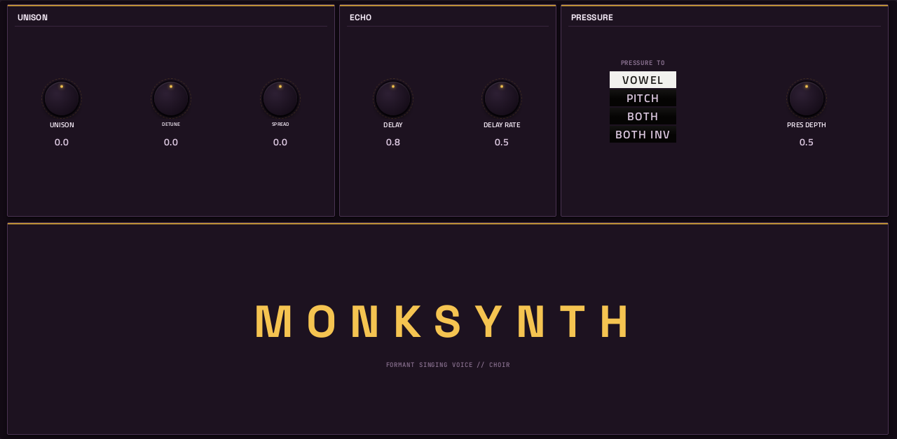

# MonkSynth

**Synth** · A formant (FOF) singing voice with 12 characters and a choir. · maker in MPC: Jonathan Taylor · licence: MIT


A vocal synthesiser built on FOF formant synthesis: it sings vowels, and its 12 singers (the presets) are different characters. Shape VOWEL, HEAD SIZE, BREATH, glide and vibrato on the SINGER page, with an ADSR; CHOIR stacks unison voices (detune, spread), adds an echo, and routes pressure (aftertouch) to the vowel, the pitch or both. Choirs, chants, robotic voices and vocal pads.

## On the MPC

- In the plugin browser: **MonkSynth** by **Jonathan Taylor** (Synth)
- Files: `/sdcard/vst/monksynth.so`, screen in `/sdcard/Synths/Jonathan Taylor - VST - MonkSynth/`
- 25 parameters (all automatable) on 2 pages

## Playing it

Add it to a **plugin track** and play it from the pads, a keyboard or a MIDI clip. Every control can be turned with the Q-Links and automated, and the settings are saved with your project.

## Pages

Screenshots are rendered from the built skin with the engine's real values right after it's inserted. On the MPC each page is a tab under the plugin header. The Q-Links follow the page column by column: on a 4-knob MPC the Q-Link button steps through the columns, and MPC outlines the active one.

### 1. SINGER


Q-Link columns: **1** SINGER, VOWEL, HEAD SIZE, BREATH  ·  **2** LEVEL, ATTACK, DECAY, SUSTAIN  ·  **3** RELEASE, GLIDE, VIBRATO, VIB RATE  ·  **4** BEND RNG

### 2. CHOIR



Q-Link columns: **1** UNISON, DETUNE, SPREAD, DELAY  ·  **2** DELAY RATE, PRESSURE TO, PRES DEPTH

## Install

From the top of this repo (see [INSTALL.md](../../../INSTALL.md)):

```
./install.sh <mpc-address> monksynth
```

## Where it comes from

- Upstream: https://github.com/charlesvestal/schwung-monksynth
- Vendored at commit f8afe350f249bafa32588b37e9a26712432d56fe 2026-09-09
- Schwung module "MonkSynth" v0.1.1 by Jonathan Taylor (DSP), Charles Vestal (port)
- Licence: MIT ([`LICENSE`](LICENSE), [`NOTICE`](NOTICE))
- MPC port and screen: this repo, built on [sd88me's mpc-vst-plugins](https://github.com/sd88me/mpc-vst-plugins) (wrapper, Schwung adapter, skin tools).

## Changes for the MPC

- New touchscreen page from its Google Stitch design (`design/`): the design's artwork as the background, its own knob art, live names and values, and controls the design left out added in its style (see RESKINNING.md).
- Presets in MPC's PRESET menu (2026-10-03): its 12 singer presets are VST programs (vst.json `programs`), so the PRESET
  dropdown in the plugin header, also on the arrangement screen, lists and loads them.

## Files

| Path | What |
|---|---|
| `screenshots/` | the pages as MPC draws them |
| `deploy/` | ready to install: `vst/` → `/sdcard/vst/`, `Synths/` → `/sdcard/Synths/`, plus the plugin-list entry (its presets/kits are in the repo's `presets/` folder, not here) |
| `vst.json` | build settings: name, maker, sources, compiler flags |
| `params.json` | the plugin's parameters as MPC sees them (VST index = order) |
| `params.base.json` | the engine's own parameter list it was derived from |
| `params.pre-stitch.json` | the parameter list before the Stitch screen renamed controls |
| `layout.conf` | the screen: control positions, art, Q-Links (generated from the Stitch design) |
| `layout.grid.conf` | the plan of pages and controls the Stitch conversion fills in |
| `monksynth.css` | the artwork stylesheet |
| `images/` | artwork: backgrounds, knobs, displays |
| `design/` | the Google Stitch design this screen was converted from (`stitch.html`, as Stitch wrote it) |
| `src/` | the engine's source, vendored from upstream |
| `UPSTREAM` | where the source came from, and at which commit |

To rebuild from source see [BUILDING.md](../../../BUILDING.md); to change the screen, [RESKINNING.md](../../../RESKINNING.md).
