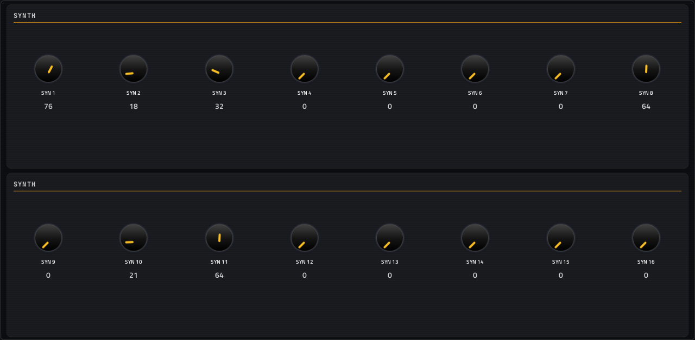
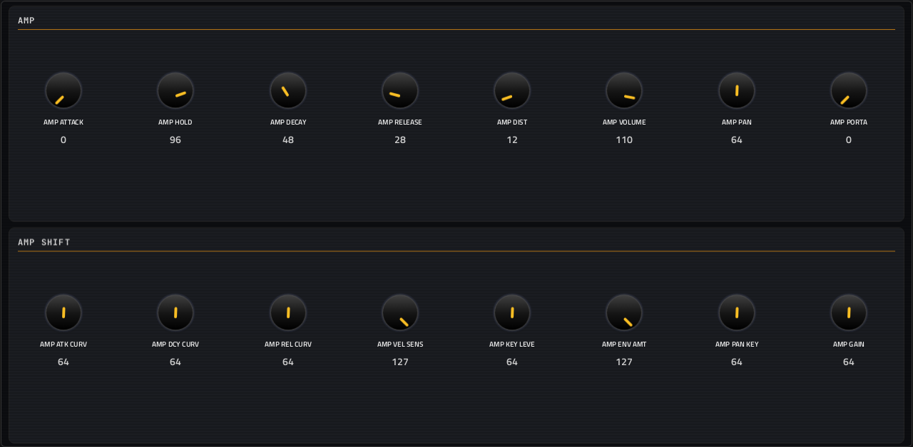
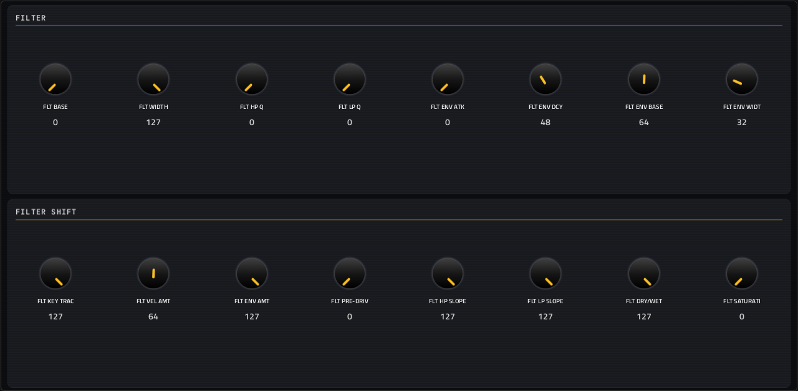
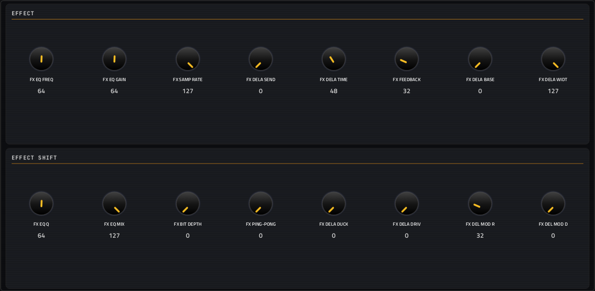
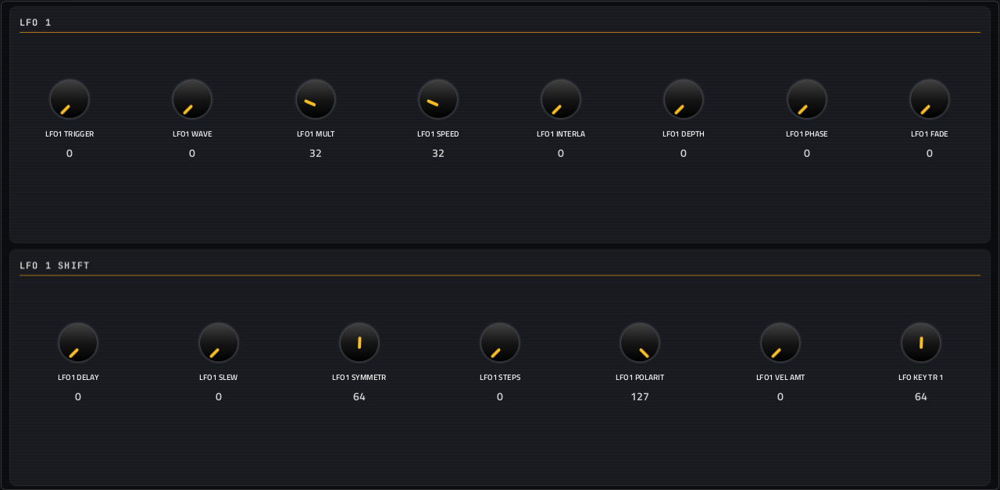

# Mono Voice

**Synth** · Elektron Monomachine-style digital voice: SuperWave, SID, DigiPRO, FM and more machines; 12 factory patches. · maker in MPC: timncox · licence: MIT


A digital synth voice modelled on the Elektron Monomachine: the MACHINE page picks the synthesis machine (SuperWave, SID-style chip sounds, user-wave DigiPRO, FM and others, with an arpeggiator), and the SYNTH page's 16 controls change meaning with the machine (they're numbered SYN 1-16 for that reason). Then an amp page, a filter page and an effect page, each with a SHIFT layer, and three LFOs that can each reach any of 114 destinations (picked with arrows).

Its built-in patch library (Chrome Bass, Wide Current, Hollow Wire, PWM Basin, Glass Choir, Just Fifths, Arcade Lead, Dust Pulse, Scan Bell, Circuit Reed, Metal Key, Soft Operator) is in MPC's PRESET menu after an Init, and on the MACHINE page's PATCH selector (2026-10-04).

## On the MPC

- In the plugin browser: **[SYN] Mono Voice** by **timncox** (Synth)
- Files: the release installs one folder, `/sdcard/Synths/timncox - VST - [SYN] Mono Voice/`, holding `monovoice.so`, its screen. The vst_instruments installer puts `monovoice.so` in `/sdcard/vst/` instead.
- 120 parameters (all automatable) on 8 pages

## Playing it

Add it to a **plugin track** and play it from the pads, a keyboard or a MIDI clip. Every control can be turned with the Q-Links and automated, and the settings are saved with your project.

## Pages

Screenshots are rendered from the built skin with the engine's real values right after it's inserted. On the MPC each page is a tab under the plugin header. The Q-Links follow the page column by column: on a 4-knob MPC the Q-Link button steps through the columns, and MPC outlines the active one.

### 1. MACHINE


Q-Link columns: **1** MACHINE, PATCH  ·  **2** LFO1 DEST, LFO2 DEST, LFO3 DEST

### 2. SYNTH



Q-Link columns: **1** SYN 1, SYN 2, SYN 3, SYN 4  ·  **2** SYN 5, SYN 6, SYN 7, SYN 8  ·  **3** SYN 9, SYN 10, SYN 11, SYN 12  ·  **4** SYN 13, SYN 14, SYN 15, SYN 16

### 3. AMP



Q-Link columns: **1** AMP ATTACK, AMP HOLD, AMP DECAY, AMP RELEASE  ·  **2** AMP DIST, AMP VOLUME, AMP PAN, AMP PORTA  ·  **3** AMP ATK CURV, AMP DCY CURV, AMP REL CURV, AMP VEL SENS  ·  **4** AMP KEY LEVE, AMP ENV AMT, AMP PAN KEY, AMP GAIN

### 4. FILTER



Q-Link columns: **1** FLT BASE, FLT WIDTH, FLT HP Q, FLT LP Q  ·  **2** FLT ENV ATK, FLT ENV DCY, FLT ENV BASE, FLT ENV WIDT  ·  **3** FLT KEY TRAC, FLT VEL AMT, FLT ENV AMT, FLT PRE-DRIV  ·  **4** FLT HP SLOPE, FLT LP SLOPE, FLT DRY/WET, FLT SATURATI

### 5. EFFECT



Q-Link columns: **1** FX EQ FREQ, FX EQ GAIN, FX SAMP RATE, FX DELA SEND  ·  **2** FX DELA TIME, FX FEEDBACK, FX DELA BASE, FX DELA WIDT  ·  **3** FX EQ Q, FX EQ MIX, FX BIT DEPTH, FX PING-PONG  ·  **4** FX DELA DUCK, FX DELA DRIV, FX DEL MOD R, FX DEL MOD D

### 6. LFO 1



Q-Link columns: **1** LFO1 TRIGGER, LFO1 WAVE, LFO1 MULT, LFO1 SPEED  ·  **2** LFO1 INTERLA, LFO1 DEPTH, LFO1 PHASE, LFO1 FADE  ·  **3** LFO1 DELAY, LFO1 SLEW, LFO1 SYMMETR, LFO1 STEPS  ·  **4** LFO1 POLARIT, LFO1 VEL AMT, LFO KEY TR 1

### 7. LFO 2


Q-Link columns: **1** LFO2 TRIGGER, LFO2 WAVE, LFO2 MULT, LFO2 SPEED  ·  **2** LFO2 INTERLA, LFO2 DEPTH, LFO2 PHASE, LFO2 FADE  ·  **3** LFO2 DELAY, LFO2 SLEW, LFO2 SYMMETR, LFO2 STEPS  ·  **4** LFO2 POLARIT, LFO2 VEL AMT, LFO KEY TR 2

### 8. LFO 3


Q-Link columns: **1** LFO3 TRIGGER, LFO3 WAVE, LFO3 MULT, LFO3 SPEED  ·  **2** LFO3 INTERLA, LFO3 DEPTH, LFO3 PHASE, LFO3 FADE  ·  **3** LFO3 DELAY, LFO3 SLEW, LFO3 SYMMETR, LFO3 STEPS  ·  **4** LFO3 POLARIT, LFO3 VEL AMT, LFO KEY TR 3

## Install

Needs a standalone MPC or Force on MPC OS 3.x with root SSH access (checked on an MPC Live II).

**From the release:** download `SYN-Mono-Voice-<version>-mpc-armv7.zip` from [Releases](https://github.com/saustin2010/mpc-vst-monovoice/releases),
copy it to the MPC, unzip it and run `sh install.sh` in its folder as root. The installer stops MPC, backs up
`MPC.settings`, installs the plugin folder and starts MPC again; `INSTALL.md` in the zip has the details and a by-hand route.

**With the rest of the collection:** from [vst_instruments](https://github.com/saustin2010/vst_instruments) ([INSTALL.md](https://github.com/saustin2010/vst_instruments/blob/main/INSTALL.md)):

```
./install.sh <mpc-address> monovoice
```

Use one or the other for this plugin: both register the same plugin (same uid), so the last one run wins.

## Where it comes from

- Upstream: https://github.com/timncox/schwung-mono
- Vendored at commit ce377749c32d9cb29060f98fc8e671aa1af73bbc 2026-09-01
- Schwung module "Mono Voice" v0.4.3 by timncox
- Licence: MIT ([`LICENSE`](LICENSE))
- MPC port and screen: [vst_instruments](https://github.com/saustin2010/vst_instruments) (`schwung/instruments/monovoice`), built on [sd88me's mpc-vst-plugins](https://github.com/sd88me/mpc-vst-plugins) (wrapper, Schwung adapter, skin tools).

## Changes for the MPC

- LFO destinations (114 options) are steppers with PREV/NEXT triggers instead of a pop-up.
- `src/mono_voice.c` (`-DMPC_PORT`, 2026-10-04): the patch library in MPC's PRESET menu: `patch` / `patch_name` / `patch_name_at:<n>` / `patch_count` (appended params), Init first, then the library (Move loads them with `patch_init` / `patch_load` from its own UI). The chosen patch is kept in the state, so a reopened project keeps its edits. Diff: `upstream-changes.diff`.
- New touchscreen page from its Google Stitch design (`design/`): the design's artwork as the background, its own knob art, live names and values, and controls the design left out added in its style (see RESKINNING.md).

## Files

| Path | What |
|---|---|
| `screenshots/` | the pages as MPC draws them |
| `.github/workflows/release.yml` | the release build (GitHub Actions, a draft release) |
| `FRAMEWORK.md` | the changes to sd88me's tools this plugin is built with, and why |
| `deploy/` | ready to install: `vst/` → `/sdcard/vst/`, `Synths/` → `/sdcard/Synths/`, plus the plugin-list entry (not used by the release) |
| `vst.json` | build settings: name, maker, sources, compiler flags |
| `params.json` | the plugin's parameters as MPC sees them (VST index = order) |
| `params.base.json` | the engine's own parameter list it was derived from |
| `layout.conf` | the screen: control positions, art, Q-Links (generated from the Stitch design) |
| `layout.grid.conf` | the plan of pages and controls the Stitch conversion fills in |
| `monovoice.css` | the artwork stylesheet |
| `images/` | artwork: backgrounds, knobs, displays |
| `design/` | the Google Stitch design this screen was converted from (`stitch.html`, as Stitch wrote it) |
| `src/` | the engine's source, vendored from upstream |
| `include/` | extra headers the build needs |
| `UPSTREAM` | where the source came from, and at which commit |

## Building

With Docker (32-bit ARM emulation for the build), Python 3 and the tools from
[saustin2010/mpc-vst-plugins](https://github.com/saustin2010/mpc-vst-plugins/tree/steve-features) (sd88me's [mpc-vst-plugins](https://github.com/sd88me/mpc-vst-plugins)
plus changes offered to it, until they're merged there; the commit is the one in `.github/workflows/release.yml`, and [FRAMEWORK.md](FRAMEWORK.md) says which changes this plugin uses and why):

```
git clone -b steve-features https://github.com/saustin2010/mpc-vst-plugins
MPC_VST=$PWD/mpc-vst-plugins
bash "$MPC_VST/tools/build_port.sh" vst.json        # build/: monovoice.so, the screen, the plugin-list entry
bash "$MPC_VST/tools/test_port.sh" vst.json         # the offline host test (ASan/UBSan): must print PASSED
```

Releases are built by GitHub Actions (`.github/workflows/release.yml`, "Release (draft)") as a draft, installed and checked
on a device, then published. More: [BUILDING.md](https://github.com/saustin2010/vst_instruments/blob/main/BUILDING.md), and to change the screen, [RESKINNING.md](https://github.com/saustin2010/vst_instruments/blob/main/RESKINNING.md).

## Development

This plugin is developed in [vst_instruments](https://github.com/saustin2010/vst_instruments) (`schwung/instruments/monovoice`), next to the other plugins
and the tools that made its screen, and published to [mpc-vst-monovoice](https://github.com/saustin2010/mpc-vst-monovoice) for its
releases. Issues and pull requests are welcome in either.
