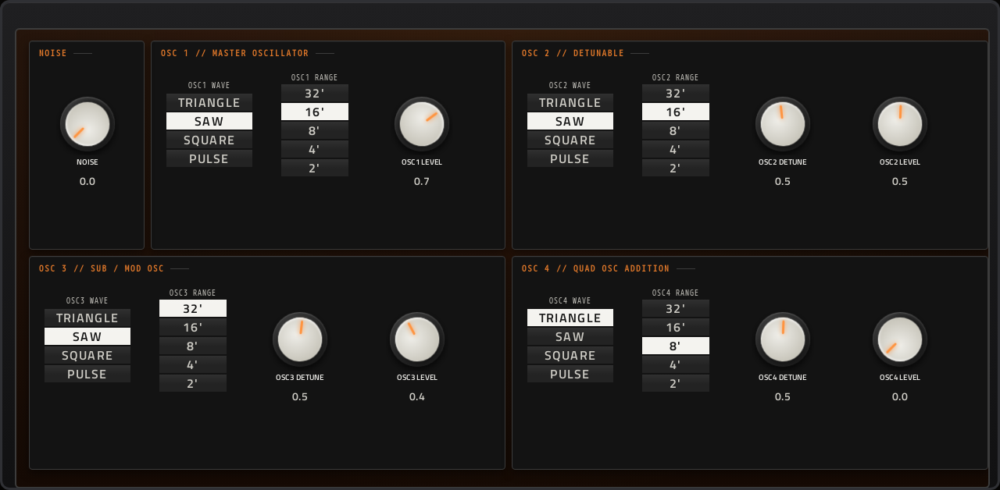
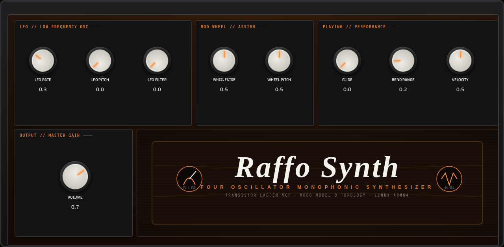

# Moog

**Synth** · RaffoSynth: a Minimoog-style mono synth with four oscillators and a ladder filter. · maker in MPC: Raffo · licence: MIT


RaffoSynth, a Minimoog-inspired monosynth: four oscillators (waveform and footage switches, 32' to 2', detune), noise, the 24 dB resonant ladder filter with its contour, a loudness contour, an LFO, mod wheel routing and glide. Fat basses and leads. 14 presets, also listed in MPC's own PRESET menu in the plugin header. The oscilloscope on the MAIN page shows oscillator 1's waveform, and the two envelope displays follow their knobs.

## On the MPC

- In the plugin browser: **[SYN] Moog** by **Raffo** (Synth)
- Files: the release installs one folder, `/sdcard/Synths/Raffo - VST - [SYN] Moog/`, holding `moog.so`, its screen. The vst_instruments installer puts `moog.so` in `/sdcard/vst/` instead.
- 41 parameters (all automatable) on 3 pages

## Playing it

Add it to a **plugin track** and play it from the pads, a keyboard or a MIDI clip. Every control can be turned with the Q-Links and automated, and the settings are saved with your project.

Its presets also appear in MPC's own **PRESET** menu in the plugin header.

## Pages

Screenshots are rendered from the built skin with the engine's real values right after it's inserted. On the MPC each page is a tab under the plugin header. The Q-Links follow the page column by column: on a 4-knob MPC the Q-Link button steps through the columns, and MPC outlines the active one.

### 1. MAIN


Q-Link columns: **1** CUTOFF, EMPHASIS, CONTOUR, KEY TRACK  ·  **2** FLT ATTACK, FLT DECAY, FLT SUSTAIN, FLT RELEASE  ·  **3** AMP ATTACK, AMP DECAY, AMP SUSTAIN, AMP RELEASE  ·  **4** PATCH

### 2. OSCILLATORS



Q-Link columns: **1** NOISE, OSC1 WAVE, OSC1 RANGE, OSC1 LEVEL  ·  **2** OSC2 WAVE, OSC2 RANGE, OSC2 DETUNE, OSC2 LEVEL  ·  **3** OSC3 WAVE, OSC3 RANGE, OSC3 DETUNE, OSC3 LEVEL  ·  **4** OSC4 WAVE, OSC4 RANGE, OSC4 DETUNE, OSC4 LEVEL

### 3. MODULATION



Q-Link columns: **1** LFO RATE, LFO PITCH, LFO FILTER  ·  **2** WHEEL FILTER, WHEEL PITCH  ·  **3** GLIDE, BEND RANGE, VELOCITY  ·  **4** VOLUME

## Install

Needs a standalone MPC or Force on MPC OS 3.x with root SSH access (checked on an MPC Live II).

**From the release:** download `SYN-Moog-<version>-mpc-armv7.zip` from [Releases](https://github.com/saustin2010/mpc-vst-moog/releases),
copy it to the MPC, unzip it and run `sh install.sh` in its folder as root. The installer stops MPC, backs up
`MPC.settings`, installs the plugin folder and starts MPC again; `INSTALL.md` in the zip has the details and a by-hand route.

**With the rest of the collection:** from [vst_instruments](https://github.com/saustin2010/vst_instruments) ([INSTALL.md](https://github.com/saustin2010/vst_instruments/blob/main/INSTALL.md)):

```
./install.sh <mpc-address> moog
```

Use one or the other for this plugin: both register the same plugin (same uid), so the last one run wins.

## Where it comes from

- Schwung module "RaffoSynth" v0.2.5 by Nicolas Roulet, Julian Palladino (port: charlesvestal)
- Licence: MIT, as declared in the module's `src/module.json` (text: [LICENSE](LICENSE))
- MPC port and screen: [vst_instruments](https://github.com/saustin2010/vst_instruments) (`schwung/instruments/moog`), built on [sd88me's mpc-vst-plugins](https://github.com/sd88me/mpc-vst-plugins) (wrapper, Schwung adapter, skin tools).

## Changes for the MPC

- Presets work: the engine has 14 built in that were never exposed; now a PATCH browser.
- Oscillator waveforms are labelled switches (TRIANGLE/SAW/SQUARE/PULSE) and the ranges are footage switches (32'/16'/8'/4'/2', sending the engine's -2..2); three pages (MAIN, OSCILLATORS, MODULATION).
- New touchscreen page from its Google Stitch design (`design/`): the design's artwork as the background, its own knob art, live names and values, and controls the design left out added in its style (see RESKINNING.md).

## Files

| Path | What |
|---|---|
| `screenshots/` | the pages as MPC draws them |
| `.github/workflows/release.yml` | the release build (GitHub Actions, a draft release) |
| `LICENSE` | the licence |
| `deploy/` | ready to install: `vst/` → `/sdcard/vst/`, `Synths/` → `/sdcard/Synths/`, plus the plugin-list entry (not used by the release) |
| `vst.json` | build settings: name, maker, sources, compiler flags |
| `params.json` | the plugin's parameters as MPC sees them (VST index = order) |
| `params.base.json` | the engine's own parameter list it was derived from |
| `layout.conf` | the screen: control positions, art, Q-Links (generated from the Stitch design) |
| `layout.grid.conf` | the plan of pages and controls the Stitch conversion fills in |
| `moog.css` | the artwork stylesheet |
| `images/` | artwork: backgrounds, knobs, displays |
| `design/` | the Google Stitch design this screen was converted from (`stitch.html`, as Stitch wrote it) |
| `src/` | the engine's source, vendored from upstream |

## Building

With Docker (32-bit ARM emulation for the build), Python 3 and the tools from
[saustin2010/mpc-vst-plugins](https://github.com/saustin2010/mpc-vst-plugins/tree/steve-features) (sd88me's [mpc-vst-plugins](https://github.com/sd88me/mpc-vst-plugins)
plus changes offered to it, until they're merged there; the commit is the one in `.github/workflows/release.yml`):

```
git clone -b steve-features https://github.com/saustin2010/mpc-vst-plugins
MPC_VST=$PWD/mpc-vst-plugins
bash "$MPC_VST/tools/build_port.sh" vst.json        # build/: moog.so, the screen, the plugin-list entry
bash "$MPC_VST/tools/test_port.sh" vst.json         # the offline host test (ASan/UBSan): must print PASSED
```

Releases are built by GitHub Actions (`.github/workflows/release.yml`, "Release (draft)") as a draft, installed and checked
on a device, then published. More: [BUILDING.md](https://github.com/saustin2010/vst_instruments/blob/main/BUILDING.md), and to change the screen, [RESKINNING.md](https://github.com/saustin2010/vst_instruments/blob/main/RESKINNING.md).

## Development

This plugin is developed in [vst_instruments](https://github.com/saustin2010/vst_instruments) (`schwung/instruments/moog`), next to the other plugins
and the tools that made its screen, and published to [mpc-vst-moog](https://github.com/saustin2010/mpc-vst-moog) for its
releases. Issues and pull requests are welcome in either.
