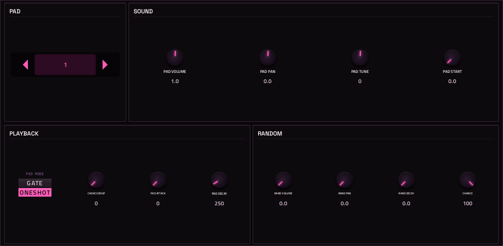

# Mrdrums

**Drum sampler** · A 16-pad drum sampler: kits of samples on pads 36-51. · maker in MPC: Move Everything · licence: MIT


A drum sample player: each kit is a folder of up to 16 samples on MIDI notes 36-51, so MPC's pads play it. Per pad: volume, pan, tune, start, attack, decay, choke group, gate or one-shot, and random pan, volume and decay plus a play chance for humanised hits. Master volume, polyphony, velocity curve and humanize apply to the kit. Kits live in /sdcard/vst/mrdrums/kits on the MPC (add your own folders there); a starter kit of synthesised hits ships with it.

## On the MPC

- In the plugin browser: **Mrdrums** by **Move Everything** (Synth)
- Files: `/sdcard/vst/mrdrums.so`, presets/data in `/sdcard/vst/mrdrums/` (from this repo's `presets/mrdrums/`, which `tools/fetch-presets.py` fills; install.sh does that for you), screen in `/sdcard/Synths/Move Everything - VST - Mrdrums/`
- 26 parameters (all automatable) on 2 pages

## Playing it

Add it to a **plugin track** and play it from the pads, a keyboard or a MIDI clip. Every control can be turned with the Q-Links and automated, and the settings are saved with your project.

Its 16 sounds sit on MIDI notes 36-51, one per pad.

## Pages

Screenshots are rendered from the built skin with the engine's real values right after it's inserted. On the MPC each page is a tab under the plugin header. The Q-Links follow the page column by column: on a 4-knob MPC the Q-Link button steps through the columns, and MPC outlines the active one.

### 1. KIT


Q-Link columns: **1** MASTER VOL, POLYPHONY, VEL CURVE, HUMANIZE  ·  **2** EDIT PAD, AUTO SELECT  ·  **3** RAND LOOP  ·  **4** KIT

### 2. PAD



Q-Link columns: **1** EDIT PAD  ·  **2** PAD VOLUME, PAD PAN, PAD TUNE, PAD START  ·  **3** PAD MODE, CHOKE GROUP, PAD ATTACK, PAD DECAY  ·  **4** RAND VOLUME, RAND PAN, RAND DECAY, CHANCE

## Install

From the top of this repo (see [INSTALL.md](../../../INSTALL.md)):

```
./install.sh <mpc-address> mrdrums
```

## Where it comes from

- Schwung module "MrDrums" v0.0.4 by move-anything contributors
- Licence: MIT, as declared in the module's `src/module.json` (text: [licenses/](../../../licenses/))
- MPC port and screen: this repo, built on [sd88me's mpc-vst-plugins](https://github.com/sd88me/mpc-vst-plugins) (wrapper, Schwung adapter, skin tools).

## Changes for the MPC

- It makes sound now: on the Move, samples are picked in a file browser, which the MPC doesn't have, so it was always silent. A small engine patch (VENDORED.md) adds kit folders: every folder in /sdcard/vst/mrdrums/kits is a kit, its WAV/AIF files in name order go to pads 1-16. The first kit loads automatically.
- Parameter ranges fixed: the pad controls were declared 0-1 while the engine uses real units (volume 0-2, tune ±24, attack/decay in ms, chance in %), so a project restore zeroed decay and chance.
- The pad sample-path slot is retired (a host restoring it as a number would have cleared the pad).
- KIT page (kit browser, master volume, polyphony, velocity curve, humanize, pad select + AUTO SELECT) and PAD page (the selected pad's sound, envelope, randomisation).
- **Crash fix (2026-10-02)**: a project load or a pad sample change no longer frees a sample a voice is still playing (upstream bug; see `VENDORED.md`).
- New touchscreen page from its Google Stitch design (`design/`): the design's artwork as the background, its own knob art, live names and values, and controls the design left out added in its style (see RESKINNING.md).
- Presets in MPC's PRESET menu (2026-10-03): its kits are VST programs, listed live from the engine (vst.json
  `programs` with `count` and `name_at`; the engine answers a preset's name by number, marked MPC port), so kit folders you add show up.

## Files

| Path | What |
|---|---|
| `screenshots/` | the pages as MPC draws them |
| `deploy/` | ready to install: `vst/` → `/sdcard/vst/`, `Synths/` → `/sdcard/Synths/`, plus the plugin-list entry (its presets/kits are in the repo's `presets/` folder, not here) |
| `vst.json` | build settings: name, maker, sources, compiler flags |
| `params.json` | the plugin's parameters as MPC sees them (VST index = order) |
| `params.base.json` | the engine's own parameter list it was derived from |
| `params.pre-stitch.json` | the parameter list before the Stitch screen renamed controls |
| `layout.conf` | the screen: control positions, art, Q-Links (generated from the Stitch design) |
| `layout.grid.conf` | the plan of pages and controls the Stitch conversion fills in |
| `mrdrums.css` | the artwork stylesheet |
| `images/` | artwork: backgrounds, knobs, displays |
| `design/` | the Google Stitch design this screen was converted from (`stitch.html`, as Stitch wrote it) |
| `src/` | the engine's source, vendored from upstream |
| `VENDORED.md` | notes on the vendored source and its patches |

To rebuild from source see [BUILDING.md](../../../BUILDING.md); to change the screen, [RESKINNING.md](../../../RESKINNING.md).
