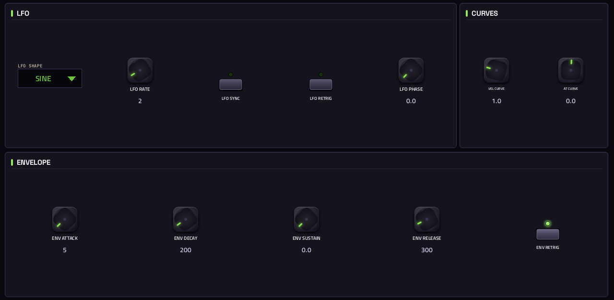
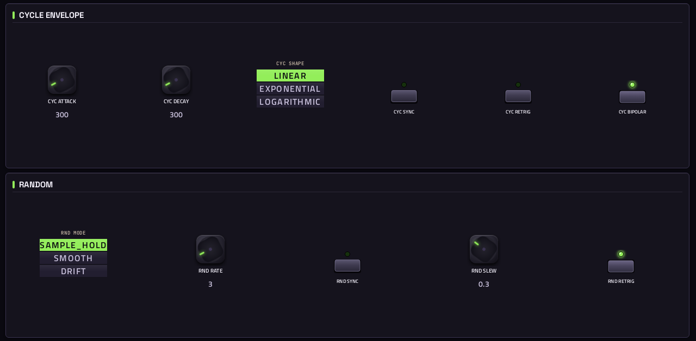
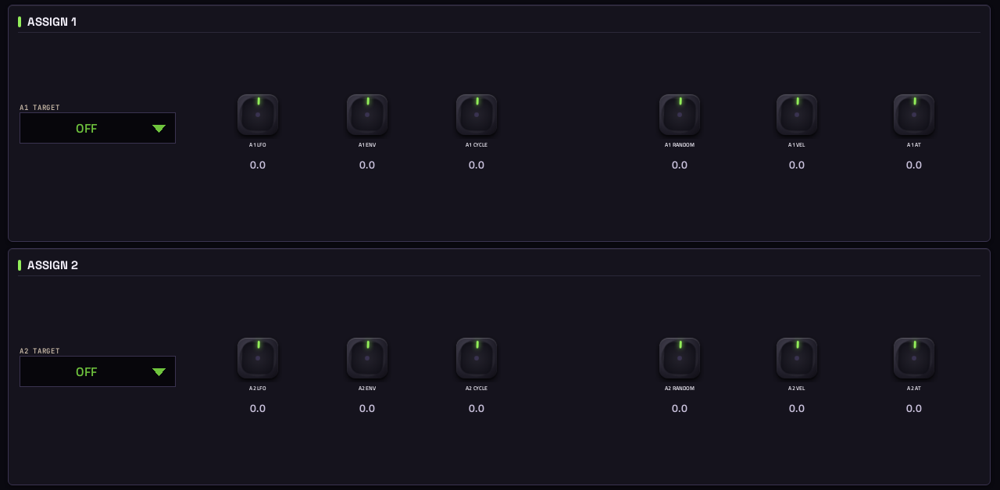
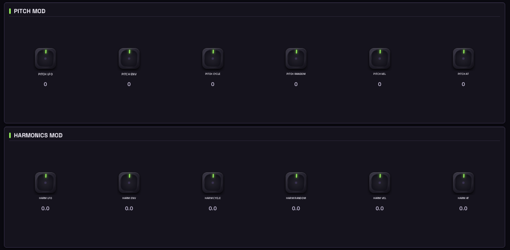
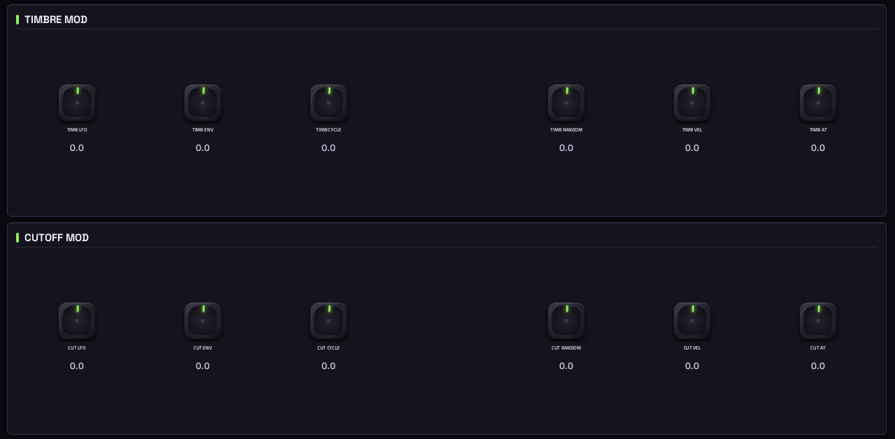
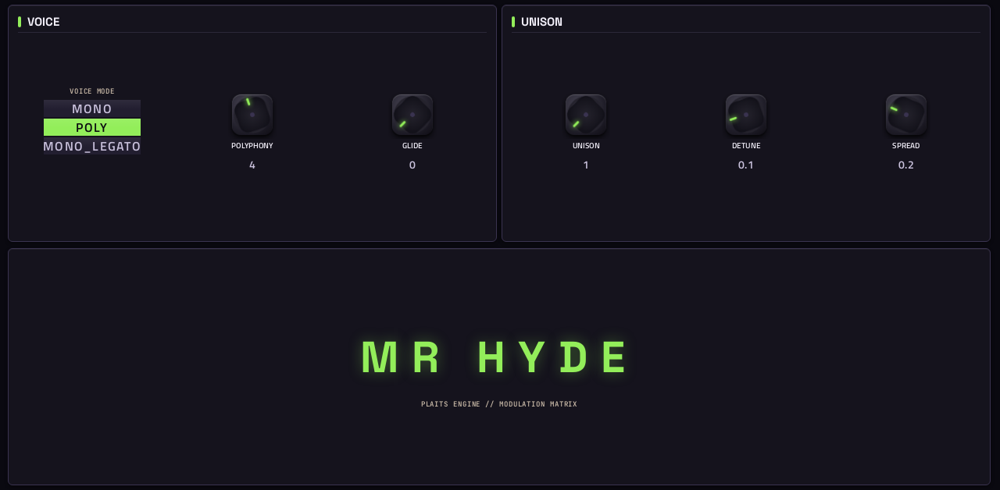

# Mr Hyde

**Synth** · A MicroFreak-inspired voice: Plaits models with a low-pass gate, filter and a 6x6 mod matrix, with 19 presets. · maker in MPC: Move Everything · licence: MIT


Built around Mutable Instruments' Plaits engine (17 models: virtual analog, wavetables, FM, grains, chords, speech, strings, modal and percussion models), Mr Hyde adds what a MicroFreak-style instrument needs: a low-pass gate, a filter, an LFO, envelopes, a cycling envelope, a random source, and a 6x6 modulation matrix whose rows are spread over the ASSIGN, PITCH HARM and TIMB CUT pages.

Upstream has no presets, so the port brings 19 (Init, Freak Bass, Wobble Bass, Sync Lead, Terrain Pad, String Machine, Supersaw Stack, Folded Pluck, FM Keys, Formant Choir, Drawbar Organ, Wavetable Sweep, Chord Memory, Speech Synth, Swarm, Noise Sweep, Particle Rain, Glass String, Modal Bells), in MPC's PRESET menu. Each sets every control; levels are evened out as far as VOLUME allows (it drives the low-pass gate, which saturates), so a few models (organ, string machine, inharmonic string, particles) stay quieter by nature.

## On the MPC

- In the plugin browser: **[SYN] Mr Hyde** by **Move Everything** (Synth)
- Files: the release installs one folder, `/sdcard/Synths/Move Everything - VST - [SYN] Mr Hyde/`, holding `mrhyde.so`, its screen. The vst_instruments installer puts `mrhyde.so` in `/sdcard/vst/` instead.
- 81 parameters (all automatable) on 7 pages

## Playing it

Add it to a **plugin track** and play it from the pads, a keyboard or a MIDI clip. Every control can be turned with the Q-Links and automated, and the settings are saved with your project.

## Pages

Screenshots are rendered from the built skin with the engine's real values right after it's inserted. On the MPC each page is a tab under the plugin header. The Q-Links follow the page column by column: on a 4-knob MPC the Q-Link button steps through the columns, and MPC outlines the active one.

### 1. MAIN


Q-Link columns: **1** MODEL, FM AMOUNT, AUX MIX  ·  **2** PITCH, HARMONICS, TIMBRE, MORPH  ·  **3** FILTER MODE, CUTOFF FREQ, RESONANCE  ·  **4** LPG DECAY, LPG COLOR, VOLUME, PAN

### 2. LFO ENV



Q-Link columns: **1** LFO SHAPE, LFO RATE, LFO PHASE, LFO SYNC  ·  **2** VEL CURVE, AT CURVE  ·  **3** ENV ATTACK, ENV DECAY, ENV SUSTAIN, ENV RELEASE  ·  **4** LFO RETRIG, ENV RETRIG

### 3. CYC RAND



Q-Link columns: **1** CYC ATTACK, CYC DECAY, CYC SHAPE  ·  **2** CYC SYNC, CYC RETRIG, CYC BIPOLAR  ·  **3** RND MODE, RND RATE, RND SLEW  ·  **4** RND SYNC, RND RETRIG

### 4. ASSIGN



Q-Link columns: **1** A1 TARGET, A1 LFO, A1 ENV, A1 CYCLE  ·  **2** A1 RANDOM, A1 VEL, A1 AT  ·  **3** A2 TARGET, A2 LFO, A2 ENV, A2 CYCLE  ·  **4** A2 RANDOM, A2 VEL, A2 AT

### 5. PITCH HARM



Q-Link columns: **1** PITCH LFO, PITCH ENV, PITCH CYCLE  ·  **2** PITCH RANDOM, PITCH VEL, PITCH AT  ·  **3** HARM LFO, HARM ENV, HARM CYCLE  ·  **4** HARM RANDOM, HARM VEL, HARM AT

### 6. TIMB CUT



Q-Link columns: **1** TIMB LFO, TIMB ENV, TIMB CYCLE  ·  **2** TIMB RANDOM, TIMB VEL, TIMB AT  ·  **3** CUT LFO, CUT ENV, CUT CYCLE  ·  **4** CUT RANDOM, CUT VEL, CUT AT

### 7. VOICE



Q-Link columns: **1** VOICE MODE, POLYPHONY, GLIDE  ·  **2** UNISON, DETUNE, SPREAD

## Install

Needs a standalone MPC or Force on MPC OS 3.x with root SSH access (checked on an MPC Live II).

**From the release:** download `SYN-Mr-Hyde-<version>-mpc-armv7.zip` from [Releases](https://github.com/saustin2010/mpc-vst-mrhyde/releases),
copy it to the MPC, unzip it and run `sh install.sh` in its folder as root. The installer stops MPC, backs up
`MPC.settings`, installs the plugin folder and starts MPC again; `INSTALL.md` in the zip has the details and a by-hand route.

**With the rest of the collection:** from [vst_instruments](https://github.com/saustin2010/vst_instruments) ([INSTALL.md](https://github.com/saustin2010/vst_instruments/blob/main/INSTALL.md)):

```
./install.sh <mpc-address> mrhyde
```

Use one or the other for this plugin: both register the same plugin (same uid), so the last one run wins.

## Where it comes from

- Schwung module "MrHyde" v0.0.1 by move-anything contributors
- Licence: MIT, as declared in the module's `src/module.json` (text: [LICENSE](LICENSE))
- MPC port and screen: [vst_instruments](https://github.com/saustin2010/vst_instruments) (`schwung/instruments/mrhyde`), built on [sd88me's mpc-vst-plugins](https://github.com/sd88me/mpc-vst-plugins) (wrapper, Schwung adapter, skin tools).

## Changes for the MPC

- Seven compact pages (MAIN, LFO ENV, CYC RAND, ASSIGN, PITCH HARM, TIMB CUT, VOICE) instead of an auto layout; the mod matrix as rows of six.
- Readable unique names (e.g. A1 LFO, PITCH ENV, CYC BIPOLAR); the 17 models in a two-column pop-up.
- The engine reports option values as text: option labels only changed case; pop-ups draw friendlier labels.
- New touchscreen page from its Google Stitch design (`design/`): the design's artwork as the background, its own knob art, live names and values, and controls the design left out added in its style (see RESKINNING.md).

## Files

| Path | What |
|---|---|
| `screenshots/` | the pages as MPC draws them |
| `.github/workflows/release.yml` | the release build (GitHub Actions, a draft release) |
| `LICENSE` | the licence |
| `deploy/` | ready to install: `vst/` → `/sdcard/vst/`, `Synths/` → `/sdcard/Synths/`, plus the plugin-list entry (not used by the release) |
| `vst.json` | build settings: name, maker, sources, compiler flags |
| `params.json` | the plugin's parameters as MPC sees them (VST index = order) |
| `params.base.json` | the engine's own parameter list it was derived from |
| `params.pre-stitch.json` | the parameter list before the Stitch screen renamed controls |
| `layout.conf` | the screen: control positions, art, Q-Links (generated from the Stitch design) |
| `layout.grid.conf` | the plan of pages and controls the Stitch conversion fills in |
| `mrhyde.css` | the artwork stylesheet |
| `images/` | artwork: backgrounds, knobs, displays |
| `design/` | the Google Stitch design this screen was converted from (`stitch.html`, as Stitch wrote it) |
| `src/` | the engine's source, vendored from upstream |

## Building

With Docker (32-bit ARM emulation for the build), Python 3 and the tools from
[saustin2010/mpc-vst-plugins](https://github.com/saustin2010/mpc-vst-plugins/tree/steve-features) (sd88me's [mpc-vst-plugins](https://github.com/sd88me/mpc-vst-plugins)
plus changes offered to it, until they're merged there; the commit is the one in `.github/workflows/release.yml`):

```
git clone -b steve-features https://github.com/saustin2010/mpc-vst-plugins
MPC_VST=$PWD/mpc-vst-plugins
bash "$MPC_VST/tools/build_port.sh" vst.json        # build/: mrhyde.so, the screen, the plugin-list entry
bash "$MPC_VST/tools/test_port.sh" vst.json         # the offline host test (ASan/UBSan): must print PASSED
```

Releases are built by GitHub Actions (`.github/workflows/release.yml`, "Release (draft)") as a draft, installed and checked
on a device, then published. More: [BUILDING.md](https://github.com/saustin2010/vst_instruments/blob/main/BUILDING.md), and to change the screen, [RESKINNING.md](https://github.com/saustin2010/vst_instruments/blob/main/RESKINNING.md).

## Development

This plugin is developed in [vst_instruments](https://github.com/saustin2010/vst_instruments) (`schwung/instruments/mrhyde`), next to the other plugins
and the tools that made its screen, and published to [mpc-vst-mrhyde](https://github.com/saustin2010/mpc-vst-mrhyde) for its
releases. Issues and pull requests are welcome in either.
