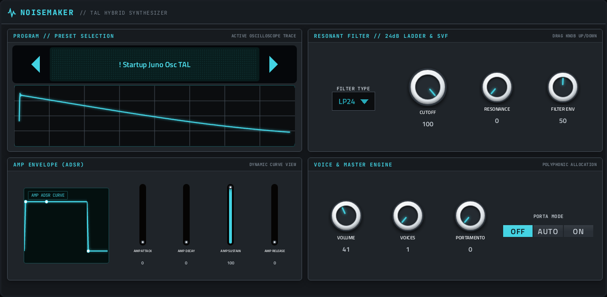
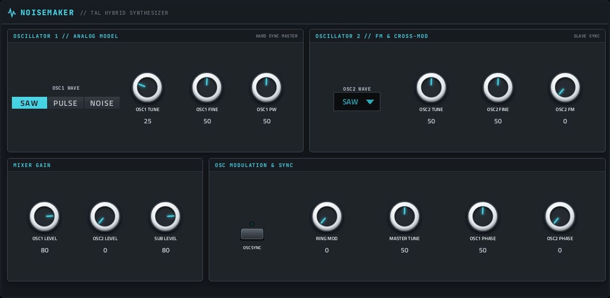
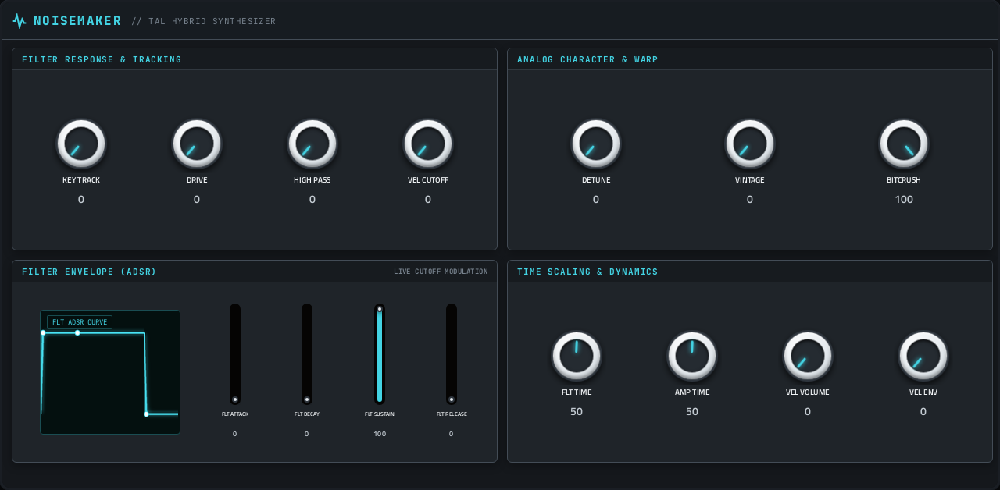
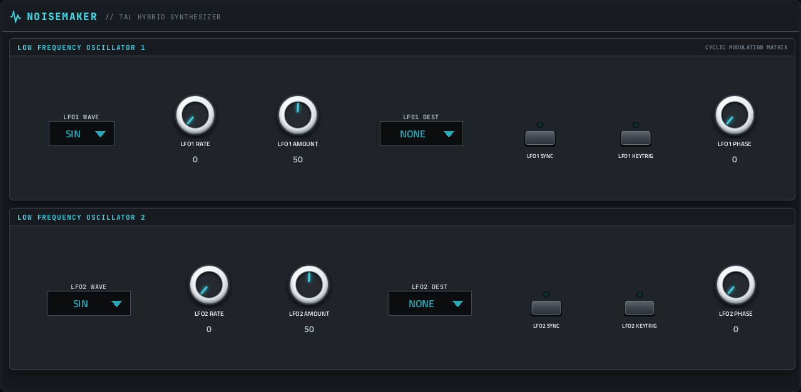
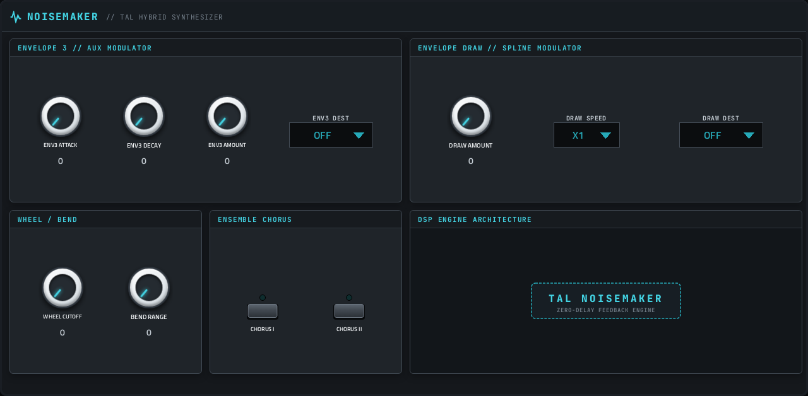
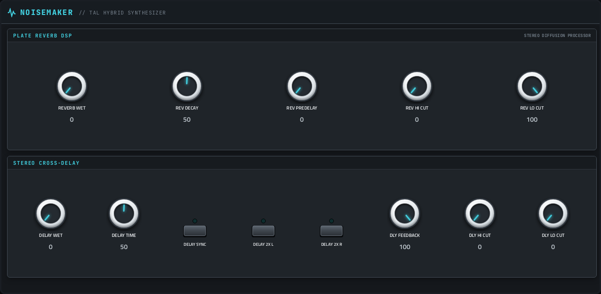

# Noisemaker

**Synth** · TAL-NoiseMaker: a classic virtual-analog polysynth with 256 factory presets. · maker in MPC: TAL · licence: GPL-2.0



TAL-NoiseMaker by Patrick Kunz: two oscillators plus sub, 12 multimode filters with their own envelope and velocity response, two LFOs, a third envelope you can draw, chorus, reverb and delay. Six voices. All 256 factory presets are built in, from pads and leads to basses and effects.

## On the MPC

- In the plugin browser: **Noisemaker** by **TAL** (Synth)
- Files: `/sdcard/vst/noisemaker.so`, screen in `/sdcard/Synths/TAL - VST - Noisemaker/`
- 87 parameters (all automatable) on 6 pages

## Playing it

Add it to a **plugin track** and play it from the pads, a keyboard or a MIDI clip. Every control can be turned with the Q-Links and automated, and the settings are saved with your project.

## Pages

Screenshots are rendered from the built skin with the engine's real values right after it's inserted. On the MPC each page is a tab under the plugin header. The Q-Links follow the page column by column: on a 4-knob MPC the Q-Link button steps through the columns, and MPC outlines the active one.

### 1. MAIN


Q-Link columns: **1** CUTOFF, RESONANCE, FILTER ENV, VOLUME  ·  **2** VOICES, PORTAMENTO, PORTA MODE, AMP ATTACK  ·  **3** AMP DECAY, AMP SUSTAIN, AMP RELEASE, PATCH  ·  **4** FILTER TYPE

### 2. OSC



Q-Link columns: **1** OSC1 TUNE, OSC1 FINE, OSC1 PW, OSC2 TUNE  ·  **2** OSC2 FINE, OSC2 FM, OSC1 LEVEL, OSC2 LEVEL  ·  **3** SUB LEVEL, RING MOD, MASTER TUNE, OSC1 PHASE  ·  **4** OSC2 PHASE, OSC1 WAVE, OSC SYNC, OSC2 WAVE

### 3. FILTER



Q-Link columns: **1** KEY TRACK, DRIVE, HIGH PASS, VEL CUTOFF  ·  **2** DETUNE, VINTAGE, BITCRUSH, FLT TIME  ·  **3** AMP TIME, VEL VOLUME, VEL ENV, FLT ATTACK  ·  **4** FLT DECAY, FLT SUSTAIN, FLT RELEASE

### 4. LFO



Q-Link columns: **1** LFO1 RATE, LFO1 AMOUNT, LFO1 PHASE, LFO2 RATE  ·  **2** LFO2 AMOUNT, LFO2 PHASE, LFO1 SYNC, LFO1 KEYTRIG  ·  **3** LFO2 SYNC, LFO2 KEYTRIG, LFO1 WAVE, LFO1 DEST  ·  **4** LFO2 WAVE, LFO2 DEST

### 5. MOD



Q-Link columns: **1** ENV3 ATTACK, ENV3 DECAY, ENV3 AMOUNT, DRAW AMOUNT  ·  **2** WHEEL CUTOFF, BEND RANGE, CHORUS I, CHORUS II  ·  **3** ENV3 DEST, DRAW SPEED, DRAW DEST

### 6. FX



Q-Link columns: **1** REVERB WET, REV DECAY, REV PREDELAY, REV HI CUT  ·  **2** REV LO CUT, DELAY WET, DELAY TIME, DLY FEEDBACK  ·  **3** DLY HI CUT, DLY LO CUT, DELAY SYNC, DELAY 2X L  ·  **4** DELAY 2X R

## Install

From the top of this repo (see [INSTALL.md](../../../INSTALL.md)):

```
./install.sh <mpc-address> noisemaker
```

## Where it comes from

- Schwung module "Noisemaker" v0.2.2 by legsmechanical (engine: Patrick Kunz / TAL)
- Licence: GPL-2.0, as declared in the module's `src/module.json` (text: [licenses/](../../../licenses/))
- MPC port and screen: this repo, built on [sd88me's mpc-vst-plugins](https://github.com/sd88me/mpc-vst-plugins) (wrapper, Schwung adapter, skin tools).

## Changes for the MPC

- Presets work: 256 factory presets were never exposed; now a PATCH browser.
- Ten real on/off switches (osc sync, LFO sync/keytrig, Chorus I/II, delay sync/2x) were 0-100 knobs; LFO waves and destinations are now choices.
- Osc 2 tuning no longer drifts when a project is restored: two Move-UI macro parameters wrote through to other settings; their slots are kept (same indices) but the engine no longer sees them.
- **Crash on changing VOICES fixed (2026-10-02).** Changing VOICES (e.g. from 1) while notes were sounding, then playing more notes than voices, took MPC down: upstream's `VoiceManager::setNumberOfVoices` emptied its list of playing notes while the voices kept sounding (and mono mode never lists its note), so the next note's "steal the oldest voice" read past the end of an empty list (`playingNotes.at(-1)`, an uncaught `std::out_of_range`). Local patch in `src/dsp/Engine/VoiceManager.h`, under `#ifdef MPC_PORT` (vst.json defines it): a real change of the voice count releases every voice and starts both note lists afresh, and a steal with an empty list takes voice 1. The original file is in `upstream-changes.diff`. Also `-fwrapv` (the noise generators rely on integer wrap-around). Found and checked with `dev-tools/fuzz/` (`fuzz_port.sh noisemaker 1 2000 0 voices` crashed before, survives after, on one thread and on two).
- The wrapper now serialises every engine call per instance (2026-10-02, all ports): MPC changes parameters on its screen thread while audio runs on another, and this engine (like most) isn't written for that.
- New touchscreen page from its Google Stitch design (`design/`): the design's artwork as the background, its own knob art, live names and values, and controls the design left out added in its style (see RESKINNING.md).

## Files

| Path | What |
|---|---|
| `screenshots/` | the pages as MPC draws them |
| `deploy/` | ready to install: `vst/` → `/sdcard/vst/`, `Synths/` → `/sdcard/Synths/`, plus the plugin-list entry (its presets/kits are in the repo's `presets/` folder, not here) |
| `vst.json` | build settings: name, maker, sources, compiler flags |
| `params.json` | the plugin's parameters as MPC sees them (VST index = order) |
| `params.base.json` | the engine's own parameter list it was derived from |
| `layout.conf` | the screen: control positions, art, Q-Links (generated from the Stitch design) |
| `layout.grid.conf` | the plan of pages and controls the Stitch conversion fills in |
| `noisemaker.css` | the artwork stylesheet |
| `images/` | artwork: backgrounds, knobs, displays |
| `design/` | the Google Stitch design this screen was converted from (`stitch.html`, as Stitch wrote it) |
| `src/` | the engine's source, vendored from upstream |
| `upstream-changes.diff` | every local change to the upstream source |

To rebuild from source see [BUILDING.md](../../../BUILDING.md); to change the screen, [RESKINNING.md](../../../RESKINNING.md).
