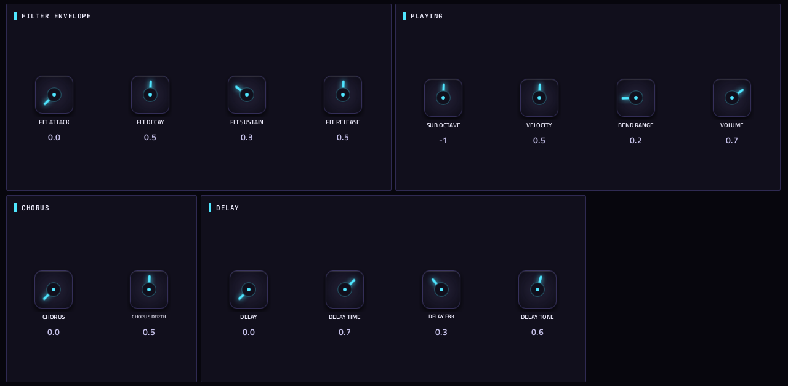

# NuSaw

**Synth** · A detuned multi-saw (supersaw) polysynth with 27 presets. · maker in MPC: Charles Vestal · licence: MIT


The supersaw sound of trance and big-room synths: a stack of detuned saws (SAWS, DETUNE, SPREAD) with a sub oscillator, a resonant low-pass filter with its own envelope, an amp envelope, chorus and delay. 27 built-in presets, shown on a cyan LED patch display. Huge pads, stabs and leads with little effort.

## On the MPC

- In the plugin browser: **NuSaw** by **Charles Vestal** (Synth)
- Files: `/sdcard/vst/nusaw.so`, screen in `/sdcard/Synths/Charles Vestal - VST - NuSaw/`
- 29 parameters (all automatable) on 2 pages

## Playing it

Add it to a **plugin track** and play it from the pads, a keyboard or a MIDI clip. Every control can be turned with the Q-Links and automated, and the settings are saved with your project.

## Pages

Screenshots are rendered from the built skin with the engine's real values right after it's inserted. On the MPC each page is a tab under the plugin header. The Q-Links follow the page column by column: on a 4-knob MPC the Q-Link button steps through the columns, and MPC outlines the active one.

### 1. MAIN


Q-Link columns: **1** PATCH, SAWS, DETUNE, SPREAD  ·  **2** SUB LEVEL, CUTOFF, RESONANCE, ENV MOD  ·  **3** ATTACK, DECAY, SUSTAIN, RELEASE

### 2. MORE



Q-Link columns: **1** FLT ATTACK, FLT DECAY, FLT SUSTAIN, FLT RELEASE  ·  **2** SUB OCTAVE, VELOCITY, BEND RANGE, VOLUME  ·  **3** CHORUS, CHORUS DEPTH, DELAY, DELAY TIME  ·  **4** DELAY FBK, DELAY TONE

## Install

From the top of this repo (see [INSTALL.md](../../../INSTALL.md)):

```
./install.sh <mpc-address> nusaw
```

## Where it comes from

- Upstream: https://github.com/charlesvestal/schwung-nusaw
- Vendored at commit d4d824de1a5679d2d5c6f3667df1176cdba92efa 2026-08-29
- Schwung module "NuSaw" v0.2.2 by charlesvestal
- Licence: MIT ([`LICENSE`](LICENSE))
- MPC port and screen: this repo, built on [sd88me's mpc-vst-plugins](https://github.com/sd88me/mpc-vst-plugins) (wrapper, Schwung adapter, skin tools).

## Changes for the MPC

- New touchscreen page from its Google Stitch design (`design/`): the design's artwork as the background, its own knob art, live names and values, and controls the design left out added in its style (see RESKINNING.md).

## Files

| Path | What |
|---|---|
| `screenshots/` | the pages as MPC draws them |
| `deploy/` | ready to install: `vst/` → `/sdcard/vst/`, `Synths/` → `/sdcard/Synths/`, plus the plugin-list entry (its presets/kits are in the repo's `presets/` folder, not here) |
| `vst.json` | build settings: name, maker, sources, compiler flags |
| `params.json` | the plugin's parameters as MPC sees them (VST index = order) |
| `params.base.json` | the engine's own parameter list it was derived from |
| `params.pre-stitch.json` | the parameter list before the Stitch screen renamed controls |
| `layout.conf` | the screen: control positions, art, Q-Links (generated from the Stitch design) |
| `layout.grid.conf` | the plan of pages and controls the Stitch conversion fills in |
| `nusaw.css` | the artwork stylesheet |
| `images/` | artwork: backgrounds, knobs, displays |
| `design/` | the Google Stitch design this screen was converted from (`stitch.html`, as Stitch wrote it) |
| `src/` | the engine's source, vendored from upstream |
| `UPSTREAM` | where the source came from, and at which commit |

To rebuild from source see [BUILDING.md](../../../BUILDING.md); to change the screen, [RESKINNING.md](../../../RESKINNING.md).
