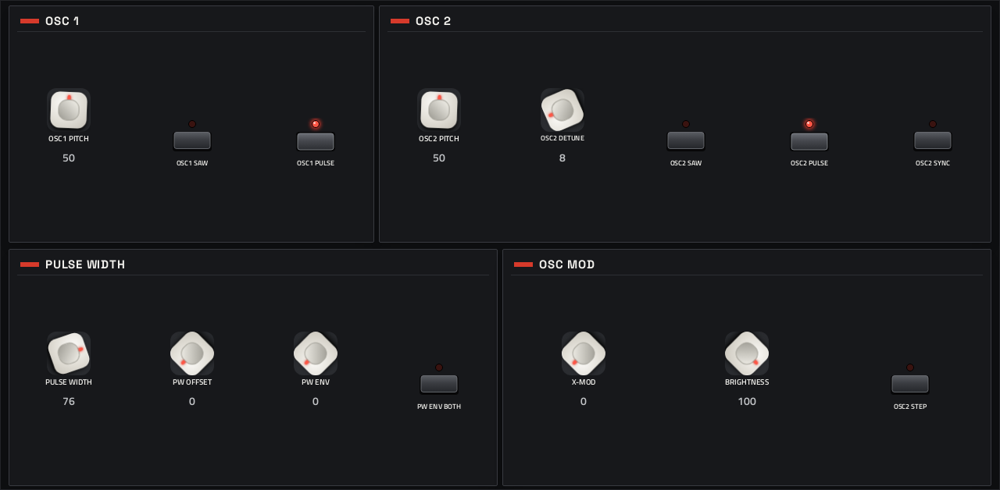
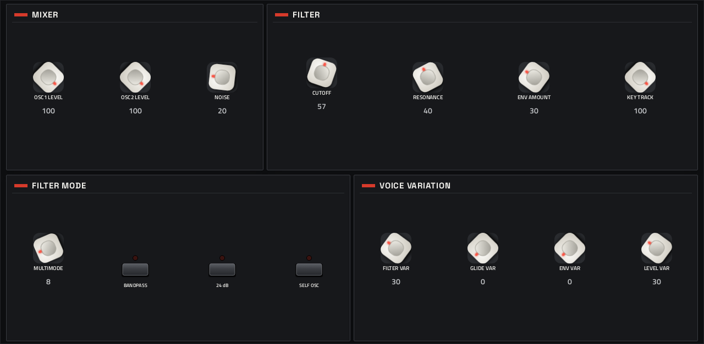
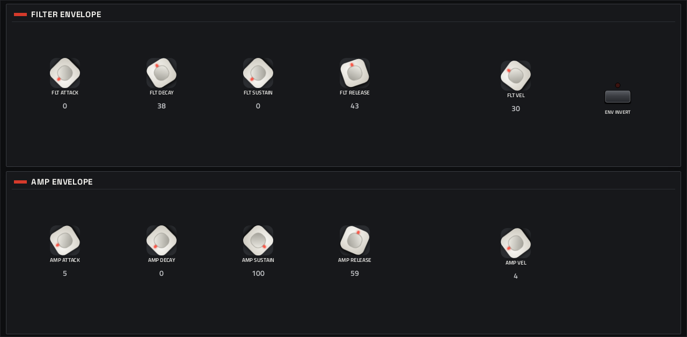
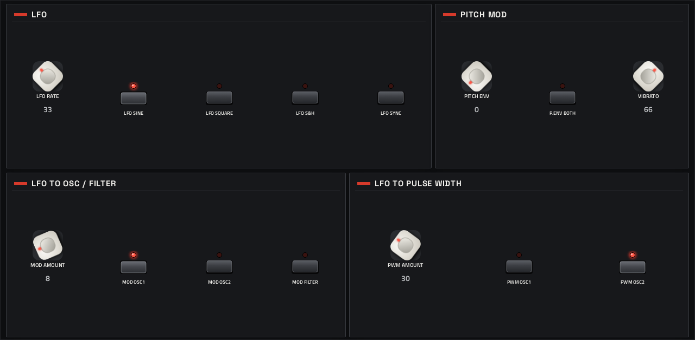

# OB-Xd

**Synth** · Oberheim OB-X: reales' OB-Xd with its 128 factory presets. · maker in MPC: reales · licence: GPL-3.0


The OB-Xd emulation of Oberheim's OB-X: two oscillators per voice with sync, cross-modulation and pulse width, a mixer with noise, a 12/24 dB multimode filter, filter and amp envelopes, an LFO routed to pitch, filter and pulse width, and "voice variation" controls that detune each voice's oscillator, filter and envelopes slightly, as analog voices do. 128 factory presets ship with it, and any `.fxb` banks you add show up in its BANK selector.

## On the MPC

- In the plugin browser: **[SYN] OB-Xd** by **reales** (Synth)
- Files: the release installs one folder, `/sdcard/Synths/reales - VST - [SYN] OB-Xd/`, holding `obxd.so`, its screen and its library (`obxd/`). The vst_instruments installer puts `obxd.so` in `/sdcard/vst/` and its data in `/sdcard/vst/obxd/` instead; the plugin finds them either way (its data folder is `obxd/` next to the `.so`).
- 74 parameters (all automatable) on 5 pages

## Playing it

Add it to a **plugin track** and play it from the pads, a keyboard or a MIDI clip. Every control can be turned with the Q-Links and automated, and the settings are saved with your project.

## Pages

Screenshots are rendered from the built skin with the engine's real values right after it's inserted. On the MPC each page is a tab under the plugin header. The Q-Links follow the page column by column: on a 4-knob MPC the Q-Link button steps through the columns, and MPC outlines the active one.

### 1. MAIN


Q-Link columns: **1** VOLUME, TUNE  ·  **2** VOICES, SPREAD, UNISON, AS PLAYED  ·  **3** PORTAMENTO, LEGATO, BEND 12, BEND OSC2  ·  **4** PATCH, BANK

### 2. OSCILLATORS



Q-Link columns: **1** OSC1 PITCH, OSC1 SAW, OSC1 PULSE  ·  **2** OSC2 PITCH, OSC2 DETUNE, OSC2 SAW, OSC2 PULSE  ·  **3** PULSE WIDTH, PW OFFSET, PW ENV, PW ENV BOTH  ·  **4** X-MOD, BRIGHTNESS, OSC2 SYNC, OSC2 STEP

### 3. FILTER



Q-Link columns: **1** OSC1 LEVEL, OSC2 LEVEL, NOISE  ·  **2** CUTOFF, RESONANCE, ENV AMOUNT, KEY TRACK  ·  **3** MULTIMODE, BANDPASS, 24 dB, SELF OSC  ·  **4** FILTER VAR, GLIDE VAR, ENV VAR, LEVEL VAR

### 4. ENVELOPES



Q-Link columns: **1** FLT ATTACK, FLT DECAY, FLT SUSTAIN, FLT RELEASE  ·  **2** FLT VEL, ENV INVERT  ·  **3** AMP ATTACK, AMP DECAY, AMP SUSTAIN, AMP RELEASE  ·  **4** AMP VEL

### 5. MODULATION



Q-Link columns: **1** LFO RATE, LFO SINE, LFO SQUARE, LFO S&H  ·  **2** PITCH ENV, P.ENV BOTH, VIBRATO  ·  **3** MOD AMOUNT, MOD OSC1, MOD OSC2, MOD FILTER  ·  **4** PWM AMOUNT, PWM OSC1, PWM OSC2

## Install

Needs a standalone MPC or Force on MPC OS 3.x with root SSH access (checked on an MPC Live II).

**From the release:** download `SYN-OB-Xd-<version>-mpc-armv7.zip` from [Releases](https://github.com/saustin2010/mpc-vst-obxd/releases),
copy it to the MPC, unzip it and run `sh install.sh` in its folder as root. The installer stops MPC, backs up
`MPC.settings`, installs the plugin folder and starts MPC again; `INSTALL.md` in the zip has the details and a by-hand route.
Your own files in `obxd/presets/` are kept when you update or uninstall.

**With the rest of the collection:** from [vst_instruments](https://github.com/saustin2010/vst_instruments) ([INSTALL.md](https://github.com/saustin2010/vst_instruments/blob/main/INSTALL.md)):

```
./install.sh <mpc-address> obxd
```

Use one or the other for this plugin: both register the same plugin (same uid), so the last one run wins.

## Where it comes from

- Schwung module "OB-Xd" v0.4.9 by reales (port: charlesvestal)
- Licence: GPL-3.0, as declared in the module's `src/module.json` (text: [LICENSE](LICENSE))
- MPC port and screen: [vst_instruments](https://github.com/saustin2010/vst_instruments) (`schwung/instruments/obxd`), built on [sd88me's mpc-vst-plugins](https://github.com/sd88me/mpc-vst-plugins) (wrapper, Schwung adapter, skin tools).

## Changes for the MPC

- Sound fixed (2026-09-30): the knobs were declared 0-1 while the engine speaks 0-100, so any restore or knob move zeroed the patch; the fallback Init patch was also silent (engine patch, VENDORED.md).
- Presets work: factory bank shipped + MODULE_DIR, PATCH browser with a red dot-matrix display.
- BANK selector (2026-10-03), under PATCH on MAIN: every `.fxb` bank in `/sdcard/vst/obxd/presets/` (up to 32; Factory first, then by file name, which is the name shown), and PATCH browses the chosen one (up to 128 programs). The bank is saved with the project by name. An OB-Xd 1.x LV2 bank (`presets.ttl`) converts with `python3 tools/obxd-lv2-to-fxb.py <presets.ttl or its archive> "presets/obxd/presets/<Bank name>.fxb"`. The new parameters are appended (indices 70-73), so saved projects and Q-Link assignments keep working.
- New touchscreen page from its Google Stitch design (`design/`): the design's artwork as the background, its own knob art, live names and values, and controls the design left out added in its style (see RESKINNING.md).
- Presets in MPC's PRESET menu (2026-10-03): its presets are VST programs, listed live from the engine (vst.json
  `programs` with `count` and `name_at`; the engine answers a preset's name by number, marked MPC port), so it lists the bank that's loaded and follows a BANK switch.

## Files

| Path | What |
|---|---|
| `screenshots/` | the pages as MPC draws them |
| `release/` | `library.json` (where its library comes from, pinned) and `fetch-library.py` (fetches it) |
| `.github/workflows/release.yml` | the release build (GitHub Actions, a draft release) |
| `FRAMEWORK.md` | the changes to sd88me's tools this plugin is built with, and why |
| `LICENSE` | the licence |
| `deploy/` | ready to install: `vst/` → `/sdcard/vst/`, `Synths/` → `/sdcard/Synths/`, plus the plugin-list entry (not used by the release) |
| `vst.json` | build settings: name, maker, sources, compiler flags |
| `params.json` | the plugin's parameters as MPC sees them (VST index = order) |
| `layout.conf` | the screen: control positions, art, Q-Links (generated from the Stitch design) |
| `layout.grid.conf` | the plan of pages and controls the Stitch conversion fills in |
| `obxd.css` | the artwork stylesheet |
| `images/` | artwork: backgrounds, knobs, displays |
| `design/` | the Google Stitch design this screen was converted from (`stitch.html`, as Stitch wrote it) |
| `src/` | the engine's source, vendored from upstream |
| `VENDORED.md` | notes on the vendored source and its patches |

## Building

With Docker (32-bit ARM emulation for the build), Python 3 and the tools from
[saustin2010/mpc-vst-plugins](https://github.com/saustin2010/mpc-vst-plugins/tree/steve-features) (sd88me's [mpc-vst-plugins](https://github.com/sd88me/mpc-vst-plugins)
plus changes offered to it, until they're merged there; the commit is the one in `.github/workflows/release.yml`, and [FRAMEWORK.md](FRAMEWORK.md) says which changes this plugin uses and why):

```
git clone -b steve-features https://github.com/saustin2010/mpc-vst-plugins
MPC_VST=$PWD/mpc-vst-plugins
python3 release/fetch-library.py library        # its library, from its project at a pinned commit
bash "$MPC_VST/tools/build_port.sh" vst.json        # build/: obxd.so, the screen, the plugin-list entry
bash "$MPC_VST/tools/test_port.sh" vst.json         # the offline host test (ASan/UBSan): must print PASSED
```

Releases are built by GitHub Actions (`.github/workflows/release.yml`, "Release (draft)") as a draft, installed and checked
on a device, then published. More: [BUILDING.md](https://github.com/saustin2010/vst_instruments/blob/main/BUILDING.md), and to change the screen, [RESKINNING.md](https://github.com/saustin2010/vst_instruments/blob/main/RESKINNING.md).

## Development

This plugin is developed in [vst_instruments](https://github.com/saustin2010/vst_instruments) (`schwung/instruments/obxd`), next to the other plugins
and the tools that made its screen, and published to [mpc-vst-obxd](https://github.com/saustin2010/mpc-vst-obxd) for its
releases. Issues and pull requests are welcome in either.
