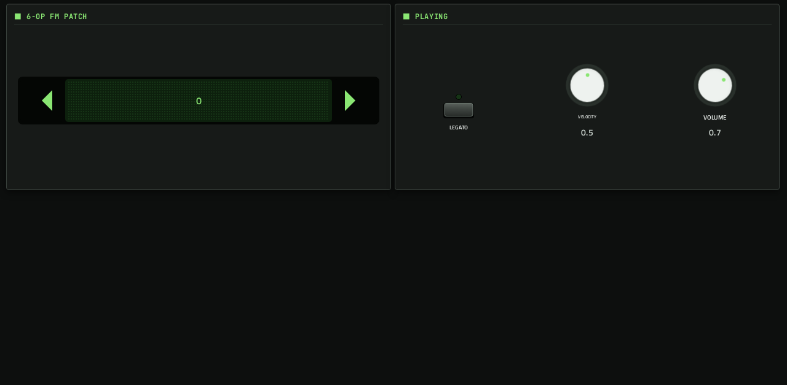

# Plaits

**Synth** · Mutable Instruments Plaits: a macro oscillator with 24 models, played like a synth, with 24 presets. · maker in MPC: Mutable Instruments · licence: MIT


Plaits, the successor to Braids: 24 synthesis models. The original sixteen (virtual analog, waveshaping, FM, grains, additive, wavetables, chords, speech, swarms, noise, modal and string physical models, three drums) plus the eight from the later firmware (analog with a filter, phase distortion, three 6-operator FM banks, wave terrain, string machine, chiptune). HARMONICS, TIMBRE and MORPH shape every model, and the built-in low-pass gate gives it plucky, organic decays. For the 6-op FM models, FM PATCH steps through the bank's patches and shows each patch's name.

Upstream ships no presets for the synth alone, so the port brings 24 (one or two per model: Analog Bass, Phase Lead, E-Piano, Mallets, Tubular Bells, Drawbar Organ, Glass Pad, Wave Terrain, String Machine, Chip Arp, Wavefolder, FM Bell, Grain Cloud, Additive Organ, Wavetable Sweep, Chord Stab, Talking Synth, Swarm Pad, Plucked String, Modal Bell, Kick, Snare, Hi-Hat), in MPC's PRESET menu. A VOLUME control (PLAY page, added 2026-10-04) levels them: Plaits' models differ by about 30 dB.

## On the MPC

- In the plugin browser: **Plaits** by **Mutable Instruments** (Synth)
- Files: `/sdcard/vst/plaits.so`, screen in `/sdcard/Synths/Mutable Instruments - VST - Plaits/`
- 19 parameters (all automatable) on 2 pages

## Playing it

Add it to a **plugin track** and play it from the pads, a keyboard or a MIDI clip. Every control can be turned with the Q-Links and automated, and the settings are saved with your project.

## Pages

Screenshots are rendered from the built skin with the engine's real values right after it's inserted. On the MPC each page is a tab under the plugin header. The Q-Links follow the page column by column: on a 4-knob MPC the Q-Link button steps through the columns, and MPC outlines the active one.

### 1. PLAITS


Q-Link columns: **1** MODEL, OCTAVE  ·  **2** HARMONICS, TIMBRE, MORPH  ·  **3** LPG DECAY, LPG COLOUR, ATTACK  ·  **4** FM, TIMBRE MOD, MORPH MOD, AUX MIX

### 2. PLAY



Q-Link columns: **1** FM PATCH  ·  **2** LEGATO, VELOCITY, VOLUME

## Install

From the top of this repo (see [INSTALL.md](../../../INSTALL.md)):

```
./install.sh <mpc-address> plaits
```

## Where it comes from

- Upstream: https://github.com/j3threejay/move-anything-plaits
- Vendored at commit 6d2ab081ac729acd254f5eec66a11c3fca8910d4 2026-04-08
- Schwung module "Plaits" v0.5.1 by Emilie Gillet (port: Justin Joe)
- Licence: MIT ([`LICENSE`](LICENSE), [`THIRD_PARTY_LICENSES`](THIRD_PARTY_LICENSES))
- MPC port and screen: this repo, built on [sd88me's mpc-vst-plugins](https://github.com/sd88me/mpc-vst-plugins) (wrapper, Schwung adapter, skin tools).

## Changes for the MPC

- `src/dsp/plaits_plugin.cpp` (`-DMPC_PORT`): an `fm_preset_index` param (the FM patch as a number, so the screen can step it; the names differ per 6-op bank). Diff: `upstream-changes.diff`.
- `src/dsp/plaits_plugin.cpp` (2026-10-04): a VOLUME param (appended, so older projects keep their mappings; its default is the Move port's level), applied at the output. Diff: `upstream-changes.diff`.
- `src/dsp/plaits/dsp/engine2/six_op_engine.cc` (2026-10-02): the 6-op scratch buffer is 4 blocks; the Move port's 1 block let every render write 48 floats into the FM patch bank (patches 0-1 played garbage, out-of-range reads; found with dev-tools/fuzz).
- All Mutable ports (2026-10-02): `stmlib::Interpolate` clamps its index (a control at exactly 100% read one past a table). Diff: `upstream-changes.diff`.
- New touchscreen page from its Google Stitch design (`design/`): the design's artwork as the background, its own knob art, live names and values, and controls the design left out added in its style (see RESKINNING.md).

## Files

| Path | What |
|---|---|
| `screenshots/` | the pages as MPC draws them |
| `deploy/` | ready to install: `vst/` → `/sdcard/vst/`, `Synths/` → `/sdcard/Synths/`, plus the plugin-list entry (its presets/kits are in the repo's `presets/` folder, not here) |
| `vst.json` | build settings: name, maker, sources, compiler flags |
| `params.json` | the plugin's parameters as MPC sees them (VST index = order) |
| `params.base.json` | the engine's own parameter list it was derived from |
| `layout.conf` | the screen: control positions, art, Q-Links (generated from the Stitch design) |
| `layout.grid.conf` | the plan of pages and controls the Stitch conversion fills in |
| `plaits.css` | the artwork stylesheet |
| `images/` | artwork: backgrounds, knobs, displays |
| `design/` | the Google Stitch design this screen was converted from (`stitch.html`, as Stitch wrote it) |
| `src/` | the engine's source, vendored from upstream |
| `upstream-changes.diff` | every local change to the upstream source |
| `UPSTREAM` | where the source came from, and at which commit |

To rebuild from source see [BUILDING.md](../../../BUILDING.md); to change the screen, [RESKINNING.md](../../../RESKINNING.md).
