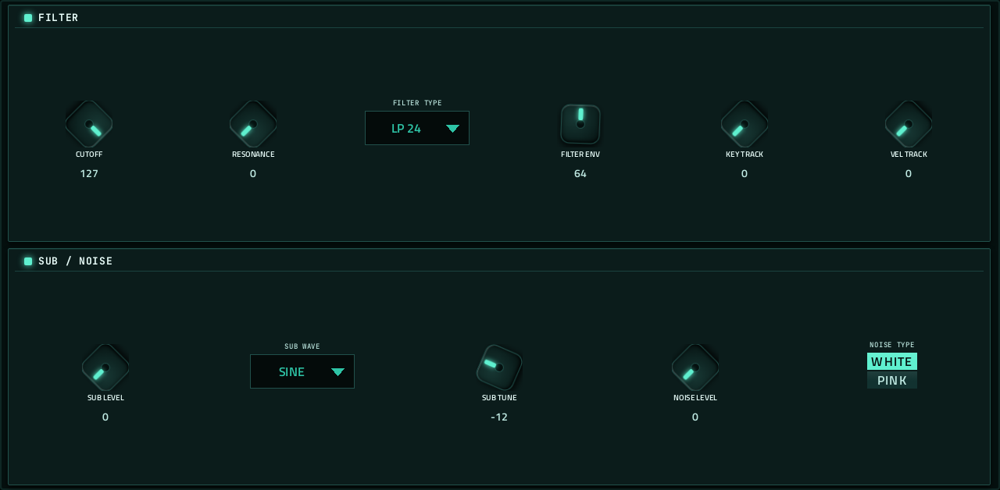
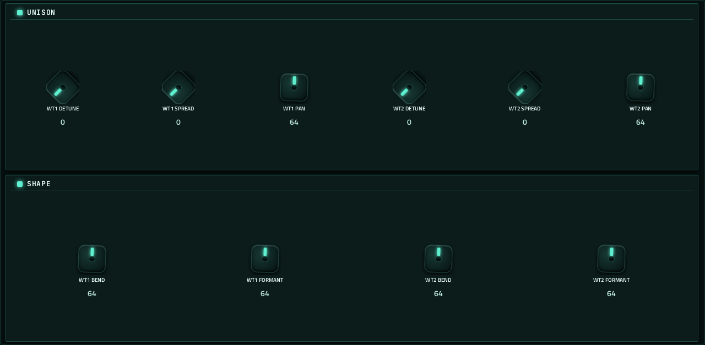
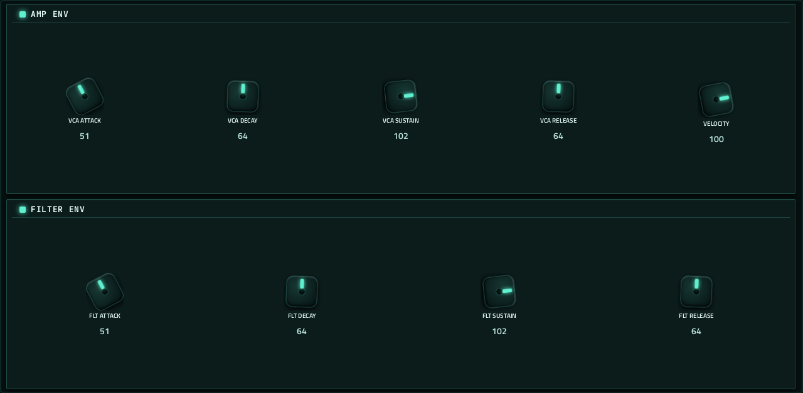
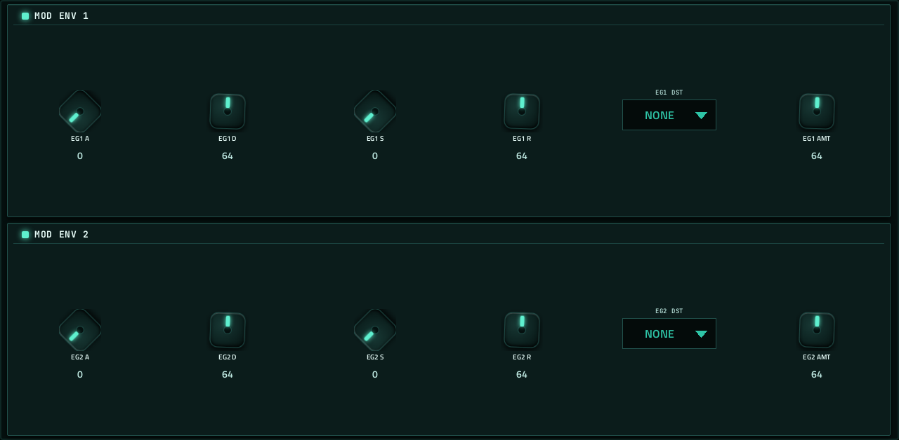
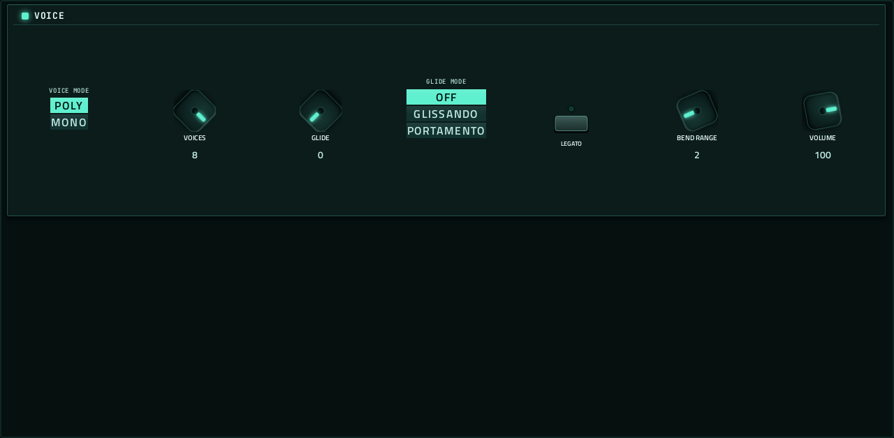

# Tablor

**Synth** · A two-oscillator wavetable synth that ships with its wavetables. · maker in MPC: athousanddetails · licence: BSD-3-Clause


Two wavetable oscillators, each scanning its own table (the table's name shows next to it, and the arrows step through the library), with unison and shape controls, a sub and noise, a filter, amp and filter envelopes, two modulation envelopes and a voice section. Its wavetable library ships with it; add your own tables to /sdcard/vst/tablor/wavetables on the MPC.

## On the MPC

- In the plugin browser: **Tablor** by **athousanddetails** (Synth)
- Files: `/sdcard/vst/tablor.so`, presets/data in `/sdcard/vst/tablor/` (from this repo's `presets/tablor/`, which `tools/fetch-presets.py` fills; install.sh does that for you), screen in `/sdcard/Synths/athousanddetails - VST - Tablor/`
- 65 parameters (all automatable) on 6 pages

## Playing it

Add it to a **plugin track** and play it from the pads, a keyboard or a MIDI clip. Every control can be turned with the Q-Links and automated, and the settings are saved with your project.

## Pages

Screenshots are rendered from the built skin with the engine's real values right after it's inserted. On the MPC each page is a tab under the plugin header. The Q-Links follow the page column by column: on a 4-knob MPC the Q-Link button steps through the columns, and MPC outlines the active one.

### 1. MAIN


Q-Link columns: **1** WT1 TABLE, WT1 POSITION, WT1 LEVEL, WT1 TUNE  ·  **2** WT1 UNISON, WT2 TABLE, WT2 POSITION, WT2 LEVEL  ·  **3** WT2 TUNE, WT2 UNISON

### 2. FILTER



Q-Link columns: **1** CUTOFF, RESONANCE, FILTER TYPE, FILTER ENV  ·  **2** KEY TRACK, VEL TRACK, SUB LEVEL, SUB WAVE  ·  **3** SUB TUNE, NOISE LEVEL, NOISE TYPE

### 3. SHAPE



Q-Link columns: **1** WT1 DETUNE, WT1 SPREAD, WT1 PAN, WT2 DETUNE  ·  **2** WT2 SPREAD, WT2 PAN, WT1 BEND, WT1 FORMANT  ·  **3** WT2 BEND, WT2 FORMANT

### 4. ENVELOPES



Q-Link columns: **1** VCA ATTACK, VCA DECAY, VCA SUSTAIN, VCA RELEASE  ·  **2** VELOCITY, FLT ATTACK, FLT DECAY, FLT SUSTAIN  ·  **3** FLT RELEASE

### 5. MOD ENVS



Q-Link columns: **1** EG1 A, EG1 D, EG1 S, EG1 R  ·  **2** EG1 DST, EG1 AMT, EG2 A, EG2 D  ·  **3** EG2 S, EG2 R, EG2 DST, EG2 AMT

### 6. VOICE



Q-Link columns: **1** VOICE MODE, VOICES, GLIDE, GLIDE MODE  ·  **2** LEGATO, BEND RANGE, VOLUME

## Install

From the top of this repo (see [INSTALL.md](../../../INSTALL.md)):

```
./install.sh <mpc-address> tablor
```

## Where it comes from

- Upstream: https://github.com/athousanddetails/schwung-tablor
- Vendored at commit d51887187f7a03f7b32cc4a74f5c60c5532e65fa 2026-09-03
- Schwung module "Tablor" v1.3.3 by athousanddetails; after Wavetable (Roland Rabien / FigBug, BSD-3)
- Licence: BSD-3-Clause ([`LICENSE`](LICENSE))
- MPC port and screen: this repo, built on [sd88me's mpc-vst-plugins](https://github.com/sd88me/mpc-vst-plugins) (wrapper, Schwung adapter, skin tools).

## Changes for the MPC

- `src/dsp/wt/scanner.h`: the user wavetable folder is `/sdcard/vst/tablor/wavetables` (where the shipped packs go), and the first-run copy into a user folder is skipped (`-DMPC_PORT`).
- `src/dsp/tablor_plugin.cpp`: `wt1_name`/`wt2_name` readouts (the table's file name) for the screen.
- `src/dsp/wt/loader.h` + `tb_destroy_instance`: the loader thread is joined before the instance is deleted. Upstream deletes members the loader may still be publishing into (ASan heap-use-after-free on a quick insert/remove, found by the offline test 2026-10-01).
- Diff: `upstream-changes.diff`.
- `params.base.json` comes from the module's `chain_params` (what the engine actually takes, saved as `chain_params.engine.json`), not its menu tree.
- New touchscreen page from its Google Stitch design (`design/`): the design's artwork as the background, its own knob art, live names and values, and controls the design left out added in its style (see RESKINNING.md).

## Files

| Path | What |
|---|---|
| `screenshots/` | the pages as MPC draws them |
| `deploy/` | ready to install: `vst/` → `/sdcard/vst/`, `Synths/` → `/sdcard/Synths/`, plus the plugin-list entry (its presets/kits are in the repo's `presets/` folder, not here) |
| `vst.json` | build settings: name, maker, sources, compiler flags |
| `params.json` | the plugin's parameters as MPC sees them (VST index = order) |
| `params.base.json` | the engine's own parameter list it was derived from |
| `chain_params.engine.json` | what the engine reports it takes (its `chain_params`) |
| `layout.conf` | the screen: control positions, art, Q-Links (generated from the Stitch design) |
| `layout.grid.conf` | the plan of pages and controls the Stitch conversion fills in |
| `tablor.css` | the artwork stylesheet |
| `images/` | artwork: backgrounds, knobs, displays |
| `design/` | the Google Stitch design this screen was converted from (`stitch.html`, as Stitch wrote it) |
| `src/` | the engine's source, vendored from upstream |
| `upstream-changes.diff` | every local change to the upstream source |
| `UPSTREAM` | where the source came from, and at which commit |

To rebuild from source see [BUILDING.md](../../../BUILDING.md); to change the screen, [RESKINNING.md](../../../RESKINNING.md).
