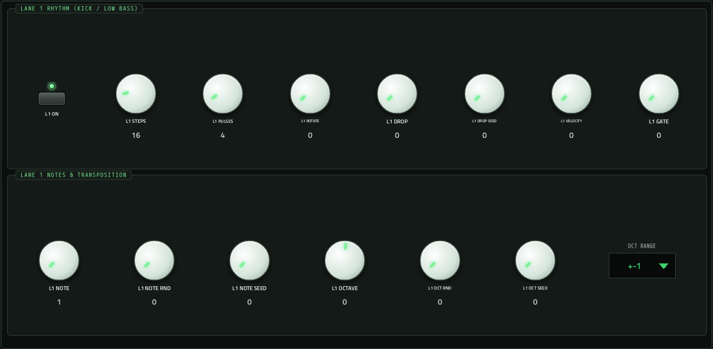
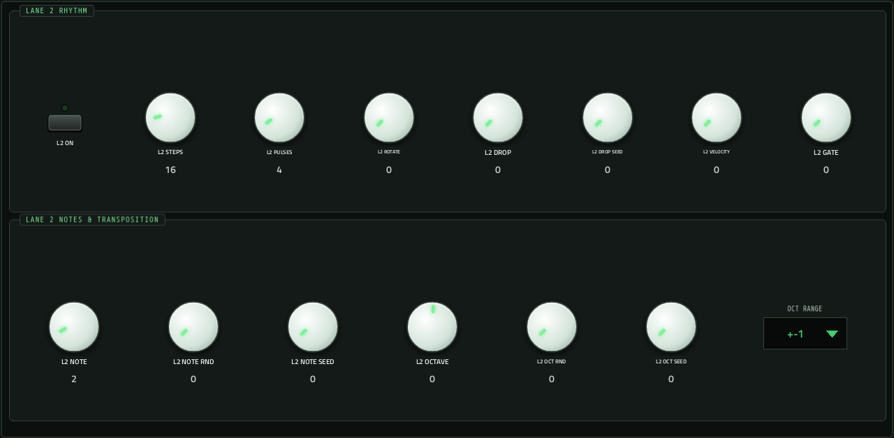
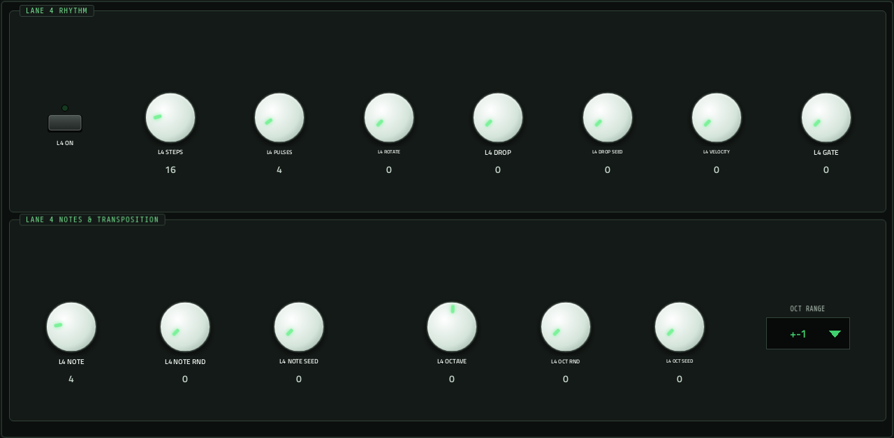
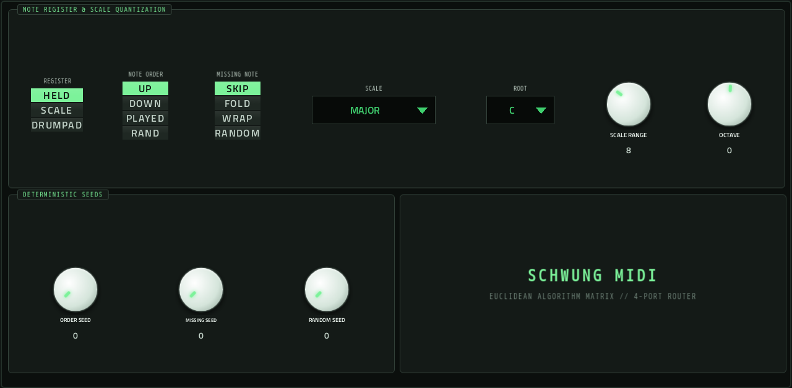

# Eucalypso

**MIDI sequencer** · Four-lane Euclidean sequencer: turns held notes into interlocking rhythms for other tracks. · maker in MPC: handcraftedcc · licence: MIT


Hold a chord (or a single note) on Eucalypso's track and its four lanes play it as Euclidean rhythms: each lane spreads PULSES hits evenly over its STEPS, with ROTATE, a DROP chance, its own note and octave (with randomisation), velocity and gate, all in time with MPC's tempo. Notes come from what you hold, from a scale, or as drum-pad notes (REGISTER). Swing, velocity and gate randomisation loosen it up; seeds make every random choice repeatable. It makes no sound itself: its notes go out of its own MIDI port to whatever tracks you point at it (see "Playing other tracks").

## On the MPC

- In the plugin browser: **[SEQ] Eucalypso** by **handcraftedcc** (Sequencer)
- Files: `/sdcard/vst/eucalypso.so`, screen in `/sdcard/Synths/handcraftedcc - VST - [SEQ] Eucalypso/`
- 82 parameters (all automatable) on 6 pages

## Playing it

The walk-through, with what to check when nothing plays: [docs/sequencers.md](../../../docs/sequencers.md).

MPC OS ignores a plugin's own MIDI output, so Eucalypso opens its own MIDI port (MPC lists it as **[SEQ] Eucalypso MIDI Out**), the way a USB MIDI device would appear. MPC picks the port up without a restart:

1. Put Eucalypso on a plugin track and play or hold notes into it (pads, keys or a MIDI clip).
2. **Menu → Preferences → MIDI**: switch **Track** on for **[SEQ] Eucalypso MIDI Out**.
3. On the track(s) that should play, set **MIDI Input Port** to that port and **Monitor** to **In** (not Auto, which only listens while that track is selected). Not on Eucalypso's own track, or it hears itself.
4. Press play: it follows MPC's tempo and transport (MIDI clock from the plugin host).

Eucalypso makes no sound of its own.

## Pages

Screenshots are rendered from the built skin with the engine's real values right after it's inserted. On the MPC each page is a tab under the plugin header. The Q-Links follow the page column by column: on a 4-knob MPC the Q-Link button steps through the columns, and MPC outlines the active one.

### 1. MAIN


Q-Link columns: **1** SYNC, RATE, BPM, SWING  ·  **2** PLAY MODE, RETRIGGER, VOICES, RAND CYCLE  ·  **3** VELOCITY, VEL RANDOM, GATE, GATE RANDOM

### 2. LANE 1



Q-Link columns: **1** L1 ON, L1 STEPS, L1 PULSES, L1 ROTATE  ·  **2** L1 DROP, L1 DROP SEED, L1 VELOCITY, L1 GATE  ·  **3** L1 NOTE, L1 NOTE RND, L1 NOTE SEED  ·  **4** L1 OCTAVE, L1 OCT RND, L1 OCT SEED, L1 OCT RANGE

### 3. LANE 2



Q-Link columns: **1** L2 ON, L2 STEPS, L2 PULSES, L2 ROTATE  ·  **2** L2 DROP, L2 DROP SEED, L2 VELOCITY, L2 GATE  ·  **3** L2 NOTE, L2 NOTE RND, L2 NOTE SEED  ·  **4** L2 OCTAVE, L2 OCT RND, L2 OCT SEED, L2 OCT RANGE

### 4. LANE 3


Q-Link columns: **1** L3 ON, L3 STEPS, L3 PULSES, L3 ROTATE  ·  **2** L3 DROP, L3 DROP SEED, L3 VELOCITY, L3 GATE  ·  **3** L3 NOTE, L3 NOTE RND, L3 NOTE SEED  ·  **4** L3 OCTAVE, L3 OCT RND, L3 OCT SEED, L3 OCT RANGE

### 5. LANE 4



Q-Link columns: **1** L4 ON, L4 STEPS, L4 PULSES, L4 ROTATE  ·  **2** L4 DROP, L4 DROP SEED, L4 VELOCITY, L4 GATE  ·  **3** L4 NOTE, L4 NOTE RND, L4 NOTE SEED  ·  **4** L4 OCTAVE, L4 OCT RND, L4 OCT SEED, L4 OCT RANGE

### 6. NOTES



Q-Link columns: **1** REGISTER, NOTE ORDER, MISSING NOTE  ·  **2** SCALE, ROOT, SCALE RANGE, OCTAVE  ·  **3** ORDER SEED, MISSING SEED, RANDOM SEED

## Install

From the top of this repo (see [INSTALL.md](../../../INSTALL.md)):

```
./install.sh <mpc-address> eucalypso
```

## Where it comes from

- Upstream: https://github.com/handcraftedcc/move-everything-eucalypso
- Vendored at commit f0ff52557829bd686118f45b90119c59188a9bf8 2026-03-23
- Licence: MIT ([`LICENSE`](LICENSE))
- MPC port and screen: this repo, built on [sd88me's mpc-vst-plugins](https://github.com/sd88me/mpc-vst-plugins) (wrapper, Schwung adapter, skin tools).

## Changes for the MPC

- `mpc/` = the MIDI FX adapter (`dev-tools/midifx/schwung_midi_fx.c`), Schwung's host headers and `wrapper/engine.h`. The adapter opens an ALSA MIDI port named after the plugin, sends the module's notes there, and turns MPC's transport (tempo, position, play/stop) into the 24-PPQN MIDI clock and Start/Stop the module expects.
- `mpc/host/plugin_api_v1.h`: its `offsetof(reserved) == 120` assert is a 64-bit (Move) layout check, so it is skipped on the MPC's 32-bit ARM (the module and adapter share the one header).
- New touchscreen page from its Google Stitch design (`design/`): the design's artwork as the background, its own knob art, live names and values, and controls the design left out added in its style (see RESKINNING.md).

## Files

| Path | What |
|---|---|
| `screenshots/` | the pages as MPC draws them |
| `deploy/` | ready to install: `vst/` → `/sdcard/vst/`, `Synths/` → `/sdcard/Synths/`, plus the plugin-list entry (its presets/kits are in the repo's `presets/` folder, not here) |
| `vst.json` | build settings: name, maker, sources, compiler flags |
| `params.json` | the plugin's parameters as MPC sees them (VST index = order) |
| `params.base.json` | the engine's own parameter list it was derived from |
| `layout.conf` | the screen: control positions, art, Q-Links (generated from the Stitch design) |
| `layout.grid.conf` | the plan of pages and controls the Stitch conversion fills in |
| `eucalypso.css` | the artwork stylesheet |
| `images/` | artwork: backgrounds, knobs, displays |
| `design/` | the Google Stitch design this screen was converted from (`stitch.html`, as Stitch wrote it) |
| `src/` | the engine's source, vendored from upstream |
| `mpc/` | MPC-side glue: the engine wrapper or MIDI/audio adapter, and headers |
| `UPSTREAM` | where the source came from, and at which commit |

To rebuild from source see [BUILDING.md](../../../BUILDING.md); to change the screen, [RESKINNING.md](../../../RESKINNING.md).
