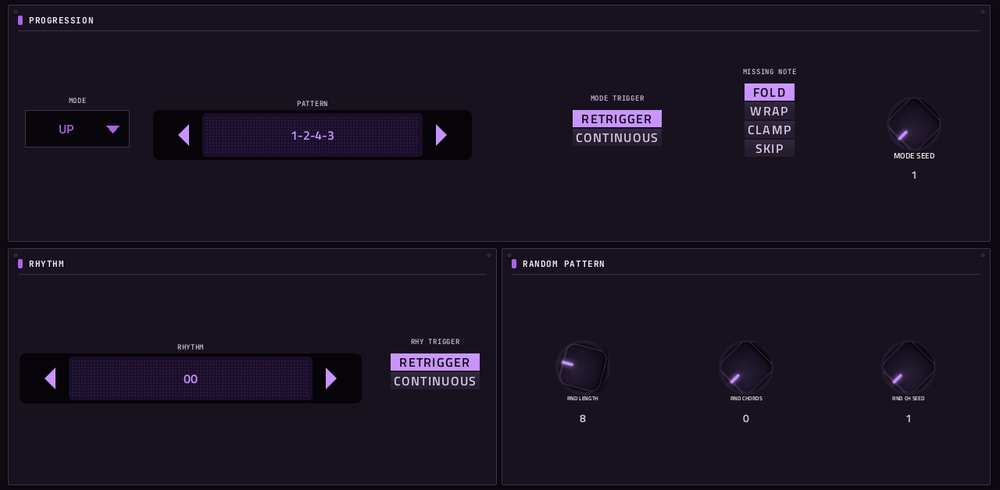
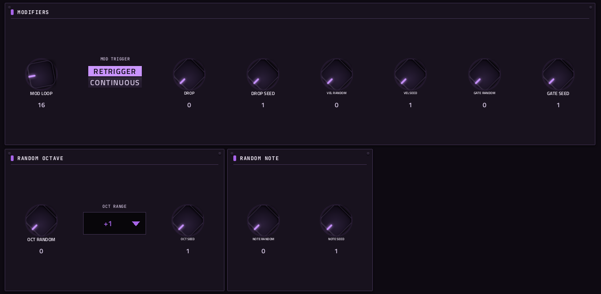

# Super Arp

**Arpeggiator** · A pattern and rhythm arpeggiator with 40 patterns, 40 rhythms and random modifiers. · maker in MPC: handcraftedcc · licence: MIT


An arpeggiator that separates the note order from the rhythm: a MODE (up, down, as played, leaps, chord) or one of 40 PATTERNs sets which note comes next, and one of 40 RHYTHMs sets when, so the same chord can roll, skip and syncopate in many ways. Drops, octave and note randomisation, and velocity and gate randomisation all have seeds, so a random result repeats until you change it. Hold a chord on its track: the arpeggio follows MPC's tempo (or its own BPM) and goes out of its own MIDI port to the tracks you point at it.

## On the MPC

- In the plugin browser: **Super Arp** by **handcraftedcc** (Synth)
- Files: `/sdcard/vst/superarp.so`, screen in `/sdcard/Synths/handcraftedcc - VST - Super Arp/`
- 37 parameters (all automatable) on 3 pages

## Playing it

MPC OS ignores a plugin's own MIDI output, so Super Arp opens its own MIDI port (named **Super Arp**, port **MIDI Out**), the way a USB MIDI device would appear. MPC picks the port up without a restart:

1. Put Super Arp on a plugin track and play or hold notes into it (pads, keys or a MIDI clip).
2. **Menu → Preferences → MIDI**: switch **Track** on for the Super Arp port.
3. On the track(s) that should play, set **MIDI input** to that port (not *All*, and not on Super Arp's own track, or it hears itself).
4. Press play: it follows MPC's tempo and transport (MIDI clock from the plugin host).

Super Arp makes no sound of its own.

## Pages

Screenshots are rendered from the built skin with the engine's real values right after it's inserted. On the MPC each page is a tab under the plugin header. The Q-Links follow the page column by column: on a 4-knob MPC the Q-Link button steps through the columns, and MPC outlines the active one.

### 1. MAIN


Q-Link columns: **1** SYNC, RATE, TRIPLET, TEMPO (BPM)  ·  **2** LATCH STATE, OCTAVES  ·  **3** GATE, VELOCITY, SWING, VOICES

### 2. PATTERN



Q-Link columns: **1** MODE, PATTERN  ·  **2** MODE TRIGGER, MISSING NOTE, MODE SEED  ·  **3** RHYTHM, RHY TRIGGER  ·  **4** RND LENGTH, RND CHORDS, RND CH SEED

### 3. MODIFY



Q-Link columns: **1** MOD LOOP, MOD TRIGGER, DROP, DROP SEED  ·  **2** VEL RANDOM, VEL SEED, GATE RANDOM, GATE SEED  ·  **3** OCT RANDOM, OCT RANGE, OCT SEED  ·  **4** NOTE RANDOM, NOTE SEED

## Install

From the top of this repo (see [INSTALL.md](../../../INSTALL.md)):

```
./install.sh <mpc-address> superarp
```

## Where it comes from

- Upstream: https://github.com/handcraftedcc/move-everything-superarp
- Vendored at commit 6eefd02af91823e330f7ce86883dc097b634ecc1 2026-03-23
- Licence: MIT ([`LICENSE`](LICENSE))
- MPC port and screen: this repo, built on [sd88me's mpc-vst-plugins](https://github.com/sd88me/mpc-vst-plugins) (wrapper, Schwung adapter, skin tools).

## Changes for the MPC

- `mpc/` = the MIDI FX adapter (`dev-tools/midifx/schwung_midi_fx.c`), Schwung's host headers and `wrapper/engine.h`. The adapter opens an ALSA MIDI port named after the plugin, sends the module's notes there, and turns MPC's transport (tempo, position, play/stop) into the 24-PPQN MIDI clock and Start/Stop the module expects.
- `mpc/host/plugin_api_v1.h`: its `offsetof(reserved) == 120` assert is a 64-bit (Move) layout check, so it is skipped on the MPC's 32-bit ARM (the module and adapter share the one header).
- New touchscreen page from its Google Stitch design (`design/`): the design's artwork as the background, its own knob art, live names and values, and controls the design left out added in its style (see RESKINNING.md).

## Files

| Path | What |
|---|---|
| `screenshots/` | the pages as MPC draws them |
| `deploy/` | ready to install: `vst/` → `/sdcard/vst/`, `Synths/` → `/sdcard/Synths/`, plus the plugin-list entry (its presets/kits are in the repo's `presets/` folder, not here) |
| `vst.json` | build settings: name, maker, sources, compiler flags |
| `params.json` | the plugin's parameters as MPC sees them (VST index = order) |
| `params.base.json` | the engine's own parameter list it was derived from |
| `params.pre-stitch.json` | the parameter list before the Stitch screen renamed controls |
| `layout.conf` | the screen: control positions, art, Q-Links (generated from the Stitch design) |
| `layout.grid.conf` | the plan of pages and controls the Stitch conversion fills in |
| `superarp.css` | the artwork stylesheet |
| `images/` | artwork: backgrounds, knobs, displays |
| `design/` | the Google Stitch design this screen was converted from (`stitch.html`, as Stitch wrote it) |
| `src/` | the engine's source, vendored from upstream |
| `mpc/` | MPC-side glue: the engine wrapper or MIDI/audio adapter, and headers |
| `UPSTREAM` | where the source came from, and at which commit |

To rebuild from source see [BUILDING.md](../../../BUILDING.md); to change the screen, [RESKINNING.md](../../../RESKINNING.md).
