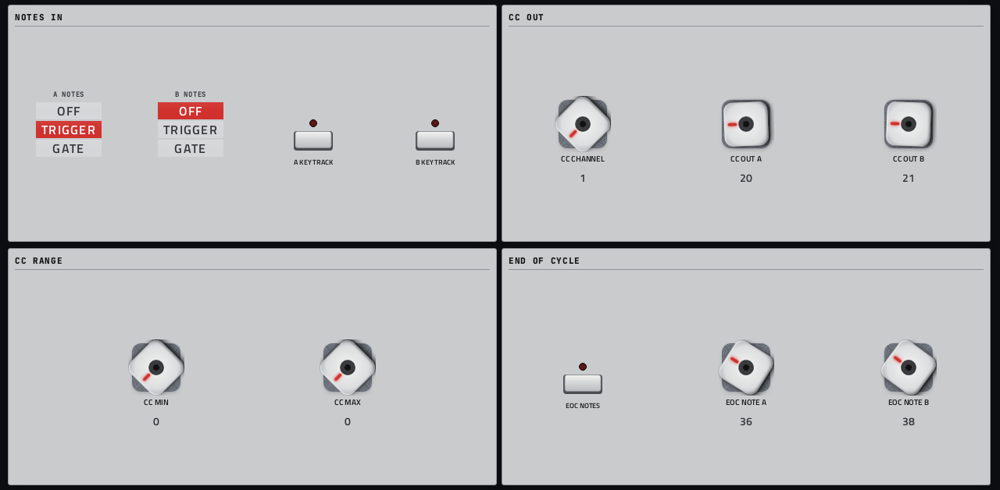

# Rampage

**Modulator** · Befaco Rampage: a dual slope generator (envelopes, LFOs, slew) that modulates other tracks. · maker in MPC: Befaco · licence: GPL-3.0


Rampage is Befaco's dual function generator: two channels that each make a rise and a fall, with adjustable times, shapes and range. Triggered they're envelopes, gated they hold (attack-sustain-release), cycling they're LFOs, and BALANCE and the MIN/MAX outputs combine both channels. On the MPC, notes on its track trigger or gate each channel, and OUT A/B, MIN and MAX go out of its own MIDI port as CCs you can MIDI-learn on another track; end-of-cycle events go out as notes. Turn AUDIO on to hear the outputs. Ported unchanged from Befaco's VCV Rack code through a small Rack API stand-in.

## On the MPC

- In the plugin browser: **[SEQ] Rampage** by **Befaco** (Sequencer)
- Files: `/sdcard/vst/rampage.so`, screen in `/sdcard/Synths/Befaco - VST - [SEQ] Rampage/`
- 27 parameters (all automatable) on 2 pages

## Playing it

The walk-through, with what to check when nothing plays: [docs/sequencers.md](../../docs/sequencers.md).

MPC OS ignores a plugin's own MIDI output, so Rampage opens its own MIDI port (MPC lists it as **[SEQ] Rampage MIDI Out**), the way a USB MIDI device would appear. MPC picks the port up without a restart:

1. Put Rampage on a plugin track and play or hold notes into it (pads, keys or a MIDI clip).
2. **Menu → Preferences → MIDI**: switch **Track** on for **[SEQ] Rampage MIDI Out**.
3. On the track to modulate, set **MIDI Input Port** to that port (with **Monitor** on **In**), then MIDI-learn the parameter you want moved to CC OUT A or CC OUT B (MIDI page). MIN and MAX send too when given a CC number.
4. EOC NOTES sends a short note at the end of each cycle, e.g. to fire a drum pad on another track.

Rampage makes no sound of its own unless AUDIO is on.

## Pages

Screenshots are rendered from the built skin with the engine's real values right after it's inserted. On the MPC each page is a tab under the plugin header. The Q-Links follow the page column by column: on a 4-knob MPC the Q-Link button steps through the columns, and MPC outlines the active one.

### 1. RAMPAGE


Q-Link columns: **1** A RANGE, A RISE, A FALL, A SHAPE  ·  **2** B RANGE, B RISE, B FALL, B SHAPE  ·  **3** CYCLE A, BALANCE, CYCLE B  ·  **4** AUDIO, VOLUME

### 2. MIDI



Q-Link columns: **1** A NOTES, B NOTES, A KEY TRACK, B KEY TRACK  ·  **2** CC CHANNEL, CC OUT A, CC OUT B  ·  **3** CC MIN, CC MAX  ·  **4** EOC NOTES, EOC NOTE A, EOC NOTE B

## Install

From the top of this repo (see [INSTALL.md](../../INSTALL.md)):

```
./install.sh <mpc-address> rampage
```

## Where it comes from

- Upstream: https://github.com/VCVRack/Befaco (src/Rampage.cpp, src/plugin.hpp)
- Vendored at commit bf03788cf11668ba4d371291d6b6dc8377393a24 2026-09-17
- Licence: GPL-3.0 ([`LICENSE`](LICENSE), [`LICENSE.md`](LICENSE.md), [`LICENSE-GPLv3.txt`](LICENSE-GPLv3.txt))
- MPC port and screen: this repo, built on [sd88me's mpc-vst-plugins](https://github.com/sd88me/mpc-vst-plugins) (wrapper, Schwung adapter, skin tools).

## Changes for the MPC

- Not a Move module: Befaco's Rampage from VCVRack/Befaco. `src/Rampage_dsp.hpp` is its module code without the panel widget, unchanged (`dev-tools/rack/extract_module.py`), compiled against `dev-tools/rack/rack_shim.hpp`, a small portable stand-in for the Rack API (Module, ports, float_4).
- `mpc/rampage_engine.cc`: MIDI notes trigger (AR) or gate (ASR) each channel, KEY TRACK drives EXP CV; OUT A/B, MIN and MAX go out as MIDI CC through the plugin's own port (`dev-tools/midiout`), end-of-cycle as notes; AUDIO plays OUT A/B (DC-blocked). Turning CYCLE on kicks the loop once (Rampage only re-fires at a cycle's end).
- New touchscreen page from its Google Stitch design (`design/`): the design's artwork as the background, its own knob art, live names and values, and controls the design left out added in its style (see RESKINNING.md).

## Files

| Path | What |
|---|---|
| `screenshots/` | the pages as MPC draws them |
| `deploy/` | ready to install: `vst/` → `/sdcard/vst/`, `Synths/` → `/sdcard/Synths/`, plus the plugin-list entry (its presets/kits are in the repo's `presets/` folder, not here) |
| `vst.json` | build settings: name, maker, sources, compiler flags |
| `params.json` | the plugin's parameters as MPC sees them (VST index = order) |
| `params.base.json` | the engine's own parameter list it was derived from |
| `params.pre-stitch.json` | the parameter list before the Stitch screen renamed controls |
| `layout.conf` | the screen: control positions, art, Q-Links (generated from the Stitch design) |
| `layout.grid.conf` | the plan of pages and controls the Stitch conversion fills in |
| `rampage.css` | the artwork stylesheet |
| `images/` | artwork: backgrounds, knobs, displays |
| `design/` | the Google Stitch design this screen was converted from (`stitch.html`, as Stitch wrote it) |
| `src/` | the engine's source, vendored from upstream |
| `mpc/` | MPC-side glue: the engine wrapper or MIDI/audio adapter, and headers |
| `UPSTREAM` | where the source came from, and at which commit |

To rebuild from source see [BUILDING.md](../../BUILDING.md); to change the screen, [RESKINNING.md](../../RESKINNING.md).
